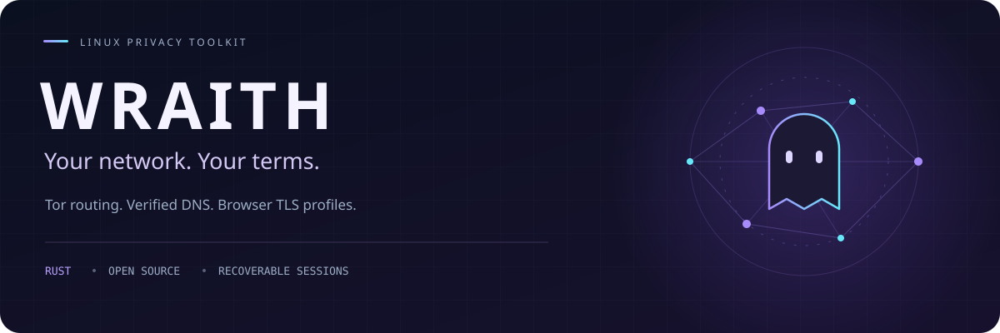
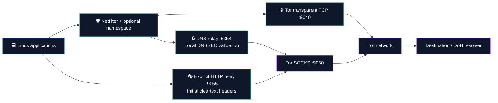
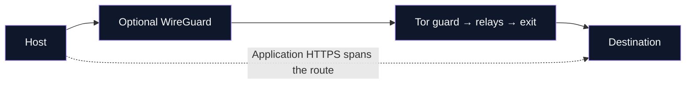

<a id="top"></a>

<p align="center">
  
</p>

<h1 align="center">Linux network privacy, in one terminal.</h1>
<p align="center">
  Route TCP through Tor. Validate DNS locally. Make verified HTTPS requests with browser TLS profiles.<br>
  <b>Configure a session. Inspect the route. Restore your settings.</b>
</p>

<p align="center">
  <a href="#installation"></a>
  <a href="#cli-reference"></a>
  <a href="#privacy-matrix"></a>
</p>

<p align="center">
  
  
  
  <a href="#validation"></a>
  <a href="LICENSE"></a>
  <a href="https://github.com/ByGh00st/wraith/stargazers"></a>
</p>

---

**Wraith is an open-source Linux Tor proxy and privacy session manager.** It brings network routing, DNSSEC over DoH, browser-profile HTTPS requests and recoverable host controls into a Rust CLI with a localized terminal interface.

<table>
<tr>
<td width="50%" valign="top">
<h3>🌐 Choose your route</h3>
<p>Tor TCP routing, optional network namespaces and Tor-over-WireGuard, with session controls in one place.</p>
<a href="#core-architecture">Explore the architecture →</a>
</td>
<td width="50%" valign="top">
<h3>🔒 Verify your connections</h3>
<p>Local DNSSEC validation over Tor DoH. Certificate-verified HTTPS with Chrome, Firefox or Safari TLS profiles.</p>
<a href="#browser-tls">See TLS profiles and scope →</a>
</td>
</tr>
<tr>
<td width="50%" valign="top">
<h3>⌨️ Stay in the terminal</h3>
<p>Interface and resolver selectors, circuit telemetry, 17 locales and a concise command workflow.</p>
<a href="#cli-reference">Find your command →</a>
</td>
<td width="50%" valign="top">
<h3>↩️ Keep a way back</h3>
<p>Recorded configuration changes, explicit session shutdown and retryable recovery when cleanup fails.</p>
<a href="#full-security">Read setup and recovery →</a>
</td>
</tr>
</table>

### A session in three commands

After [installation](#installation), keep the session running in its terminal. Use another terminal to inspect or stop it.

```bash
sudo wraith -s     # Start a foreground session
sudo wraith -i     # Inspect status and Tor circuits
sudo wraith -x     # Stop and restore recorded settings
```

<p align="center">
  <a href="#installation"><b>Installation</b></a> · <a href="https://github.com/ByGh00st/wraith/wiki"><b>Wiki guides</b></a> · <a href="#browser-tls">TLS profiles</a> · <a href="#privacy-matrix">Comparison</a> · <a href="#updates">Updates</a> · <a href="#codebase-metrics">Source metrics</a> · <a href="#validation">Validation</a>
</p>

<details>
<summary><b>Browse the complete technical guide</b></summary>

## 📋 Table of Contents

- [🌌 System Overview](#system-overview)
- [📊 Codebase Metrics & Language Breakdown](#codebase-metrics)
- [⚡ Core Architectural Pillars](#core-architecture)
- [🛡️ Privacy & Security Comparison Matrix](#privacy-matrix)
- [📂 Modular Crate Topology](#crate-topology)
- [🚀 Quickstart & Installation](#installation)
  - [1. Automated System Deployment](#1-clone--automated-system-deployment)
  - [2. Manual Cargo Compilation & Binary Setup](#2-manual-cargo-compilation--binary-setup)
  - [3. Systemd Daemon Deployment](#3-systemd-daemon-deployment)
- [💻 Operational Command Reference](#cli-reference)
  - [📋 Primary Shortcuts & Subcommands](#-primary-shortcuts--subcommands)
  - [🖧 Hardware Interface Selector (`wraith interfaces`)](#hardware-interface-selector)
  - [🔒 Encrypted DNS-over-HTTPS (`wraith doh`)](#dns-over-https)
  - [🌉 Tor Moat Protocol & Bridge Discovery (`wraith bridge`)](#tor-moat-protocol)
  - [🌐 17-Language i18n Architecture](#enterprise-i18n)
  - [🛠️ Granular Control Flags Matrix](#granular-control-flags)
  - [🛡️ Operational Usage Examples](#operational-usage-examples)
- [🛡️ HTTP Header Normalization & Signature Catalog](#dpi-sanitization)
  - [🔐 Real ClientHello Profiles: JA3 / JA4 Scope](#browser-tls)
  - [🌊 Encrypted Cover Requests](#cover-requests)
  - [🎯 Signature Catalog Categories (1,338 Entries)](#supported-tool-matrix)
  - [🎭 Diversified Multi-Browser User-Agent Pool](#diversified-ua-pool)
- [🛡️ Tor Threats & Operational Boundaries](#tor-defense)
- [🔒 In-Memory Cryptographic Security Specifications](#memory-security)
- [🛡️ Fail-Closed Crash Protection & Panic Sentry](#panic-sentry)
- [🔧 Full-Security Setup & Recovery](#full-security)
- [⬆️ Official GitHub Updates](#updates)
- [🧪 Development & Validation](#validation)
- [⚖️ Legal & Operational Disclaimer](#legal-disclaimer)
- [🤝 Project guides](#project-guides)
- [📜 License](#-license)

</details>


---

<a id="system-overview"></a>
## 🌌 System Overview

**Wraith-Prime** brings Tor routing, DNS policy, host settings and a localized terminal interface into one Linux session manager. Its six-crate Rust workspace combines netfilter rules, network namespaces, a local HTTP relay and optional browser controls.

Start a foreground session, inspect its status, and stop it to restore recorded settings. Advanced presets and their host prerequisites are covered in [setup and recovery](#full-security).

| Layer | Role |
| :--- | :--- |
| 🌐 Network | Tor TCP routing, dedicated Tor UID, IPv6 firewall rules and optional namespace/WireGuard |
| 🔒 DNS | UDP/TCP local relay, Tor DoH transport and local DNSSEC proof validation |
| 🎭 Application | Initial cleartext HTTP header normalization and managed browser preferences |
| 🧠 Host | Reversible sysctl/configuration snapshots, memory controls and strict prerequisites |
| 💻 Operations | Interface selection, 17-language TUI, circuit telemetry and official GitHub updates |

**Validation scope:** portable regressions and Linux cross-compilation are checked. Live Linux network integration remains unverified; see [development and validation](#validation) for the measured results.

---

<a id="codebase-metrics"></a>

## 📊 Codebase Metrics & Language Breakdown

<details open>
<summary><b>Source snapshot · Tokei 12.1.2 · 2026-09-11</b></summary>

Measured **2026-09-11** with Tokei 12.1.2. Scope: source crates, manifests, Cargo configuration and the three shell scripts; documentation and build output are excluded.

```sh
tokei crates Cargo.toml .cargo build.sh install-daemon.sh uninstall.sh
```

```text
===============================================================================
 Language            Files        Lines         Code     Comments       Blanks
===============================================================================
 Shell                   3          551          460           43           48
 TOML                    8          228          211            0           17
 YAML                  342        10504        10487            0           17
-------------------------------------------------------------------------------
 Rust                   67        17802        15385          554         1863
 |- Markdown            61          383            0          382            1
 (Total)                          18185        15385          936         1864
===============================================================================
 Total                 420        29085        26543          597         1945
===============================================================================
```

</details>

---

<a id="core-architecture"></a>
## ⚡ Core Architectural Pillars



The watchdog preserves application egress restrictions when Tor becomes unhealthy. WireGuard, when selected, carries Tor's outer connection. The packet monitor supplies observations, while netfilter and namespace rules enforce egress policy.

---

<a id="privacy-matrix"></a>
## 🛡️ Privacy & Security Comparison Matrix

<p align="center">
  <b>Different tools. Different boundaries. One detailed comparison.</b><br>
  Compare routing, application privacy and everyday operation by documented capability.
</p>

<p align="center">
  <a href="#matrix-network">🌐 Network</a> · <a href="#matrix-privacy">🔐 Privacy</a> · <a href="#matrix-workflow">⌨️ Workflow</a> · <a href="#matrix-evidence">📚 Evidence</a>
</p>

| ✅ Supported | ◐ Conditional / limited | ❌ Not provided in the compared scope | — Not established / not applicable |
| :---: | :---: | :---: | :---: |

**Read the qualifiers:** a tick means an implemented or documented capability, not a security score. Optional controls still require configuration. Wraith's privileged paths have portable tests and Linux cross-compilation coverage; live Linux network integration remains unverified.

<a id="matrix-network"></a>
### 🌐 01 / Network & transport

| Capability | 👻 **Wraith** | 🦜 **AnonSurf** | 👤 **TorGhost** | 🔗 **Proxychains-NG** | 💿 **Tails** |
| :--- | :---: | :---: | :---: | :---: | :---: |
| **Host-level Tor TCP routing** | ✅ Netfilter | ✅ Netfilter | ✅ Netfilter | ❌ Per-app hooks | ✅ OS policy |
| **Application socket proxying** | ◐ Local Tor relay | — | — | ✅ SOCKS / HTTP chains | ◐ Tor applications |
| **Non-Tor egress restrictions** | ✅ Strict policy | ◐ LAN exclusions | ◐ LAN exclusions | ❌ No host firewall | ✅ OS policy¹ |
| **DNS sent through Tor** | ✅ DoH relay | ✅ Tor DNS | ✅ Tor DNS | ◐ Proxy DNS setup | ✅ Integrated |
| **Local DNSSEC proof validation** | ✅ Hickory | — | ❌ Tor DNS only | ❌ No validator | — |
| **TCP + UDP port-53 interception** | ✅ Both | ◐ UDP rule | ◐ UDP rule | ❌ No interception | — |
| **Explicit host IPv6 restriction** | ✅ Session rules | ✅ Disable IPv6 | ❌ No IPv6 rule² | ❌ No host policy | — |
| **General UDP transport through Tor** | ❌ | ❌ | ❌ | ❌ | ❌ |

<a id="matrix-privacy"></a>
### 🔐 02 / Application privacy & recovery

| Capability | 👻 **Wraith** | 🦜 **AnonSurf** | 👤 **TorGhost** | 🔗 **Proxychains-NG** | 💿 **Tails** |
| :--- | :---: | :---: | :---: | :---: | :---: |
| **Selectable Chrome / Firefox / Safari TLS client** | ✅ Owned requests³ | — | ❌ | ❌ App TLS | ◐ Tor Browser⁴ |
| **Initial cleartext HTTP header normalization** | ◐ Local relay | — | ❌ | ❌ | — |
| **Other apps' HTTPS ClientHello rewriting** | ❌ CONNECT passthrough | — | ❌ | ❌ | — |
| **Saved firewall restoration** | ✅ Journaled tables | ✅ Saved rules | ❌ Flush/reset² | — No host policy | — Separate OS |
| **Resolver backup / restoration** | ✅ Saved entry | ✅ dnstool | ✅ Backup file | — | — Separate OS |
| **MAC address randomization** | ✅ Optional | — | ❌ | ❌ | ✅ Default⁵ |
| **Encrypted persistent OS storage** | ❌ Runtime vault only | ❌ Host tool | ❌ Host tool | ❌ App tool | ✅ Optional⁶ |
| **Browser privacy preferences** | ✅ Managed profiles | — | ❌ | ❌ | ✅ Tor Browser⁴ |

<a id="matrix-workflow"></a>
### ⌨️ 03 / Deployment & daily workflow

| Capability | 👻 **Wraith** | 🦜 **AnonSurf** | 👤 **TorGhost** | 🔗 **Proxychains-NG** | 💿 **Tails** |
| :--- | :---: | :---: | :---: | :---: | :---: |
| **Use on an existing Linux installation** | ✅ | ✅ Parrot focus | ✅ | ✅ | ❌ Boot environment |
| **Dedicated bootable privacy OS** | ❌ | ❌ | ❌ | ❌ | ✅ |
| **Graphical desktop interface** | ❌ Terminal UI | ✅ GTK | ❌ CLI | ❌ CLI | ✅ Desktop |
| **Native runtime on a non-Linux OS** | ❌ Runtime | ❌ | ❌ | ✅ BSD / macOS / others | ❌ Dedicated OS |
| **Start / stop command workflow** | ✅ Sessions | ✅ Sessions | ✅ Sessions | ◐ Per process | ◐ Boot / shutdown |
| **Operator-requested Tor identity change** | ✅ NEWNYM | ✅ Identity action | ✅ NEWNYM | — Upstream proxy | ✅ Tor Browser⁴ |

<a id="matrix-evidence"></a>
<details open>
<summary><b>📚 Evidence, scope and comparison notes</b></summary>

Reviewed **2026-09-11** against upstream documentation and source. A dash is deliberately not a cross: an unverified capability must not be presented as absent. These projects differ in deployment scope; there is no overall winner or calculated anonymity score.

1. [How Tails works](https://tails.net/about/index.en.html) describes its integrated environment and Tor limits. Its explicitly separate Unsafe Browser is not an anonymous Tor browsing path.
2. [TorGhost routing source](https://github.com/SusmithKrishnan/torghost/blob/master/torghost.py) defines the compared rules, resolver backup and stop/reset behavior. Entries describe that implementation, not every possible external Tor configuration.
3. Wraith's profiles apply to `fetch`, its native client API and DoH. The HTTP relay normalizes the first cleartext request; CONNECT retains application TLS. [TLS scope](#browser-tls) · [Threat model](docs/THREAT_MODEL.md) · [Validation](#validation).
4. Tails integrates Tor Browser; this is not equivalent to a three-profile HTTP client API. Browser identity controls have a different scope from system-wide identity changes. See [Tails included software](https://tails.net/doc/about/features/index.en.html).
5. [Tails MAC address anonymization](https://tails.net/doc/first_steps/welcome_screen/mac_spoofing/index.en.html) documents its defaults and compatibility limits.
6. [Tails Persistent Storage](https://tails.net/doc/persistent_storage/index.en.html) is encrypted optional storage. Wraith's in-memory vault serves a different purpose.

Additional sources: [AnonSurf routing and restoration](https://github.com/ParrotSec/anonsurf/blob/master/scripts/anondaemon), [AnonSurf project and interfaces](https://github.com/ParrotSec/anonsurf), [Proxychains-NG capabilities and compatibility](https://github.com/rofl0r/proxychains-ng#readme).

</details>

### Inside Wraith

<details>
<summary><b>Implementation details &amp; practical boundaries</b></summary>

| Capability | Implementation | Boundary |
| :--- | :--- | :--- |
| Tor routing | IPv4 TCP redirection and dedicated Tor UID | Arbitrary UDP/QUIC is not carried by Tor |
| Strict kill switch | Preserves scoped policy on Tor failure | No measured sub-millisecond response guarantee |
| DNSSEC | Local chain/proof validation over Tor DoH | Authenticated unsigned delegations remain unsigned |
| DNS interception | UDP/TCP port 53 reaches the local relay | Application-selected encrypted DNS is a separate flow |
| IPv6 control | Session firewall blocking | Live route and teardown validation remains required |
| HTTP normalization | Cleartext headers, absolute URLs and CONNECT tunnels | CONNECT preserves the application TLS stream |
| Browser TLS / HTTP2 | BoringSSL-backed Chrome, Firefox and Safari profiles | Wraith-owned requests and supported integrations only |
| Cover traffic | Real HTTPS requests over Tor every 15–45 seconds | Explicit endpoint; no proven correlation resistance |
| Browser hardening | Managed preferences preserving user.js | Verify the profile actually used |
| Font controls | Fontconfig restrictions and saved-file restoration | No universal fixed font-count guarantee |
| Memory controls | AEAD vault, zeroization and process locking | Does not isolate from a compromised kernel |
| Optional netem | Owned qdisc and guarded cleanup | No demonstrated traffic-correlation resistance |
| Recovery | Pre-mutation journals and retryable cleanup | Unrelated privileged writers are not coordinated |

</details>

<p align="center"><a href="#installation"><b>Get started →</b></a> · <a href="#browser-tls">Explore TLS profiles</a></p>

---

<a id="crate-topology"></a>

## 📂 Modular Crate Topology

Wraith is cleanly architected into 6 Rust crates with separate responsibilities:

<details>
<summary><b>Explore the six-crate source tree</b></summary>

```
wraith/
├── Cargo.toml                              # Workspace Root Manifest (v1.3.0)
├── LICENSE                                 # GNU General Public License v3.0 (GPLv3)
├── README.md                               # Operational Architecture & Documentation
├── SECURITY.md                             # Private Vulnerability Reporting Policy
├── CONTRIBUTING.md                         # Development & Review Guide
├── SUPPORT.md                              # Support Routes & Troubleshooting
├── CODE_OF_CONDUCT.md                      # Community Expectations
├── docs/THREAT_MODEL.md                    # Protection Scope & Trust Assumptions
├── build.sh                                # User-Privilege Build & Atomic Installation
├── install-daemon.sh                       # Systemd Network-Online Service Deployment
├── uninstall.sh                            # Uninstaller with Recorded-Session Cleanup
└── crates/
    ├── wraith-core/                        # [Core & Memory Security Layer]
    │   ├── locales/                        # Localized Core & Crypto Dictionaries
    │   ├── src/crypto.rs                   # SHA-256 and HMAC Utilities
    │   ├── src/vault.rs                    # Encrypted RAMFS Vault (RFC 8439 ChaCha20-Poly1305, mlockall, ZeroizeOnDrop)
    │   ├── src/kernel_lockdown.rs          # Strict Prerequisites & Reversible Sysctl Controls
    │   ├── src/process_lockdown.rs         # Process Memory Lockdown (PR_SET_DUMPABLE=0, PR_SET_NO_NEW_PRIVS)
    │   ├── src/file_snapshot.rs            # Retryable Configuration Snapshots
    │   ├── src/signed_update.rs            # Optional Minisign Release Verification
    │   ├── src/config.rs                   # Runtime Paths, Socket Addresses & Security Defaults
    │   └── src/state.rs                    # Atomic State Lifecycle & Safe Persistence
    │
    ├── wraith-net/                         # [Kernel Networking & DPI Layer]
    │   ├── locales/                        # Localized Network & DPI Dictionaries
    │   ├── src/netlink.rs                  # Direct AF_NETLINK Route, Link, Address & FIB Rule Engine
    │   ├── src/ids.rs                      # Packet Dissection & 1,338-Entry Signature Helpers
    │   ├── src/tcp_stack.rs                # TCP/IP Stack Normalizer & p0f Evasion (TTL=128, TS=0)
    │   ├── src/multihop.rs                 # Tor-over-WireGuard Outer Tunnel
    │   ├── src/ebpf_fastpath.rs            # Experimental Fastpath Helpers (Not Active Egress Policy)
    │   ├── src/ipv6.rs                     # IPv6 Dual-Stack Blackout & Leak Guard
    │   ├── src/mac.rs                      # IEEE 802.3 Hardware MAC Address & Hostname Randomizer
    │   ├── src/namespace.rs                # Isolated Kernel Network Namespace (veth jail)
    │   ├── src/nftables.rs                 # Journaled iptables Rule Manager
    │   ├── src/cgroup_jail.rs              # Cgroup Membership Management
    │   └── src/traffic_shaper.rs           # Kernel TC/Netem Traffic Shaping (Jitter & Latency Obfuscation)
    │
    ├── wraith-guard/                       # [Defense & DNS Engine]
    │   ├── locales/                        # Localized Guard & DNS Dictionaries
    │   ├── src/dns_engine.rs               # UDP/TCP DNS Relay, DoH Transport & Sinkhole
    │   ├── src/dnssec.rs                   # Local DNSSEC Validator over Tor DoH
    │   ├── src/killswitch.rs               # Bounded Tor Health Checks & Policy Preservation
    │   ├── src/traffic_jitter.rs           # Bounded HTTPS Cover Requests over Tor
    │   ├── src/bpf_filter_engine.rs        # Classic BPF / eBPF Raw Packet Assembly & Filtering
    │   ├── src/seccomp_jail.rs             # Ptrace-Deny Filter with Thread Synchronization
    │   ├── src/honey_ports.rs              # Deceptive Honey-Port Listeners & Inbound Scanner Trap
    │   └── src/leak.rs                     # Multi-Vector Egress Leak Auditor
    │
    ├── wraith-tor/                         # [Tor Transport & HTTP Relay Layer]
    │   ├── locales/                        # Localized Tor Transport Dictionaries
    │   ├── src/grease.rs                   # TLS/HTTP2 Profile Metadata Helpers
    │   ├── src/browser_tls.rs              # Verified Browser TLS/HTTP2 Client over Tor
    │   ├── src/proxy_request.rs            # CONNECT / HTTP Authority & Framing Validation
    │   ├── src/tls_camouflage.rs           # HTTP Relay with Tor SOCKS Transport
    │   ├── src/multichain.rs               # Five-Eyes Exclusion Matrix & Strict Geographic Exit Profiler
    │   ├── src/circuit.rs                  # Multi-Hop Circuit Topology & Live Telemetry Inspector
    │   ├── src/control.rs                  # Tor Control Protocol Interface (SIGNAL NEWNYM, Telemetry)
    │   ├── src/onion_service.rs            # Ephemeral v3 Onion Hidden Service Controller
    │   ├── src/daemon.rs                   # Isolated Tor Daemon Lifecycle & Sandboxed Process Manager
    │   └── src/bridge.rs                   # obfs4 / Snowflake Pluggable Transport Manager
    │
    ├── wraith-forensic/                    # [Anti-Forensics & Hardware Cloaking Layer]
    │   ├── locales/                        # Localized Anti-Forensics Dictionaries
    │   ├── src/shred.rs                    # Multi-Pass Crypto Shredder with FS Sync & Zeroization
    │   ├── src/memory.rs                   # Volatile RAM & Swap Partition Cleaner (with 5s Emergency Timeout)
    │   ├── src/anti_debug_probe.rs         # Dynamic RE Detection (PTRACE_TRACEME, TracerPid Probe)
    │   ├── src/anti_fingerprint.rs         # WebGL, Canvas, AudioContext & Letterboxing Profile Hardener
    │   ├── src/font_jail.rs                # Fontconfig Restrictions & Cache Refresh
    │   ├── src/display_jail.rs             # Xvfb Standardized 1920x1080@24bit Virtual Display Sandbox
    │   ├── src/hardware_cloaker.rs         # Hardware Serial & /etc/machine-id Mutator
    │   ├── src/browser.rs                  # Firefox Profile user.js Automated Security Injector
    │   └── src/logs.rs                     # System Journal, Bash History & Memory Dump Sanitizer
    │
    └── wraith-cli/                         # [Command Interface, Localized TUI & Completions]
        ├── locales/                        # 17 Native YAML Language Dictionaries
        ├── src/display.rs                  # Universal Box Renderer, Dynamic ANSI Width Calculator & Help Matrix
        ├── src/commands.rs                 # Operational Command Handlers with Graceful Cleanup Hooks
        ├── src/tui.rs                      # Native Rust Terminal UI & 17-Language Interactive Selector
        ├── src/diagnostics.rs              # Deep Kernel, Sysctl & Network Health Auditor (Doctor Mode)
        └── src/benchmark.rs                # High-Performance Cryptographic & Kernel Benchmark Suite
```

</details>
<p align="right"><a href="#top">⬆ Back to Top</a></p>

---

<a id="installation"></a>
## 🚀 Quickstart & Installation

### 1. Clone & Automated System Deployment

The runtime targets **x86_64 Linux**, primarily Debian/Kali-style installations. Windows supports portable development tests, not privileged network sessions.

```bash
git clone https://github.com/ByGh00st/wraith.git
cd wraith
chmod +x build.sh
sudo ./build.sh
```

Install Rust under your ordinary account first. The helper installs Debian-family dependencies, builds the locked workspace as the invoking user, and atomically installs one executable. Existing sessions keep running; firewall, resolver and filesystem mount settings are preserved. See [build.sh](build.sh).

### 2. Manual Cargo Compilation & Binary Setup

Use current stable Rust (dependencies require at least Rust 1.88) and C/C++ compilers, CMake, Perl and libclang for BoringSSL. Build as your ordinary account, then install the executable:

```bash
cargo build --release --locked
sudo install -m 0755 target/release/wraith /usr/local/bin/wraith
wraith --version
wraith --help
```

| Dependency | Required for |
| :--- | :--- |
| Tor and dedicated `debian-tor` account | Tor transport; UID 0 is never a fallback |
| Tor package runtime directory `/run/tor` | Daemon runtime files; ownership is not recursively rewritten |
| iproute2 (`ip`, `tc`) | Interfaces, namespaces and optional shaping |
| iptables/ip6tables plus save/restore tools | Session policy and recovery snapshots |
| CMake, Perl, libclang, C/C++ compiler | Native browser TLS engine build, including source updates |
| curl | Connectivity and bridge helper requests |
| fontconfig / `fc-cache` | Font sandbox application and restoration |
| WireGuard tools | Optional `-W` outer tunnel |
| Xvfb and `xauth` | Optional private virtual display |
| Pluggable transport executable | Selected Tor bridge transport |

### 3. Systemd Daemon Deployment

```bash
sudo ./install-daemon.sh
# Or configure without the wizard:
sudo ./install-daemon.sh --non-interactive --boot-mode standard --profile stealth --doh quad9
```

Default service ordering follows `network-online.target`; installation does not immediately start a session. Unsupported `--boot-mode early` is rejected. Inspect the generated unit and strict prerequisites before enabling it. The service does not establish protection for all early-boot traffic.

<p align="right"><a href="#top">⬆ Back to Top</a></p>

---

<a id="cli-reference"></a>

## 💻 Operational Command Reference

```bash
sudo wraith [SHORTCUTS | OPTIONS] [COMMAND]
```

### 📋 Primary Shortcuts & Subcommands

| Shortcut | Command Format | Operational Action |
| :--- | :--- | :--- |
| `-s` | `sudo wraith -s [OPTIONS]` / `wraith start` | **Start Wraith Engine**: Initializes fail-closed routing and selected hardening layers. |
| `-x` | `sudo wraith -x [-d]` / `wraith stop` | **Stop Wraith**: Restores normal network, netfilter rules, and DNS. (`-d` self-destructs binary). |
| `-r` | `sudo wraith -r` / `wraith switch` | **Circuit Rotation**: Issues `SIGNAL NEWNYM` to request a fresh Tor exit node identity. |
| `-t` | `sudo wraith -t` / `wraith test` | **Connectivity Checks**: Reports bounded probes and unverified DNS/WebRTC coverage. |
| `-i` | `sudo wraith -i` / `wraith info` | **Status Telemetry**: Displays live connection status, active exit IP, and circuit topology. |
| `-p` | `sudo wraith -p <NAME>` / `wraith profile` | **Geographic Exit Profiler**: Enforces Tor exit nodes (`stealth`, `speed`, `journalists`, `research`, `darkweb`). |
| `-F` | `sudo wraith -F` / `wraith -s -F` | **Strict Preset**: Requires core setup and the kill switch; see prerequisites below. |
| `-u` | `sudo wraith -u` / `wraith update` | **Official GitHub Update**: Fetches source, builds without root, then atomically installs. |
| `-c` | `sudo wraith -c` / `wraith cleanup`| **Anti-Forensic Purge**: Clears volatile RAM caches, temporary state, and session traces. |
| — | `sudo wraith --cleanup-full` | **Deep Anti-Forensic Purge**: Wipes RAM, swap partitions, and all system authentication logs. |
| `-M` | `sudo wraith -M` / `wraith monitor` | **Real-Time DPI & IDS Monitor**: Displays inspected packet copies and signature observations. |
| — | `sudo wraith doctor` | **Kernel Integrity Auditor**: Deeply audits IPv4/IPv6 sysctls, Tor daemon state, Netlink, and Seccomp. |
| — | `sudo wraith benchmark` | **Cryptographic Benchmark**: Evaluates ChaCha20-Poly1305, SHA-256, HMAC, and Netlink throughput. |
| — | `sudo wraith mac` | **Hardware Randomizer**: Randomizes L2 MAC address and system hostname immediately. |
| — | `sudo wraith pentest` | **Security Audit Guide**: Displays isolation guidelines for Nmap, Sqlmap, Ffuf, Metasploit. |
| — | `sudo wraith shred <FILE>` | **File Overwrite**: Requests overwrite passes; SSD/snapshot erasure is not guaranteed. |
| — | `sudo wraith interfaces` | **Hardware Interface Selector**: Inspects and binds to physical network interfaces. |
| — | `sudo wraith doh` | **Encrypted DoH**: Selects or configures DNS-over-HTTPS providers (Cloudflare, Quad9, Google, AdGuard, Mullvad, Custom). |
| — | `sudo wraith bridge` | **Tor Moat & Bridge Discovery**: Fetches bridges via Moat API or sets up obfs4/snowflake/webtunnel. |
| — | `sudo wraith --select-lang` | **17-Language Selector**: Launches interactive Unicode terminal UI to change system language. |
| — | `sudo wraith --lang <CODE>` | **Runtime Language Override**: Dynamically executes any command in any of the 17 supported locales. |

---

<a id="hardware-interface-selector"></a>
### 🖧 Hardware Interface Selector (`wraith interfaces`)

```bash
sudo wraith interfaces
sudo wraith interfaces --all
sudo wraith start --select-interface
sudo wraith start -I wlan0
sudo wraith -Fs -I eth0
```

Select the intended egress adapter on machines with multiple interfaces. MAC randomization can interrupt Wi-Fi association or DHCP; the original address is recorded before changes. Interface selection does not isolate the machine from other root processes.

---

<a id="dns-over-https"></a>
### 🔒 Encrypted DNS-over-HTTPS (`wraith doh`)

```bash
wraith doh                       # Show resolver choices
sudo wraith doh --select          # Interactive selection
sudo wraith -s -D quad9
sudo wraith -s -D cloudflare
sudo wraith -s -D mullvad
sudo wraith -s -D https://resolver.example/dns-query
```

| DNS stage | Behavior |
| :--- | :--- |
| Client transport | UDP and TCP on local port 5354 |
| Default upstream | Quad9 DoH through Tor SOCKS; `-D` selects another preset/URL |
| Validation | [Hickory DNSSEC](https://docs.rs/hickory-net/0.26.3/hickory_net/dnssec/struct.DnssecDnsHandle.html) with built-in root trust anchors |
| Trust checks | Bogus/indeterminate proofs rejected; upstream AD cannot replace validation |
| Unsigned zones | Authenticated insecure delegations accepted without authenticated-data labeling |
| Failures | SERVFAIL without an unvalidated fallback |
| Large replies | UDP truncation requests a TCP retry |
| Limits | Bounded tasks, response size and operation deadlines |

Every validation lookup uses Tor DoH. Client CD flags cannot disable gateway validation. The sinkhole intentionally synthesizes local policy responses. `UdpTor` remains an explicit nonvalidating library transport for legacy callers; CLI startup selects validating DoH.

Resolver bootstrap/availability still depend on Tor. DNSSEC does not make unsigned domains signed or replace HTTPS certificate checks.

---

<a id="tor-moat-protocol"></a>
### 🌉 Tor Moat Protocol & Bridge Discovery (`wraith bridge`)

```bash
wraith bridge list
wraith bridge moat --transport obfs4
wraith bridge moat --transport webtunnel
sudo wraith -s --bridge --bridge-type obfs4
sudo wraith -s --bridge --bridge-type snowflake
```

Discovery and transport launch are separate steps. A listed bridge is not proof of present reachability. Install the selected transport executable and inspect Tor startup results. Captcha-assisted Moat discovery and fallback pools depend on upstream availability.

Use `wraith bridge --help` and `wraith bridge moat --help` for supported forms; old examples such as `bridge --test` are not valid CLI commands.

---

<a id="enterprise-i18n"></a>
### 🌐 Internationalization (17 Locales)

The selector uses the 17 dictionaries shipped in this workspace. `/etc/wraith/lang` stores the system selection; `--lang` overrides it for one command.

```bash
sudo wraith --select-lang
wraith --lang tr --help
wraith --lang en doh
```

| Languages | Codes |
| :--- | :--- |
| English · Turkish · Azerbaijani | `en` · `tr` · `az` |
| German · French · Spanish · Italian | `de` · `fr` · `es` · `it` |
| Portuguese · Dutch · Polish | `pt` · `nl` · `pl` |
| Russian · Ukrainian | `ru` · `uk` |
| Arabic · Persian | `ar` · `fa` |
| Chinese · Japanese · Korean | `zh` · `ja` · `ko` |

The TUI supports arrow/page navigation and confirmation. Translation coverage can differ by message; locale count does not imply every diagnostic is translated.

---

<a id="granular-control-flags"></a>

### 🛠️ Granular Control Flags Matrix

<details open>
<summary><b>⚙️ Click to Expand / Collapse Full CLI Flag & Option Tree</b></summary>

```text
Quick Shortcuts:
  -s, --start                      Quick start shortcut with active options
  -x, --stop                       Quick stop shortcut (restores clean clearnet)
  -r, --switch                     Request new Tor exit identity (Newnym)
  -t, --test                       Run bounded connectivity checks
  -i, --info                       Display live telemetry dashboard & circuits
  -u, --update                     Fetch updates & recompile binary in-place
  -c, --cleanup                    Anti-forensic RAM and state purge
      --cleanup-full               Thorough anti-forensic purge (RAM, swap, auth logs)
  -M, --monitor                    Launch packet-observation monitor
Network Isolation & Tunneling:
  -m, --mac                        Randomize network interface L2 MAC address and hostname
  -b, --bridge                     Route traffic through censorship-resistant obfs4 Tor bridges
  -n, --namespace                  Restrict routing to an isolated Linux Network Namespace (10.200.1.0/24)
  -p, --profile <PROFILE>          Enforce geographic Tor exit node profile (stealth, speed, journalists, research, darkweb)
      --rotate-interval <SECS>     Automatically rotate Tor exit node identity every N seconds (e.g. --rotate 60)
                                   [aliases: --interval, --rotate, --auto-rotate]
      --jitter                     Enable bounded HTTPS cover requests over Tor
      --jitter-endpoint <HTTPS_URL> Required endpoint you control or are authorized to use
      --no-killswitch [--no-ks]    Disable the Fail-Closed KillSwitch watchdog monitor
  -W, --wireguard <CONF>           Encapsulate Tor traffic inside a kernel WireGuard tunnel (Multi-Hop DPI/ISP bypass)
      --onion <VIRT:TARGET>        Provision an Ephemeral v3 Onion Hidden Service (e.g. --onion 80:8080)
                                   [aliases: --onion-service, --hidden-service]
      --shaper                     Inject Linux Kernel TC Netem traffic shaping (35ms delay, 12ms jitter)
                                   [aliases: --traffic-shaper, --netem, --tc-shaper]
      --spawn-monitor              Automatically spawn dedicated DPI/IDS monitor window on startup
System Hardening & Anti-Fingerprinting:
      --honey-ports                Arm localhost deception honeypot traps (:2222, :3306, :5432, :6379, :8080, :27017)
                                   [aliases: --honeypot, --honey-trap, --trap-ports]
      --honey-lan                  🚨 LAN SENSOR MODE: Bind honeypots to 0.0.0.0 (Trap & tarpit Wi-Fi/LAN port scanners)
                                   [aliases: --lan-honeypot, --lan-trap, --deception-sensor]
      --display-sandbox            Spawn isolated X11 Virtual Display sandbox (Xvfb 1920x1080@24bit) to mask EDID
                                   [aliases: --virtual-display, --xvfb, --display-jail]
      --browser-shield             Inject WebGL, Canvas, Audio, GPU, Font and Resolution anti-fingerprint profiles
                                   [aliases: --shield, --canvas-shield]
      --font-sandbox               Restrict OS-level font discovery via Fontconfig sandbox
                                   [alias: --font-jail]
      --tcp-mask                   Normalize TCP/IP L4 stack parameters (TTL=128, TS=0) for p0f evasion
      --machine-id                 Rotate unique OS /etc/machine-id and system hardware identifiers
                                   [alias: --cloaking]
  -F, --full-security              Require strict session controls; reject missing prerequisites
                                   [-Fs combines -F and -s; aliases: --full, --strict, --harden, --full-defense, --strict-hardening, --max-hardening]
High-Risk & Forensic Operations (Explicit Opt-In Only):
  -L, --forensic-wipe-logs         ⚠ IRREVERSIBLE: Eradicate system authentication logs, event logs, and shell history
                                   [aliases: --destructive-cleanup, --wipe-logs]
  -d, --forensic-self-destruct     ⚠ IRREVERSIBLE: Cryptographically shred binary from disk and wipe memory on exit
                                   [alias: --self-destruct]
  -K, --aggressive-masquerade      ⚠ EVASIVE: Spoof process name in scheduler as kernel worker ([kworker/u16:0])
                                   [aliases: --process-masquerade, --cloaked-process]
  -A, --aggressive-anti-debug      ⚠ EMERGENCY ABORT: Immediately triggers SIGKILL if attached to a debugger
                                   [aliases: --anti-debug, --anti-ptrace]
General Options:
  -v, --verbose                    Enable verbose debug logging
      --lang <LANG>                Override system language (e.g. 'en', 'tr', 'ru', 'de')
      --select-lang                Launch interactive 17-language configuration terminal menu
  -h, --help                       Print comprehensive help screen
  -V, --version                    Print version information
```

</details>

---

<a id="operational-usage-examples"></a>
### 🛡️ Operational Usage Examples

```bash
# Foreground standard session
sudo wraith -s
# Strict/full-security preset on a prepared host
sudo wraith -Fs -I eth0
# MAC randomization and geographic exit profile
sudo wraith -s -m -p stealth
# Tor through an existing WireGuard configuration
sudo wraith -s -W /path/to/wg.conf
# Browser preferences and selected DoH provider
sudo wraith -s --browser-shield -D quad9
# Periodic identity requests
sudo wraith -s --rotate-interval 120
# Inspect and stop the session
sudo wraith -i
sudo wraith -x
# Update from official GitHub
sudo wraith -u
```

Keep the foreground process running. Ctrl+C requests cleanup. NEWNYM does not migrate existing streams. Destructive cleanup/self-destruct options are not necessary for the strict preset.

<p align="right"><a href="#top">⬆ Back to Top</a></p>

---

<a id="dpi-sanitization"></a>
## 🛡️ HTTP Header Normalization & Signature Catalog

The source contains **1,338 signature entries** spanning HTTP clients and security tools. Matching text does not prove every named tool is proxied or indistinguishable from a browser.

The HTTP relay on port 9055 intercepts all cleartext HTTP traffic (redirected by iptables NAT) and performs real wire-level User-Agent sanitization against the full 1,338+ signature catalog before forwarding through Tor SOCKS. HTTPS CONNECT tunnels preserve the application's original TLS stream. The `AF_PACKET` packet monitor inspects copies for detection and alerting; wire sanitization is handled exclusively by the L7 proxy.

```text
Cleartext HTTP → HTTP relay :9055 → Tor SOCKS :9050 → destination
HTTPS CONNECT → tunnel through Tor → original TLS stream
Packet monitor → observations and counters
```

<a id="browser-tls"></a>
### 🔐 Real ClientHello profiles: JA3 / JA4 scope

Wraith now owns a real TLS client backed by **BoringSSL through [wreq](https://github.com/0x676e67/wreq)** and its emulation profiles. TLS cipher suites, extensions, ALPN and HTTP/2 settings come from the selected profile. This changes the actual connection handshake, rather than only a User-Agent string or a displayed fingerprint value.

| Profile | Pinned emulation | Used by |
| :--- | :--- | :--- |
| `chrome` | Chrome 131 | Default `fetch`, DNS-over-HTTPS and cover requests |
| `firefox` | Firefox 133 | Explicit `fetch` or Rust client integration |
| `safari` | Safari 18 | Explicit `fetch` or Rust client integration |

These are specific supported profiles, not a promise to impersonate the latest browser release. JA3/JA4 are fingerprinting schemes, not encryption or anonymity shields. Matching a handshake profile does not reproduce JavaScript, cookies, browser behavior or every network fingerprint.

```bash
# Start a Wraith/Tor session first, then fetch without root privileges.
wraith fetch https://example.org/ --tls-profile chrome --output page.html
wraith fetch https://example.org/ --tls-profile firefox --output firefox-page.html
wraith fetch --help
```

The client uses **SOCKS5 remote DNS**, certificate-chain and hostname verification, TLS 1.2 or newer, bounded timeouts, and an 8 MiB fetch limit. Redirects are not followed. Output is written atomically and existing files are not overwritten. A failed Tor connection does not fall back to a direct request.

Supported integrations can invoke `wraith fetch` or use the public `wraith_tor::BrowserTlsClient` API for HTTPS GET requests. The DNS relay uses the same client for DNS-message POST requests. Other applications can use the HTTP relay's CONNECT support, but retain their own TLS fingerprint. Wraith does not install a root CA or decrypt their HTTPS sessions.

<a id="cover-requests"></a>
### 🌊 Optional encrypted cover requests

```bash
# Replace this with an HTTPS endpoint you control or have permission to use.
sudo wraith -s --jitter --jitter-endpoint https://your-domain.example/cover
```

The worker performs a real HTTPS GET through Tor after each randomized **15–45 second** pause, caps each response at **16 KiB**, and cancels on session shutdown. It requires an explicit endpoint and is not automatically enabled by `-Fs`. This creates application traffic; it does not establish resistance to timing correlation.

The encoded catalog is an implementation detail, not encryption or an antivirus exclusion mechanism. Normalization does not guarantee non-detection or exemption from Tor-exit blocklists.

---

<a id="supported-tool-matrix"></a>

### 🎯 Signature Catalog Categories (1,338 Entries)

<details open>
<summary><b>🛡️ Click to Expand / Collapse 1,338+ Tool Signature Normalization Table</b></summary>

| Operational Category | Examples in the Signature Catalog |
| :--- | :--- |
| **💥 Vulnerability Assessment & Compliance Scanners** | `sqlmap`, `nuclei (ProjectDiscovery)`, `httpx`, `Ghauri`, `Commix`, `dalfox`, `XSStrike`, `NoSQLMap`, `SQLiX`, `WPScan`, `Joomscan`, `Droopescan`, `Nikto`, `CMSmap`, `Sipvicious`, `OpenVAS`, `Nessus`, `Nexpose`, `Acunetix`, `Arachni`, `Wapiti`, `Vega`, `Vuls`, `tplmap` |
| **🔍 Web Discovery & API Fuzzers** | `ffuf`, `gobuster`, `dirsearch`, `feroxbuster`, `Wfuzz`, `Kiterunner`, `Katana`, `Arjun`, `Dirb`, `Dirbuster`, `ParamSpider`, `X8`, `Crawley`, `Hakrawler`, `GAU (GetAllUrls)`, `Waybackurls`, `Cariddi`, `Burp Intruder`, `Turbo Intruder` |
| **📡 OSINT, Subdomain & DNS Recon** | `theHarvester`, `Amass`, `Subfinder`, `Sublist3r`, `Assetfinder`, `Findomain`, `Recon-ng`, `DNSRecon`, `Fierce`, `Knockpy`, `Shodan CLI`, `Censys CLI`, `WhatWeb`, `wafw00f`, `EyeWitness`, `Aquatone`, `Photon`, `Spiderfoot`, `FinalRecon`, `OneForAll`, `MassDNS` |
| **🛡️ Security Frameworks & Post-Exploitation Auditing** | `Metasploit (msfconsole, msf, meterpreter, msfvenom)`, `Cobalt Strike (Beacon, Malleable C2 HTTP)`, `Sliver C2`, `Havoc C2`, `Mythic`, `Empire (PowerShell Empire, Starkiller)`, `Covenant`, `Brute Ratel C4`, `PoshC2`, `Shad0w`, `Merlin`, `Koadic`, `Caldera` |
| **🔐 Active Directory & Access Auditing** | `BloodHound`, `SharpHound`, `CrackMapExec`, `NetExec`, `Impacket (psexec, wmiexec, secretsdump, dcomexec, smbexec, atexec)`, `Responder`, `Evil-WinRM`, `Mimikatz`, `Rubeus`, `Certipy`, `Kerbrute`, `Pre2k`, `Coercer`, `PetitPotam`, `adidnsdump`, `ldapsearch`, `rpcclient` |
| **🌐 Network & Port Scanners** | `Nmap (NSE, Nmap Scripting Engine, nmap-http)`, `masscan`, `RustScan`, `ZMap`, `Unicornscan`, `Angry IP Scanner`, `AutoRecon`, `Scanless`, `Hping3`, `Netdiscover`, `Fping`, `Naabu` |
| **🔑 Credential Resilience & Auth Testing** | `Hydra (THC-Hydra)`, `Medusa`, `Ncrack`, `Patator`, `Crowbar`, `Brutespray`, `Legba`, `Hashcat`, `John The Ripper`, `Ophcrack`, `CeWL`, `CUPP` |
| **🕵️ Proxy, Interception & Traffic Auditing** | `BurpSuite (Burp Collaborator, Burp Scanner)`, `OWASP ZAP`, `Caido`, `Fiddler`, `Charles Proxy`, `mitmproxy`, `Bettercap`, `Ettercap`, `Wireshark`, `Tshark`, `Tcpdump`, `Snort`, `Suricata` |
| **🔬 Reverse Engineering & Binary Inspection Tools** | `Ghidra`, `IDA Pro`, `Radare2`, `Cutter`, `Angr`, `Binary Ninja`, `Frida`, `Hopper`, `GDB-PEDA`, `GEF`, `Pwntools` |
| **⚙️ HTTP Stacks & Scripting Libraries** | `python-requests`, `urllib3`, `aiohttp`, `httplib2`, `Go-http-client`, `curl/`, `Wget/`, `axios/`, `node-fetch`, `got`, `needle`, `Java/`, `Apache-HttpClient`, `Ruby`, `Faraday`, `libwww-perl`, `LWP::UserAgent`, `Scrapy`, `PHP`, `GuzzleHttp` |

</details>

---

<a id="diversified-ua-pool"></a>

### 🎭 Diversified Multi-Browser User-Agent Pool

The source contains browser-shaped User-Agent templates, not actual browser implementations.

The pool includes these source templates:

```rust
pub const BROWSER_USER_AGENT_POOL: &[&str] = &[
    "Mozilla/5.0 (Windows NT 10.0; Win64; x64) AppleWebKit/537.36 (KHTML, like Gecko) Chrome/131.0.0.0 Safari/537.36",
    "Mozilla/5.0 (X11; Linux x86_64; rv:132.0) Gecko/20100101 Firefox/132.0",
    "Mozilla/5.0 (Macintosh; Intel Mac OS X 10_15_7) AppleWebKit/605.1.15 (KHTML, like Gecko) Version/18.0 Safari/605.1.15",
    "Mozilla/5.0 (Windows NT 10.0; Win64; x64) AppleWebKit/537.36 (KHTML, like Gecko) Chrome/131.0.0.0 Safari/537.36 Edg/131.0.0.0",
    "Mozilla/5.0 (Windows NT 10.0; Win64; x64; rv:132.0) Gecko/20100101 Firefox/132.0",
    "Mozilla/5.0 (X11; Ubuntu; Linux x86_64; rv:132.0) Gecko/20100101 Firefox/132.0",
    "Mozilla/5.0 (Macintosh; Intel Mac OS X 14_7_1) AppleWebKit/537.36 (KHTML, like Gecko) Chrome/131.0.0.0 Safari/537.36",
    "Mozilla/5.0 (Linux; Android 14; Pixel 8 Pro) AppleWebKit/537.36 (KHTML, like Gecko) Chrome/131.0.0.0 Mobile Safari/537.36",
];
```

* **Session Consistency**: Rewriting maintains deterministic consistency for streams within the same TCP session to avoid mid-session header flapping.

* **RFC 7230 Byte-Safe Alignment**: In-flight byte replacements preserve HTTP payload framing and pad length variations with standard trailing header whitespace.

---

<a id="tor-defense"></a>
## 🛡️ Tor Threats & Operational Boundaries

| Concern | Relevant control | Remaining boundary |
| :--- | :--- | :--- |
| Direct egress | Strict firewall, namespace and watchdog | Host root can change policy |
| Guard sees source IP | Optional Tor-over-WireGuard | Trust shifts to the VPN path |
| Exit reads cleartext | Application HTTPS | Rewriting headers does not encrypt content |
| Resolver tampering | Local DNSSEC | Unsigned delegations remain unsigned |
| Geographic preference | Exit profiles | Geography does not establish relay trust |
| Long-lived identity | NEWNYM for eligible new streams | Existing streams, logins and cookies persist |
| Timing correlation | Optional netem and bounded HTTPS cover traffic | No established correlation defense |
| TLS fingerprinting | Real browser-profile TLS/HTTP2 for Wraith clients | Other applications retain their own TLS fingerprints |
| Tor blocking | Bridge support on the access path | Destinations can restrict exit addresses |



A successful exit-IP probe describes that request, not every interface, protocol or application.

---

<a id="memory-security"></a>
## 🔒 In-Memory Cryptographic Security Specifications

| Mechanism | Purpose |
| :--- | :--- |
| ChaCha20-Poly1305 | Authenticated vault encryption |
| Zeroization on drop | Clear managed buffers during normal destruction |
| Memory locking | Request resident memory; strict mode propagates failure |
| Dump restrictions | Process controls and reversible core-pattern setting |
| Seccomp TSYNC | Apply the ptrace restriction to existing threads |

Seccomp is not a general syscall allowlist. Abnormal termination can skip destructors; memory locking does not defeat a compromised kernel. File overwrites cannot establish erasure from SSD firmware, snapshots or backups.

---

<a id="panic-sentry"></a>
## 🛡️ Fail-Closed Crash Protection & Panic Sentry

The panic handler restores terminal presentation while preserving restrictive policy and recovery state. It does not flush rules to ACCEPT or switch to public DNS.

> [!TIP]
> **Kernel-Safety Boundary:** Wraith operates entirely in **user space** and does not load custom kernel modules (LKMs) or experimental eBPF/XDP hooks for HTTP rewriting. A failure in Wraith's L7 proxy is therefore contained to the user-space process and normally results in dropped connections rather than direct kernel execution failure. As with any privileged software interacting with kernel networking interfaces, Wraith does not claim that underlying kernel or driver defects can never cause host instability.

1. Claim the session exclusively before setup.
2. Journal settings and setup intent before mutation.
3. Abort activation and attempt cleanup on required setup failure.
4. Retain state and report failures when cleanup is incomplete.
5. Restore saved firewall settings and release state after successful cleanup.

Use `sudo wraith -x` to retry recovery. The troubleshooting table below explains the main recovery conditions.

<a id="full-security"></a>
## 🔧 Full-Security Setup & Recovery

`-Fs` combines full-security (`-F`) with start (`-s`). Strict mode requires the watchdog and rejects `--no-killswitch`.

### Host prerequisites

These irreversible controls must already be configured by the host administrator:

| Setting | Required state |
| :--- | :--- |
| Kernel lockdown | `confidentiality` |
| `kernel.kexec_load_disabled` | `1` |
| `kernel.yama.ptrace_scope` | `3` |

Wraith checks them instead of irreversibly enabling them for a temporary session. Reversible SysRq/core-dump controls are saved and verified. IOMMU groups are an observation, not proof of complete DMA protection.

### Recorded restoration

| Resource | Recovery behavior |
| :--- | :--- |
| IPv4/IPv6 firewall | Restore saved tables after required host cleanup |
| MAC/hostname | Restore journaled values |
| TCP/sysctl | Restore reversible controls |
| Resolver | Restore original content or symlink target |
| Tor configuration | Restore original entry |
| Font configuration | Restore entry/backup and refresh cache |
| Browser user.js | Remove managed block, preserve unrelated preferences |
| Namespace/WireGuard | Remove recorded resources and verify teardown |
| Traffic shaper | Remove only owned netem handle `a731:` |

Snapshots preserve regular-file content, mode/ownership, missing-file state and resolver symlink targets. They do not capture ACLs/xattrs, Tor working data or independent changes by other programs. New sessions do not change resolver immutable flags or recursively chown Tor runtime directories.

### Connection troubleshooting

| Symptom | First check |
| :--- | :--- |
| Strict start refuses host | Specific prerequisite/setup error |
| Wi-Fi stops after MAC change | Association and DHCP on selected adapter |
| UDP/QUIC fails | Tor carries TCP, not arbitrary UDP |
| DNS returns SERVFAIL | Tor/DoH availability, proofs and system clock |
| Cleanup reports errors | Resolve reported failure, retain state and retry `sudo wraith -x` |
| Another firewall manager writes rules | Coordinate ownership; writers are not one transaction |

Live Linux routing and kernel recovery remain integration work. Keep console access when evaluating network changes.

<a id="updates"></a>
## ⬆️ Official GitHub Updates

The normal update stays one command:

```bash
sudo wraith -u
# Equivalent:
sudo wraith update
```

Wraith fetches the official `ByGh00st/wraith` **main** branch over HTTPS, builds with `Cargo.lock` as the non-root sudo caller, and atomically installs `/usr/local/bin/wraith`. Git global/system configuration is suppressed and certificate verification stays enabled. Build failure preserves the installed executable. No manual key or manifest is needed.

Run the updater through `sudo` from the account that owns your Rust toolchain. It uses a unique build workspace under `/var/tmp`, one Cargo build job, an explicit Linux target and a fixed output directory. A user-level Cargo target-directory setting cannot redirect the expected artifact. Git, a current Rust toolchain, C/C++ compilers, CMake, Perl, libclang and sufficient disk space must be available. Missing compiler tools produce an actionable error before cloning; a direct root shell without a non-root sudo caller is rejected.

<details>
<summary><b>🔐 Optional signed offline release installation</b></summary>

This separate path verifies a Minisign signature over a JSON manifest, then checks the executable's SHA-256, Linux target and newer stable version with [minisign-verify](https://docs.rs/minisign-verify/0.2.5/minisign_verify/).

```bash
sudo wraith update --artifact ./wraith-linux-amd64 --manifest ./release.json --signature ./release.json.minisig
```

Provision a publisher key independently at `/etc/wraith/update.pub`, owned by root and not group/other-writable. Missing/invalid keys or signatures are rejected. No production key is bundled.

Example manifest (version illustrative):

```json
{
  "version": "1.4.0",
  "target": "x86_64-unknown-linux-gnu",
  "sha256": "<SHA-256 of final executable, lowercase hex>"
}
```

Publishers sign exact manifest bytes with `minisign -Sm release.json -s /secure/path/publisher.key`. Keep private keys outside the repository. Normal source updates trust GitHub HTTPS and repository access controls, without independent publisher-signature verification.

</details>
<a id="validation"></a>
## 🧪 Development & Validation

Latest local checks: **92 portable tests passed** and Linux-target Clippy passed with warnings denied. Live Linux networking and a complete installed-system update were not exercised.

```bash
cargo test --workspace --locked
cargo check --workspace --tests --target x86_64-unknown-linux-gnu --locked
cargo clippy --workspace --tests --target x86_64-unknown-linux-gnu --locked -- -D warnings
cargo audit --deny warnings
```

Cross-compilation needs the Rust Linux target, compatible C/C++ cross-compilers, CMake, Perl and libclang for ring and BoringSSL. Portable regressions cover real browser-profile TLS handshakes against a local test server, certificate and hostname rejection, response limits, CONNECT framing, forged DNSSEC replies, signature tampering, state claims, snapshot retries and policy construction. They do not execute Linux firewall/kernel-hardening commands.

Report failures with the command, distribution, interface and sanitized logs; omit passwords, private keys and tokens. Include the expected behavior and the exact failing step so an issue can be reproduced.

<p align="right"><a href="#top">⬆ Back to Top</a></p>

---

<a id="legal-disclaimer"></a>
## ⚖️ STRICT LEGAL & AUTHORIZED-USE DISCLAIMER

> [!CAUTION]
> **READ CAREFULLY BEFORE USE. BY DOWNLOADING, COMPILING, OR EXECUTING THIS SOFTWARE, YOU EXPLICITLY AGREE TO ALL TERMS BELOW.**

Wraith is a sovereign, dual-use network auditing and privacy enforcement kernel. It is engineered **strictly** for authorized Red/Blue team operations, academic research, and legally sanctioned cyber-defense activities. **You are solely responsible for your actions.**

### 🛑 JURISDICTIONAL COMPLIANCE & PENAL CODES

Unauthorized use of Wraith against systems, networks, or data may constitute a criminal offense and/or give rise to civil liability under applicable law. Users are solely responsible for determining and complying with the laws, regulations, contractual obligations, and authorization requirements applicable to their activities.
1. **Republic of Turkey:** Unauthorized access to or interference with information systems may fall within Articles 243 and 244 of the Turkish Penal Code (TCK), alongside other provisions depending on the conduct involved.
2. **United States of America (USA):** Any deployment against non-consenting targets violates the **Computer Fraud and Abuse Act (CFAA, 18 U.S.C. § 1030)** and the **Electronic Communications Privacy Act (ECPA)**, punishable by severe federal penalties and imprisonment.
3. **European Union (EU):** Malicious deployment breaches the **Directive on Attacks against Information Systems (Directive 2013/40/EU)** and the **General Data Protection Regulation (GDPR)** regarding unauthorized data processing.

### 🚫 PROHIBITED USES

You are **explicitly forbidden** from using Wraith for:
- Unauthorized penetration testing, intrusion, or exploitation of third-party infrastructure.
- Unlawful surveillance, data interception, or credential theft.
- Botnet operations, DDoS, or malicious traffic obfuscation.
- Bypassing lawful interception or actively aiding illicit activities.

**Operational Responsibility:** The developers, contributors, and the "ByGh00st" organization assume **ZERO LIABILITY** for any direct, indirect, incidental, or consequential damages, or legal repercussions resulting from the use or misuse of this software. No claim of guaranteed anonymity, non-detection, or regulatory immunity is made. **You operate this toolkit at your own absolute legal and technical risk.**

**License and Warranty:** Distribution and modification rights are governed by [GNU GPL v3.0](LICENSE). The software is provided "AS IS", without warranty of any kind. This responsible-use guidance does not add restrictions to the GPL license itself, but serves as an unconditional legal disclaimer.

---

<details>
<summary><b>Wraith terminal wordmark</b></summary>

```ascii
 ██╗    ██╗██████╗  █████╗ ██╗████████╗██╗  ██╗   ██████╗ ██████╗ ██╗███╗   ███╗███████╗
 ██║    ██║██╔══██╗██╔══██╗██║╚══██╔══╝██║  ██║   ██╔══██╗██╔══██╗██║████╗ ████║██╔════╝
 ██║ █╗ ██║██████╔╝███████║██║   ██║   ███████║   ██████╔╝██████╔╝██║██╔████╔██║█████╗
 ██║███╗██║██╔══██╗██╔══██║██║   ██║   ██╔══██║   ██╔═══╝ ██╔══██╗██║██║╚██╔╝██║██╔══╝
 ╚███╔███╔╝██║  ██║██║  ██║██║   ██║   ██║  ██║   ██║     ██║  ██║██║██║ ╚═╝ ██║███████╗
  ╚══╝╚══╝ ╚═╝  ╚═╝╚═╝  ╚═╝╚═╝   ╚═╝   ╚═╝  ╚═╝   ╚═╝     ╚═╝  ╚═╝╚═╝╚═╝     ╚═╝╚══════╝
```

</details>

<a id="project-guides"></a>
## 🤝 Project guides

| Report securely | Contribute | Get support | Understand scope |
| :--- | :--- | :--- | :--- |
| [Security policy](SECURITY.md) | [Contribution guide](CONTRIBUTING.md) | [Support guide](SUPPORT.md) | [Threat model](docs/THREAT_MODEL.md) |

Bug and feature forms are available in [Issues](https://github.com/ByGh00st/wraith/issues/new/choose). Sensitive vulnerabilities use the private channel described in the security policy. Collaboration follows the [community code of conduct](CODE_OF_CONDUCT.md).

## 📜 License

Distributed under **GNU GPL v3.0**. See [LICENSE](LICENSE).

<p align="center"><a href="#top">⬆ Back to Top</a> · <a href="https://github.com/ByGh00st/wraith/issues">Report an Issue</a> · <a href="https://github.com/ByGh00st/wraith/stargazers">Star Wraith</a></p>
