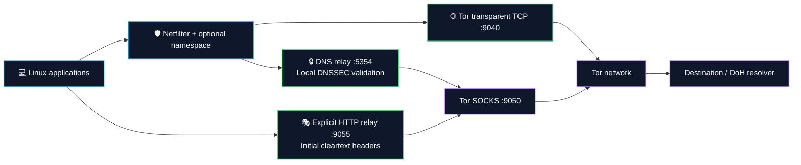
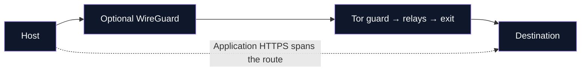

<a id="top"></a>
<p align="center">
  
  
  
  
  
  
</p>

```ascii
 ██╗    ██╗██████╗  █████╗ ██╗████████╗██╗  ██╗   ██████╗ ██████╗ ██╗███╗   ███╗███████╗
 ██║    ██║██╔══██╗██╔══██╗██║╚══██╔══╝██║  ██║   ██╔══██╗██╔══██╗██║████╗ ████║██╔════╝
 ██║ █╗ ██║██████╔╝███████║██║   ██║   ███████║   ██████╔╝██████╔╝██║██╔████╔██║█████╗
 ██║███╗██║██╔══██╗██╔══██║██║   ██║   ██╔══██║   ██╔═══╝ ██╔══██╗██║██║╚██╔╝██║██╔══╝
 ╚███╔███╔╝██║  ██║██║  ██║██║   ██║   ██║  ██║   ██║     ██║  ██║██║██║ ╚═╝ ██║███████╗
  ╚══╝╚══╝ ╚═╝  ╚═╝╚═╝  ╚═╝╚═╝   ╚═╝   ╚═╝  ╚═╝   ╚═╝     ╚═╝  ╚═╝╚═╝╚═╝     ╚═╝╚══════╝
```

<h3 align="center">Linux Network Privacy, Tor Routing & Host Hardening</h3>
<p align="center">
  <b>6 Modular Rust Crates • 17 Native Locales • 1,338 Signature Entries • Linux Network Privacy</b><br>
  <i>Tor TCP Routing • Local DNSSEC Validation • HTTP Header Normalization • Saved-State Recovery • Optional WireGuard</i>
</p>

---

<p align="center">
  <a href="#installation">Install</a> · <a href="#cli-reference">Commands</a> · <a href="#full-security">Full Security</a> · <a href="#updates">Update</a> · <a href="#privacy-matrix">Compare</a> · <a href="#codebase-metrics">Tokei</a> · <a href="SECURITY_AUDIT.md">Security Review</a>
</p>

## 📋 Table of Contents

- [🌌 System Overview](#system-overview)
- [📊 Codebase Metrics & Language Breakdown](#codebase-metrics)
- [⚡ Core Architectural Pillars](#core-architecture)
- [🛡️ Privacy & Security Comparison Matrix](#privacy-matrix)
- [📂 Modular Crate Topology](#crate-topology)
- [🚀 Quickstart & Installation](#installation)
  - [1. Automated System Deployment](#1-clone--automated-system-deployment)
  - [2. Manual Cargo Compilation & Binary Setup](#2-manual-cargo-compilation--binary-setup)
  - [3. Systemd Daemon Deployment](#3-systemd-daemon-deployment)
- [💻 Operational Command Reference](#cli-reference)
  - [📋 Primary Shortcuts & Subcommands](#-primary-shortcuts--subcommands)
  - [🖧 Hardware Interface Selector (`wraith interfaces`)](#hardware-interface-selector)
  - [🔒 Encrypted DNS-over-HTTPS (`wraith doh`)](#dns-over-https)
  - [🌉 Tor Moat Protocol & Bridge Discovery (`wraith bridge`)](#tor-moat-protocol)
  - [🌐 17-Language i18n Architecture](#enterprise-i18n)
  - [🛠️ Granular Control Flags Matrix](#granular-control-flags)
  - [🛡️ Operational Usage Examples](#operational-usage-examples)
- [🛡️ HTTP Header Normalization & Signature Catalog](#dpi-sanitization)
  - [🎯 Signature Catalog Categories (1,338 Entries)](#supported-tool-matrix)
  - [🎭 Diversified Multi-Browser User-Agent Pool](#diversified-ua-pool)
- [🛡️ Tor Threats & Operational Boundaries](#tor-defense)
- [🔒 In-Memory Cryptographic Security Specifications](#memory-security)
- [🛡️ Fail-Closed Crash Protection & Panic Sentry](#panic-sentry)
- [🔧 Full-Security Setup & Recovery](#full-security)
- [⬆️ Official GitHub Updates](#updates)
- [🧪 Development & Validation](#validation)
- [⚖️ Legal & Operational Disclaimer](#legal-disclaimer)
- [📜 License](#-license)

---

<a id="system-overview"></a>
## 🌌 System Overview

**Wraith-Prime** brings Tor routing, DNS policy, host settings and a localized terminal interface into one Linux session manager. Its six-crate Rust workspace combines netfilter rules, network namespaces, a local HTTP relay and optional browser controls.

Start a foreground session, inspect its status, and stop it to restore recorded settings. The strict `-Fs` preset requires its core controls to succeed before activation and retains recovery state when cleanup fails.

| Layer | Role |
| :--- | :--- |
| 🌐 Network | Tor TCP routing, dedicated Tor UID, IPv6 firewall rules and optional namespace/WireGuard |
| 🔒 DNS | UDP/TCP local relay, Tor DoH transport and local DNSSEC proof validation |
| 🎭 Application | Initial cleartext HTTP header normalization and managed browser preferences |
| 🧠 Host | Reversible sysctl/configuration snapshots, memory controls and strict prerequisites |
| 💻 Operations | Interface selection, 17-language TUI, circuit telemetry and official GitHub updates |

**Development status:** portable regressions are tested; live Linux network integration remains unverified. The [security review](SECURITY_AUDIT.md) records the scope. Neither the preset nor header normalization guarantees anonymity or exemption from destination blocklists.

---

<a id="codebase-metrics"></a>

## 📊 Codebase Metrics & Language Breakdown

<details open>
<summary><b>🔍 Click to Expand / Collapse Tokei Workspace Code Verification Table</b></summary>

Measured **2026-09-11** with Tokei 12.1.2. Scope: source crates, manifests, Cargo configuration and the three shell scripts; documentation and build output are excluded.

```sh
tokei crates Cargo.toml .cargo build.sh install-daemon.sh uninstall.sh
```

```text
===============================================================================
 Language            Files        Lines         Code     Comments       Blanks
===============================================================================
 Shell                   3          644          519           57           68
 TOML                    8          220          203            0           17
 YAML                  342        10530        10513            0           17
-------------------------------------------------------------------------------
 Rust                   65        17120        14715          556         1849
 |- Markdown            59          379            0          378            1
 (Total)                          17499        14715          934         1850
===============================================================================
 Total                 418        28514        25950          613         1951
===============================================================================
```

</details>

---

<a id="core-architecture"></a>
## ⚡ Core Architectural Pillars



The watchdog preserves application egress restrictions when Tor becomes unhealthy. WireGuard, when selected, carries Tor's outer connection. The packet monitor supplies observations, while netfilter and namespace rules enforce egress policy.

---

<a id="privacy-matrix"></a>
## 🛡️ Privacy & Security Comparison Matrix

These projects work at different scopes. This compares architecture and workflow, without unmeasured performance or security rankings.

| Project | Deployment scope | Approach | Operational fit |
| :--- | :--- | :--- | :--- |
| **[AnonSurf](https://github.com/ParrotSec/anonsurf)** | Existing Parrot/Linux system | Distribution-integrated anonymous-mode tooling | The Parrot ecosystem |
| **[Proxychains-NG](https://github.com/rofl0r/proxychains-ng)** | Selected dynamically linked programs | Socket-call preloading with SOCKS/HTTP proxy chains | Explicit per-program proxying, subject to application compatibility |
| **[Tails](https://tails.net/about/index.en.html)** | Bootable operating system | Integrated privacy-oriented desktop and Tor networking | A separate OS environment with its own persistence model |
| **Wraith** | Existing x86_64 Linux system | Rust session manager, netfilter, Tor, DNSSEC relay and optional host controls | Configurable sessions with saved-state recovery |

### Wraith capability matrix

| Capability | Implementation | Boundary |
| :--- | :--- | :--- |
| Tor routing | IPv4 TCP redirection and dedicated Tor UID | Arbitrary UDP/QUIC is not carried by Tor |
| Strict kill switch | Preserves scoped policy on Tor failure | No measured sub-millisecond response guarantee |
| DNSSEC | Local chain/proof validation over Tor DoH | Authenticated unsigned delegations remain unsigned |
| DNS interception | UDP/TCP port 53 reaches the local relay | Application-selected encrypted DNS is a separate flow |
| IPv6 control | Session firewall blocking | Live route and teardown validation remains required |
| HTTP normalization | Initial cleartext headers through the relay | HTTPS payloads and ClientHello are not rewritten |
| Browser hardening | Managed preferences preserving user.js | Verify the profile actually used |
| Font controls | Fontconfig restrictions and saved-file restoration | No universal fixed font-count guarantee |
| Memory controls | AEAD vault, zeroization and process locking | Does not isolate from a compromised kernel |
| Optional netem | Owned qdisc and guarded cleanup | No demonstrated traffic-correlation resistance |
| Recovery | Pre-mutation journals and retryable cleanup | Unrelated privileged writers are not coordinated |

---

<a id="crate-topology"></a>

## 📂 Modular Crate Topology

Wraith is cleanly architected into 6 Rust crates with separate responsibilities:

<details open>
<summary><b>📁 Click to Expand / Collapse Complete 6-Crate Directory Structure</b></summary>

```
wraith/
├── Cargo.toml                              # Workspace Root Manifest (v1.3.0)
├── LICENSE                                 # GNU General Public License v3.0 (GPLv3)
├── README.md                               # Operational Architecture & Documentation
├── build.sh                                # Automated Linux Build, Shell Completion & Language Deployment
├── install-daemon.sh                       # Systemd Network-Online Service Deployment
├── uninstall.sh                            # Uninstaller with Recorded-Session Cleanup
└── crates/
    ├── wraith-core/                        # [Core & Memory Security Layer]
    │   ├── locales/                        # Localized Core & Crypto Dictionaries
    │   ├── src/crypto.rs                   # SHA-256 and HMAC Utilities
    │   ├── src/vault.rs                    # Encrypted RAMFS Vault (RFC 8439 ChaCha20-Poly1305, mlockall, ZeroizeOnDrop)
    │   ├── src/kernel_lockdown.rs          # Strict Prerequisites & Reversible Sysctl Controls
    │   ├── src/process_lockdown.rs         # Process Memory Lockdown (PR_SET_DUMPABLE=0, PR_SET_NO_NEW_PRIVS)
    │   ├── src/file_snapshot.rs            # Retryable Configuration Snapshots
    │   ├── src/signed_update.rs            # Optional Minisign Release Verification
    │   ├── src/config.rs                   # Runtime Paths, Socket Addresses & Security Defaults
    │   └── src/state.rs                    # Atomic State Lifecycle & Safe Persistence
    │
    ├── wraith-net/                         # [Kernel Networking & DPI Layer]
    │   ├── locales/                        # Localized Network & DPI Dictionaries
    │   ├── src/netlink.rs                  # Direct AF_NETLINK Route, Link, Address & FIB Rule Engine
    │   ├── src/ids.rs                      # Packet Dissection & 1,338-Entry Signature Helpers
    │   ├── src/tcp_stack.rs                # TCP/IP Stack Normalizer & p0f Evasion (TTL=128, TS=0)
    │   ├── src/multihop.rs                 # Tor-over-WireGuard Outer Tunnel
    │   ├── src/ebpf_fastpath.rs            # Experimental Fastpath Helpers (Not Active Egress Policy)
    │   ├── src/ipv6.rs                     # IPv6 Dual-Stack Blackout & Leak Guard
    │   ├── src/mac.rs                      # IEEE 802.3 Hardware MAC Address & Hostname Randomizer
    │   ├── src/namespace.rs                # Isolated Kernel Network Namespace (veth jail)
    │   ├── src/nftables.rs                 # Journaled iptables Rule Manager
    │   ├── src/cgroup_jail.rs              # Cgroup Membership Management
    │   └── src/traffic_shaper.rs           # Kernel TC/Netem Traffic Shaping (Jitter & Latency Obfuscation)
    │
    ├── wraith-guard/                       # [Defense & DNS Engine]
    │   ├── locales/                        # Localized Guard & DNS Dictionaries
    │   ├── src/dns_engine.rs               # UDP/TCP DNS Relay, DoH Transport & Sinkhole
    │   ├── src/dnssec.rs                   # Local DNSSEC Validator over Tor DoH
    │   ├── src/killswitch.rs               # Bounded Tor Health Checks & Policy Preservation
    │   ├── src/traffic_jitter.rs           # Experimental Local SOCKS Timing Task
    │   ├── src/bpf_filter_engine.rs        # Classic BPF / eBPF Raw Packet Assembly & Filtering
    │   ├── src/seccomp_jail.rs             # Ptrace-Deny Filter with Thread Synchronization
    │   ├── src/honey_ports.rs              # Deceptive Honey-Port Listeners & Inbound Scanner Trap
    │   └── src/leak.rs                     # Multi-Vector Egress Leak Auditor
    │
    ├── wraith-tor/                         # [Tor Transport & HTTP Relay Layer]
    │   ├── locales/                        # Localized Tor Transport Dictionaries
    │   ├── src/grease.rs                   # TLS/HTTP2 Profile Metadata Helpers
    │   ├── src/tls_camouflage.rs           # HTTP Relay with Tor SOCKS Transport
    │   ├── src/multichain.rs               # Five-Eyes Exclusion Matrix & Strict Geographic Exit Profiler
    │   ├── src/circuit.rs                  # Multi-Hop Circuit Topology & Live Telemetry Inspector
    │   ├── src/control.rs                  # Tor Control Protocol Interface (SIGNAL NEWNYM, Telemetry)
    │   ├── src/onion_service.rs            # Ephemeral v3 Onion Hidden Service Controller
    │   ├── src/daemon.rs                   # Isolated Tor Daemon Lifecycle & Sandboxed Process Manager
    │   └── src/bridge.rs                   # obfs4 / Snowflake Pluggable Transport Manager
    │
    ├── wraith-forensic/                    # [Anti-Forensics & Hardware Cloaking Layer]
    │   ├── locales/                        # Localized Anti-Forensics Dictionaries
    │   ├── src/shred.rs                    # Multi-Pass Crypto Shredder with FS Sync & Zeroization
    │   ├── src/memory.rs                   # Volatile RAM & Swap Partition Cleaner (with 5s Emergency Timeout)
    │   ├── src/anti_debug_probe.rs         # Dynamic RE Detection (PTRACE_TRACEME, TracerPid Probe)
    │   ├── src/anti_fingerprint.rs         # WebGL, Canvas, AudioContext & Letterboxing Profile Hardener
    │   ├── src/font_jail.rs                # Fontconfig Restrictions & Cache Refresh
    │   ├── src/display_jail.rs             # Xvfb Standardized 1920x1080@24bit Virtual Display Sandbox
    │   ├── src/hardware_cloaker.rs         # Hardware Serial & /etc/machine-id Mutator
    │   ├── src/browser.rs                  # Firefox Profile user.js Automated Security Injector
    │   └── src/logs.rs                     # System Journal, Bash History & Memory Dump Sanitizer
    │
    └── wraith-cli/                         # [Command Interface, Localized TUI & Completions]
        ├── locales/                        # 17 Native YAML Language Dictionaries
        ├── src/display.rs                  # Universal Box Renderer, Dynamic ANSI Width Calculator & Help Matrix
        ├── src/commands.rs                 # Operational Command Handlers with Graceful Cleanup Hooks
        ├── src/tui.rs                      # Native Rust Terminal UI & 17-Language Interactive Selector
        ├── src/diagnostics.rs              # Deep Kernel, Sysctl & Network Health Auditor (Doctor Mode)
        └── src/benchmark.rs                # High-Performance Cryptographic & Kernel Benchmark Suite
```

</details>
<p align="right"><a href="#top">⬆ Back to Top</a></p>

---

<a id="installation"></a>
## 🚀 Quickstart & Installation

### 1. Clone & Automated System Deployment

The runtime targets **x86_64 Linux**, primarily Debian/Kali-style installations. Windows supports portable development tests, not privileged network sessions.

```bash
git clone https://github.com/ByGh00st/wraith.git
cd wraith
chmod +x build.sh
sudo ./build.sh
```

The helper performs host installation and language setup. Inspect [build.sh](build.sh) for the package manager and system changes relevant to your distribution.

### 2. Manual Cargo Compilation & Binary Setup

Use current stable Rust (dependencies require at least Rust 1.88) and a C compiler. Build as your ordinary account, then install the executable:

```bash
cargo build --release --locked
sudo install -m 0755 target/release/wraith /usr/local/bin/wraith
wraith --version
wraith --help
```

| Dependency | Required for |
| :--- | :--- |
| Tor and dedicated `debian-tor` account | Tor transport; UID 0 is never a fallback |
| Tor package runtime directory `/run/tor` | Daemon runtime files; ownership is not recursively rewritten |
| iproute2 (`ip`, `tc`) | Interfaces, namespaces and optional shaping |
| iptables/ip6tables plus save/restore tools | Session policy and recovery snapshots |
| curl | Tor DoH and connectivity requests |
| fontconfig / `fc-cache` | Font sandbox application and restoration |
| WireGuard tools | Optional `-W` outer tunnel |
| Xvfb and `xauth` | Optional private virtual display |
| Pluggable transport executable | Selected Tor bridge transport |

### 3. Systemd Daemon Deployment

```bash
sudo ./install-daemon.sh
# Or configure without the wizard:
sudo ./install-daemon.sh --non-interactive --boot-mode standard --profile stealth --doh quad9
```

Default service ordering follows `network-online.target`; installation does not immediately start a session. Unsupported `--boot-mode early` is rejected. Inspect the generated unit and strict prerequisites before enabling it. The service does not establish protection for all early-boot traffic.

<p align="right"><a href="#top">⬆ Back to Top</a></p>

---

<a id="cli-reference"></a>

## 💻 Operational Command Reference

```bash
sudo wraith [SHORTCUTS | OPTIONS] [COMMAND]
```

### 📋 Primary Shortcuts & Subcommands

| Shortcut | Command Format | Operational Action |
| :--- | :--- | :--- |
| `-s` | `sudo wraith -s [OPTIONS]` / `wraith start` | **Start Wraith Engine**: Initializes fail-closed routing and selected hardening layers. |
| `-x` | `sudo wraith -x [-d]` / `wraith stop` | **Stop Wraith**: Restores normal network, netfilter rules, and DNS. (`-d` self-destructs binary). |
| `-r` | `sudo wraith -r` / `wraith switch` | **Circuit Rotation**: Issues `SIGNAL NEWNYM` to request a fresh Tor exit node identity. |
| `-t` | `sudo wraith -t` / `wraith test` | **Connectivity Checks**: Reports bounded probes and unverified DNS/WebRTC coverage. |
| `-i` | `sudo wraith -i` / `wraith info` | **Status Telemetry**: Displays live connection status, active exit IP, and circuit topology. |
| `-p` | `sudo wraith -p <NAME>` / `wraith profile` | **Geographic Exit Profiler**: Enforces Tor exit nodes (`stealth`, `speed`, `journalists`, `research`, `darkweb`). |
| `-F` | `sudo wraith -F` / `wraith -s -F` | **Strict Preset**: Requires core setup and the kill switch; see prerequisites below. |
| `-u` | `sudo wraith -u` / `wraith update` | **Official GitHub Update**: Fetches source, builds without root, then atomically installs. |
| `-c` | `sudo wraith -c` / `wraith cleanup`| **Anti-Forensic Purge**: Clears volatile RAM caches, temporary state, and session traces. |
| — | `sudo wraith --cleanup-full` | **Deep Anti-Forensic Purge**: Wipes RAM, swap partitions, and all system authentication logs. |
| `-M` | `sudo wraith -M` / `wraith monitor` | **Real-Time DPI & IDS Monitor**: Displays inspected packet copies and signature observations. |
| — | `sudo wraith doctor` | **Kernel Integrity Auditor**: Deeply audits IPv4/IPv6 sysctls, Tor daemon state, Netlink, and Seccomp. |
| — | `sudo wraith benchmark` | **Cryptographic Benchmark**: Evaluates ChaCha20-Poly1305, SHA-256, HMAC, and Netlink throughput. |
| — | `sudo wraith mac` | **Hardware Randomizer**: Randomizes L2 MAC address and system hostname immediately. |
| — | `sudo wraith pentest` | **Security Audit Guide**: Displays isolation guidelines for Nmap, Sqlmap, Ffuf, Metasploit. |
| — | `sudo wraith shred <FILE>` | **File Overwrite**: Requests overwrite passes; SSD/snapshot erasure is not guaranteed. |
| — | `sudo wraith interfaces` | **Hardware Interface Selector**: Inspects and binds to physical network interfaces. |
| — | `sudo wraith doh` | **Encrypted DoH**: Selects or configures DNS-over-HTTPS providers (Cloudflare, Quad9, Google, AdGuard, Mullvad, Custom). |
| — | `sudo wraith bridge` | **Tor Moat & Bridge Discovery**: Fetches bridges via Moat API or sets up obfs4/snowflake/webtunnel. |
| — | `sudo wraith --select-lang` | **17-Language Selector**: Launches interactive Unicode terminal UI to change system language. |
| — | `sudo wraith --lang <CODE>` | **Runtime Language Override**: Dynamically executes any command in any of the 17 supported locales. |

---

<a id="hardware-interface-selector"></a>
### 🖧 Hardware Interface Selector (`wraith interfaces`)

```bash
sudo wraith interfaces
sudo wraith interfaces --all
sudo wraith start --select-interface
sudo wraith start -I wlan0
sudo wraith -Fs -I eth0
```

Select the intended egress adapter on machines with multiple interfaces. MAC randomization can interrupt Wi-Fi association or DHCP; the original address is recorded before changes. Interface selection does not isolate the machine from other root processes.

---

<a id="dns-over-https"></a>
### 🔒 Encrypted DNS-over-HTTPS (`wraith doh`)

```bash
wraith doh                       # Show resolver choices
sudo wraith doh --select          # Interactive selection
sudo wraith -s -D quad9
sudo wraith -s -D cloudflare
sudo wraith -s -D mullvad
sudo wraith -s -D https://resolver.example/dns-query
```

| DNS stage | Behavior |
| :--- | :--- |
| Client transport | UDP and TCP on local port 5354 |
| Default upstream | Quad9 DoH through Tor SOCKS; `-D` selects another preset/URL |
| Validation | [Hickory DNSSEC](https://docs.rs/hickory-net/0.26.3/hickory_net/dnssec/struct.DnssecDnsHandle.html) with built-in root trust anchors |
| Trust checks | Bogus/indeterminate proofs rejected; upstream AD cannot replace validation |
| Unsigned zones | Authenticated insecure delegations accepted without authenticated-data labeling |
| Failures | SERVFAIL without an unvalidated fallback |
| Large replies | UDP truncation requests a TCP retry |
| Limits | Bounded tasks, response size and operation deadlines |

Every validation lookup uses Tor DoH. Client CD flags cannot disable gateway validation. The sinkhole intentionally synthesizes local policy responses. `UdpTor` remains an explicit nonvalidating library transport for legacy callers; CLI startup selects validating DoH.

Resolver bootstrap/availability still depend on Tor. DNSSEC does not make unsigned domains signed or replace HTTPS certificate checks.

---

<a id="tor-moat-protocol"></a>
### 🌉 Tor Moat Protocol & Bridge Discovery (`wraith bridge`)

```bash
wraith bridge list
wraith bridge moat --transport obfs4
wraith bridge moat --transport webtunnel
sudo wraith -s --bridge --bridge-type obfs4
sudo wraith -s --bridge --bridge-type snowflake
```

Discovery and transport launch are separate steps. A listed bridge is not proof of present reachability. Install the selected transport executable and inspect Tor startup results. Captcha-assisted Moat discovery and fallback pools depend on upstream availability.

Use `wraith bridge --help` and `wraith bridge moat --help` for supported forms; old examples such as `bridge --test` are not valid CLI commands.

---

<a id="enterprise-i18n"></a>
### 🌐 Internationalization (17 Locales)

The selector uses the 17 dictionaries shipped in this workspace. `/etc/wraith/lang` stores the system selection; `--lang` overrides it for one command.

```bash
sudo wraith --select-lang
wraith --lang tr --help
wraith --lang en doh
```

| Languages | Codes |
| :--- | :--- |
| English · Turkish · Azerbaijani | `en` · `tr` · `az` |
| German · French · Spanish · Italian | `de` · `fr` · `es` · `it` |
| Portuguese · Dutch · Polish | `pt` · `nl` · `pl` |
| Russian · Ukrainian | `ru` · `uk` |
| Arabic · Persian | `ar` · `fa` |
| Chinese · Japanese · Korean | `zh` · `ja` · `ko` |

The TUI supports arrow/page navigation and confirmation. Translation coverage can differ by message; locale count does not imply every diagnostic is translated.

---

<a id="granular-control-flags"></a>

### 🛠️ Granular Control Flags Matrix

<details open>
<summary><b>⚙️ Click to Expand / Collapse Full CLI Flag & Option Tree</b></summary>

```text
Quick Shortcuts:
  -s, --start                      Quick start shortcut with active options
  -x, --stop                       Quick stop shortcut (restores clean clearnet)
  -r, --switch                     Request new Tor exit identity (Newnym)
  -t, --test                       Run bounded connectivity checks
  -i, --info                       Display live telemetry dashboard & circuits
  -u, --update                     Fetch updates & recompile binary in-place
  -c, --cleanup                    Anti-forensic RAM and state purge
      --cleanup-full               Thorough anti-forensic purge (RAM, swap, auth logs)
  -M, --monitor                    Launch packet-observation monitor
Network Isolation & Tunneling:
  -m, --mac                        Randomize network interface L2 MAC address and hostname
  -b, --bridge                     Route traffic through censorship-resistant obfs4 Tor bridges
  -n, --namespace                  Restrict routing to an isolated Linux Network Namespace (10.200.1.0/24)
  -p, --profile <PROFILE>          Enforce geographic Tor exit node profile (stealth, speed, journalists, research, darkweb)
      --rotate-interval <SECS>     Automatically rotate Tor exit node identity every N seconds (e.g. --rotate 60)
                                   [aliases: --interval, --rotate, --auto-rotate]
      --jitter                     Experimental local SOCKS timing task; not end-to-end cover traffic
      --no-killswitch [--no-ks]    Disable the Fail-Closed KillSwitch watchdog monitor
  -W, --wireguard <CONF>           Encapsulate Tor traffic inside a kernel WireGuard tunnel (Multi-Hop DPI/ISP bypass)
      --onion <VIRT:TARGET>        Provision an Ephemeral v3 Onion Hidden Service (e.g. --onion 80:8080)
                                   [aliases: --onion-service, --hidden-service]
      --shaper                     Inject Linux Kernel TC Netem traffic shaping (35ms delay, 12ms jitter)
                                   [aliases: --traffic-shaper, --netem, --tc-shaper]
      --spawn-monitor              Automatically spawn dedicated DPI/IDS monitor window on startup
System Hardening & Anti-Fingerprinting:
      --honey-ports                Arm localhost deception honeypot traps (:2222, :3306, :5432, :6379, :8080, :27017)
                                   [aliases: --honeypot, --honey-trap, --trap-ports]
      --honey-lan                  🚨 LAN SENSOR MODE: Bind honeypots to 0.0.0.0 (Trap & tarpit Wi-Fi/LAN port scanners)
                                   [aliases: --lan-honeypot, --lan-trap, --deception-sensor]
      --display-sandbox            Spawn isolated X11 Virtual Display sandbox (Xvfb 1920x1080@24bit) to mask EDID
                                   [aliases: --virtual-display, --xvfb, --display-jail]
      --browser-shield             Inject WebGL, Canvas, Audio, GPU, Font and Resolution anti-fingerprint profiles
                                   [aliases: --shield, --canvas-shield]
      --font-sandbox               Restrict OS-level font discovery via Fontconfig sandbox
                                   [alias: --font-jail]
      --tcp-mask                   Normalize TCP/IP L4 stack parameters (TTL=128, TS=0) for p0f evasion
      --machine-id                 Rotate unique OS /etc/machine-id and system hardware identifiers
                                   [alias: --cloaking]
  -F, --full-security              Require strict session controls; reject missing prerequisites
                                   [-Fs combines -F and -s; aliases: --full, --strict, --harden, --full-defense, --strict-hardening, --max-hardening]
High-Risk & Forensic Operations (Explicit Opt-In Only):
  -L, --forensic-wipe-logs         ⚠ IRREVERSIBLE: Eradicate system authentication logs, event logs, and shell history
                                   [aliases: --destructive-cleanup, --wipe-logs]
  -d, --forensic-self-destruct     ⚠ IRREVERSIBLE: Cryptographically shred binary from disk and wipe memory on exit
                                   [alias: --self-destruct]
  -K, --aggressive-masquerade      ⚠ EVASIVE: Spoof process name in scheduler as kernel worker ([kworker/u16:0])
                                   [aliases: --process-masquerade, --cloaked-process]
  -A, --aggressive-anti-debug      ⚠ EMERGENCY ABORT: Immediately triggers SIGKILL if attached to a debugger
                                   [aliases: --anti-debug, --anti-ptrace]
General Options:
  -v, --verbose                    Enable verbose debug logging
      --lang <LANG>                Override system language (e.g. 'en', 'tr', 'ru', 'de')
      --select-lang                Launch interactive 17-language configuration terminal menu
  -h, --help                       Print comprehensive help screen
  -V, --version                    Print version information
```

</details>

---

<a id="operational-usage-examples"></a>
### 🛡️ Operational Usage Examples

```bash
# Foreground standard session
sudo wraith -s
# Strict/full-security preset on a prepared host
sudo wraith -Fs -I eth0
# MAC randomization and geographic exit profile
sudo wraith -s -m -p stealth
# Tor through an existing WireGuard configuration
sudo wraith -s -W /path/to/wg.conf
# Browser preferences and selected DoH provider
sudo wraith -s --browser-shield -D quad9
# Periodic identity requests
sudo wraith -s --rotate-interval 120
# Inspect and stop the session
sudo wraith -i
sudo wraith -x
# Update from official GitHub
sudo wraith -u
```

Keep the foreground process running. Ctrl+C requests cleanup. NEWNYM does not migrate existing streams. Destructive cleanup/self-destruct options are not necessary for the strict preset.

<p align="right"><a href="#top">⬆ Back to Top</a></p>

---

<a id="dpi-sanitization"></a>
## 🛡️ HTTP Header Normalization & Signature Catalog

The source contains **1,338 signature entries** spanning HTTP clients and security tools. Matching text does not prove every named tool is proxied or indistinguishable from a browser.

The HTTP relay handles initial cleartext headers, fragmented input, binary bodies and half-close. HTTPS CONNECT preserves the application's TLS stream. `AF_PACKET` counters describe inspected copies, not verified wire rewrites.

```text
Cleartext HTTP → HTTP relay :9055 → Tor SOCKS :9050 → destination
HTTPS CONNECT → tunnel through Tor → original TLS stream
Packet monitor → observations and counters
```

The encoded catalog is an implementation detail, not encryption or an antivirus exclusion mechanism. Normalization does not guarantee non-detection or exemption from Tor-exit blocklists.

---

<a id="supported-tool-matrix"></a>

### 🎯 Signature Catalog Categories (1,338 Entries)

<details open>
<summary><b>🛡️ Click to Expand / Collapse 1,338+ Tool Signature Normalization Table</b></summary>

| Operational Category | Examples in the Signature Catalog |
| :--- | :--- |
| **💥 Vulnerability Assessment & Compliance Scanners** | `sqlmap`, `nuclei (ProjectDiscovery)`, `httpx`, `Ghauri`, `Commix`, `dalfox`, `XSStrike`, `NoSQLMap`, `SQLiX`, `WPScan`, `Joomscan`, `Droopescan`, `Nikto`, `CMSmap`, `Sipvicious`, `OpenVAS`, `Nessus`, `Nexpose`, `Acunetix`, `Arachni`, `Wapiti`, `Vega`, `Vuls`, `tplmap` |
| **🔍 Web Discovery & API Fuzzers** | `ffuf`, `gobuster`, `dirsearch`, `feroxbuster`, `Wfuzz`, `Kiterunner`, `Katana`, `Arjun`, `Dirb`, `Dirbuster`, `ParamSpider`, `X8`, `Crawley`, `Hakrawler`, `GAU (GetAllUrls)`, `Waybackurls`, `Cariddi`, `Burp Intruder`, `Turbo Intruder` |
| **📡 OSINT, Subdomain & DNS Recon** | `theHarvester`, `Amass`, `Subfinder`, `Sublist3r`, `Assetfinder`, `Findomain`, `Recon-ng`, `DNSRecon`, `Fierce`, `Knockpy`, `Shodan CLI`, `Censys CLI`, `WhatWeb`, `wafw00f`, `EyeWitness`, `Aquatone`, `Photon`, `Spiderfoot`, `FinalRecon`, `OneForAll`, `MassDNS` |
| **🛡️ Security Frameworks & Post-Exploitation Auditing** | `Metasploit (msfconsole, msf, meterpreter, msfvenom)`, `Cobalt Strike (Beacon, Malleable C2 HTTP)`, `Sliver C2`, `Havoc C2`, `Mythic`, `Empire (PowerShell Empire, Starkiller)`, `Covenant`, `Brute Ratel C4`, `PoshC2`, `Shad0w`, `Merlin`, `Koadic`, `Caldera` |
| **🔐 Active Directory & Access Auditing** | `BloodHound`, `SharpHound`, `CrackMapExec`, `NetExec`, `Impacket (psexec, wmiexec, secretsdump, dcomexec, smbexec, atexec)`, `Responder`, `Evil-WinRM`, `Mimikatz`, `Rubeus`, `Certipy`, `Kerbrute`, `Pre2k`, `Coercer`, `PetitPotam`, `adidnsdump`, `ldapsearch`, `rpcclient` |
| **🌐 Network & Port Scanners** | `Nmap (NSE, Nmap Scripting Engine, nmap-http)`, `masscan`, `RustScan`, `ZMap`, `Unicornscan`, `Angry IP Scanner`, `AutoRecon`, `Scanless`, `Hping3`, `Netdiscover`, `Fping`, `Naabu` |
| **🔑 Credential Resilience & Auth Testing** | `Hydra (THC-Hydra)`, `Medusa`, `Ncrack`, `Patator`, `Crowbar`, `Brutespray`, `Legba`, `Hashcat`, `John The Ripper`, `Ophcrack`, `CeWL`, `CUPP` |
| **🕵️ Proxy, Interception & Traffic Auditing** | `BurpSuite (Burp Collaborator, Burp Scanner)`, `OWASP ZAP`, `Caido`, `Fiddler`, `Charles Proxy`, `mitmproxy`, `Bettercap`, `Ettercap`, `Wireshark`, `Tshark`, `Tcpdump`, `Snort`, `Suricata` |
| **🔬 Reverse Engineering & Binary Inspection Tools** | `Ghidra`, `IDA Pro`, `Radare2`, `Cutter`, `Angr`, `Binary Ninja`, `Frida`, `Hopper`, `GDB-PEDA`, `GEF`, `Pwntools` |
| **⚙️ HTTP Stacks & Scripting Libraries** | `python-requests`, `urllib3`, `aiohttp`, `httplib2`, `Go-http-client`, `curl/`, `Wget/`, `axios/`, `node-fetch`, `got`, `needle`, `Java/`, `Apache-HttpClient`, `Ruby`, `Faraday`, `libwww-perl`, `LWP::UserAgent`, `Scrapy`, `PHP`, `GuzzleHttp` |

</details>

---

<a id="diversified-ua-pool"></a>

### 🎭 Diversified Multi-Browser User-Agent Pool

The source contains browser-shaped User-Agent templates, not actual browser implementations.

The pool includes these source templates:

```rust
pub const BROWSER_USER_AGENT_POOL: &[&str] = &[
    "Mozilla/5.0 (Windows NT 10.0; Win64; x64) AppleWebKit/537.36 (KHTML, like Gecko) Chrome/131.0.0.0 Safari/537.36",
    "Mozilla/5.0 (X11; Linux x86_64; rv:132.0) Gecko/20100101 Firefox/132.0",
    "Mozilla/5.0 (Macintosh; Intel Mac OS X 10_15_7) AppleWebKit/605.1.15 (KHTML, like Gecko) Version/18.0 Safari/605.1.15",
    "Mozilla/5.0 (Windows NT 10.0; Win64; x64) AppleWebKit/537.36 (KHTML, like Gecko) Chrome/131.0.0.0 Safari/537.36 Edg/131.0.0.0",
    "Mozilla/5.0 (Windows NT 10.0; Win64; x64; rv:132.0) Gecko/20100101 Firefox/132.0",
    "Mozilla/5.0 (X11; Ubuntu; Linux x86_64; rv:132.0) Gecko/20100101 Firefox/132.0",
    "Mozilla/5.0 (Macintosh; Intel Mac OS X 14_7_1) AppleWebKit/537.36 (KHTML, like Gecko) Chrome/131.0.0.0 Safari/537.36",
    "Mozilla/5.0 (Linux; Android 14; Pixel 8 Pro) AppleWebKit/537.36 (KHTML, like Gecko) Chrome/131.0.0.0 Mobile Safari/537.36",
];
```

* **Session Consistency**: Rewriting maintains deterministic consistency for streams within the same TCP session to avoid mid-session header flapping.

* **RFC 7230 Byte-Safe Alignment**: In-flight byte replacements preserve HTTP payload framing and pad length variations with standard trailing header whitespace.

---

<a id="tor-defense"></a>
## 🛡️ Tor Threats & Operational Boundaries

| Concern | Relevant control | Remaining boundary |
| :--- | :--- | :--- |
| Direct egress | Strict firewall, namespace and watchdog | Host root can change policy |
| Guard sees source IP | Optional Tor-over-WireGuard | Trust shifts to the VPN path |
| Exit reads cleartext | Application HTTPS | Rewriting headers does not encrypt content |
| Resolver tampering | Local DNSSEC | Unsigned delegations remain unsigned |
| Geographic preference | Exit profiles | Geography does not establish relay trust |
| Long-lived identity | NEWNYM for eligible new streams | Existing streams, logins and cookies persist |
| Timing correlation | Optional netem | No established correlation defense |
| TLS fingerprinting | Metadata helpers only | ClientHello replacement is not implemented |
| Tor blocking | Bridge support on the access path | Destinations can restrict exit addresses |



A successful exit-IP probe describes that request, not every interface, protocol or application.

---

<a id="memory-security"></a>
## 🔒 In-Memory Cryptographic Security Specifications

| Mechanism | Purpose |
| :--- | :--- |
| ChaCha20-Poly1305 | Authenticated vault encryption |
| Zeroization on drop | Clear managed buffers during normal destruction |
| Memory locking | Request resident memory; strict mode propagates failure |
| Dump restrictions | Process controls and reversible core-pattern setting |
| Seccomp TSYNC | Apply the ptrace restriction to existing threads |

Seccomp is not a general syscall allowlist. Abnormal termination can skip destructors; memory locking does not defeat a compromised kernel. File overwrites cannot establish erasure from SSD firmware, snapshots or backups.

---

<a id="panic-sentry"></a>
## 🛡️ Fail-Closed Crash Protection & Panic Sentry

The panic handler restores terminal presentation while preserving restrictive policy and recovery state. It does not flush rules to ACCEPT or switch to public DNS.

1. Claim the session exclusively before setup.
2. Journal settings and setup intent before mutation.
3. Abort activation and attempt cleanup on required setup failure.
4. Retain state and report failures when cleanup is incomplete.
5. Restore saved firewall settings and release state after successful cleanup.

Use `sudo wraith -x` to retry recovery. See the [audit](SECURITY_AUDIT.md) for Linux integration scenarios.

<a id="full-security"></a>
## 🔧 Full-Security Setup & Recovery

`-Fs` combines full-security (`-F`) with start (`-s`). Strict mode requires the watchdog and rejects `--no-killswitch`.

### Host prerequisites

These irreversible controls must already be configured by the host administrator:

| Setting | Required state |
| :--- | :--- |
| Kernel lockdown | `confidentiality` |
| `kernel.kexec_load_disabled` | `1` |
| `kernel.yama.ptrace_scope` | `3` |

Wraith checks them instead of irreversibly enabling them for a temporary session. Reversible SysRq/core-dump controls are saved and verified. IOMMU groups are an observation, not proof of complete DMA protection.

### Recorded restoration

| Resource | Recovery behavior |
| :--- | :--- |
| IPv4/IPv6 firewall | Restore saved tables after required host cleanup |
| MAC/hostname | Restore journaled values |
| TCP/sysctl | Restore reversible controls |
| Resolver | Restore original content or symlink target |
| Tor configuration | Restore original entry |
| Font configuration | Restore entry/backup and refresh cache |
| Browser user.js | Remove managed block, preserve unrelated preferences |
| Namespace/WireGuard | Remove recorded resources and verify teardown |
| Traffic shaper | Remove only owned netem handle `a731:` |

Snapshots preserve regular-file content, mode/ownership, missing-file state and resolver symlink targets. They do not capture ACLs/xattrs, Tor working data or independent changes by other programs. New sessions do not change resolver immutable flags or recursively chown Tor runtime directories.

### Connection troubleshooting

| Symptom | First check |
| :--- | :--- |
| Strict start refuses host | Specific prerequisite/setup error |
| Wi-Fi stops after MAC change | Association and DHCP on selected adapter |
| UDP/QUIC fails | Tor carries TCP, not arbitrary UDP |
| DNS returns SERVFAIL | Tor/DoH availability, proofs and system clock |
| Cleanup reports errors | Resolve reported failure, retain state and retry `sudo wraith -x` |
| Another firewall manager writes rules | Coordinate ownership; writers are not one transaction |

Live Linux routing and kernel recovery remain integration work. Keep console access when evaluating network changes.

<a id="updates"></a>
## ⬆️ Official GitHub Updates

The normal update stays one command:

```bash
sudo wraith -u
# Equivalent:
sudo wraith update
```

Wraith fetches official `ByGh00st/wraith` source over HTTPS, builds with `Cargo.lock` as the non-root sudo caller, and atomically installs `/usr/local/bin/wraith`. Git global/system configuration is suppressed and certificate verification stays enabled. Build failure preserves the installed executable. No manual key or manifest is needed.

<details>
<summary><b>🔐 Optional signed offline release installation</b></summary>

This separate path verifies a Minisign signature over a JSON manifest, then checks the executable's SHA-256, Linux target and newer stable version with [minisign-verify](https://docs.rs/minisign-verify/0.2.5/minisign_verify/).

```bash
sudo wraith update --artifact ./wraith-linux-amd64 --manifest ./release.json --signature ./release.json.minisig
```

Provision a publisher key independently at `/etc/wraith/update.pub`, owned by root and not group/other-writable. Missing/invalid keys or signatures are rejected. No production key is bundled.

Example manifest (version illustrative):

```json
{
  "version": "1.4.0",
  "target": "x86_64-unknown-linux-gnu",
  "sha256": "<SHA-256 of final executable, lowercase hex>"
}
```

Publishers sign exact manifest bytes with `minisign -Sm release.json -s /secure/path/publisher.key`. Keep private keys outside the repository. Normal source updates trust GitHub HTTPS and repository access controls, without independent publisher-signature verification.

</details>
<a id="validation"></a>
## 🧪 Development & Validation

```bash
cargo test --workspace --locked
cargo check --workspace --tests --target x86_64-unknown-linux-gnu --locked
cargo clippy --workspace --tests --target x86_64-unknown-linux-gnu --locked -- -D warnings
cargo audit --deny warnings
```

Cross-compilation needs the Rust Linux target and a compatible C cross-compiler for ring. Portable regressions cover framing, forged DNSSEC replies, signature tampering, state claims, snapshot retries and policy construction. They do not execute Linux firewall/kernel-hardening commands.

Measured results and dependency advisories are recorded in [SECURITY_AUDIT.md](SECURITY_AUDIT.md). Report failures with the command, distribution, interface and sanitized logs; omit passwords, private keys and tokens.

<p align="right"><a href="#top">⬆ Back to Top</a></p>

---

<a id="legal-disclaimer"></a>
## ⚖️ Legal & Operational Disclaimer

Use Wraith only on systems and networks you are authorized to administer. Explicit cleanup/self-destruct options can destroy data and are not required for ordinary sessions. No anonymity, non-detection or destination-blocklist guarantee is provided.

---

## 📜 License

Distributed under **GNU GPL v3.0**. See [LICENSE](LICENSE).

<p align="center"><a href="#top">⬆ Back to Top</a> · <a href="https://github.com/ByGh00st/wraith/issues">Report an Issue</a> · <a href="SECURITY_AUDIT.md">Security Review</a></p>
