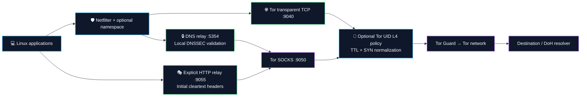
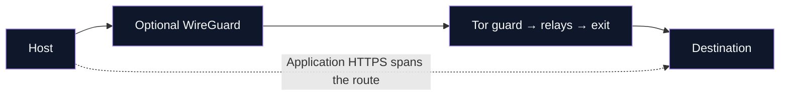

<a id="top"></a>

<p align="center">
  
</p>

<h1 align="center">Linux network privacy, in one terminal.</h1>
<p align="center">
  Route TCP through Tor. Validate DNS locally. Make verified HTTPS requests with browser TLS profiles.<br>
  <b>Configure a session. Inspect the route. Restore your settings.</b>
</p>

<p align="center">
  <a href="#installation"></a>
  <a href="#cli-reference"></a>
  <a href="#privacy-matrix"></a>
</p>

<p align="center">
  
  
  
  <a href="#validation"></a>
  <a href="LICENSE"></a>
  <a href="https://github.com/ByGh00st/wraith/stargazers"></a>
</p>

---

**Wraith is an open-source Linux Tor proxy and privacy session manager.** It brings network routing, DNSSEC over DoH, browser-profile HTTPS requests and recoverable host controls into a Rust CLI with a localized terminal interface.

<table>
<tr>
<td width="50%" valign="top">
<h3>🌐 Choose your route</h3>
<p>Tor TCP routing, optional network namespaces and Tor-over-WireGuard, with session controls in one place.</p>
<a href="#core-architecture">Explore the architecture →</a>
</td>
<td width="50%" valign="top">
<h3>🔒 Verify your connections</h3>
<p>Local DNSSEC validation over Tor DoH. Certificate-verified HTTPS with Chrome, Firefox or Safari TLS profiles.</p>
<a href="#browser-tls">See TLS profiles and scope →</a>
</td>
</tr>
<tr>
<td width="50%" valign="top">
<h3>⌨️ Stay in the terminal</h3>
<p>Interface and resolver selectors, circuit telemetry, 17 locales and a concise command workflow.</p>
<a href="#cli-reference">Find your command →</a>
</td>
<td width="50%" valign="top">
<h3>↩️ Keep a way back</h3>
<p>Recorded configuration changes, explicit session shutdown and retryable recovery when cleanup fails.</p>
<a href="#full-security">Read setup and recovery →</a>
</td>
</tr>
</table>

### A session in three commands

After [installation](#installation), start a session and inspect or stop it from the terminal.

```bash
sudo wraith -s     # Start the background session worker
sudo wraith -i     # Inspect status and Tor circuits
sudo wraith -x     # Stop and restore recorded settings
```

<p align="center">
  <a href="#installation"><b>Installation</b></a> · <a href="docs/wiki/Home.md"><b>Wiki Guides</b></a> · <a href="#browser-tls">TLS Profiles</a> · <a href="#privacy-matrix">Comparison</a> · <a href="#updates">Updates</a> · <a href="#codebase-metrics">Source Metrics</a> · <a href="#validation">Validation</a>
</p>

<details>
<summary><b>Browse the complete technical guide</b></summary>

## 📋 Table of Contents

- [🌌 System Overview](#system-overview)
- [📊 Codebase Metrics & Language Breakdown](#codebase-metrics)
- [⚡ Core Architectural Pillars](#core-architecture)
- [🛡️ Privacy & Security Comparison Matrix](#privacy-matrix)
- [📂 Modular Crate Topology](#crate-topology)
- [🚀 Quickstart & Installation](#installation)
  - [1. Automated System Deployment](#1-clone--automated-system-deployment)
  - [2. Manual Cargo Compilation & Binary Setup](#2-manual-cargo-compilation--binary-setup)
  - [3. Systemd Daemon Deployment](#3-systemd-daemon-deployment)
- [💻 Operational Command Reference](#cli-reference)
  - [📋 Primary Shortcuts & Subcommands](#-primary-shortcuts--subcommands)
  - [🖧 Hardware Interface Selector (`wraith interfaces`)](#hardware-interface-selector)
  - [🔒 Encrypted DNS-over-HTTPS (`wraith doh`)](#dns-over-https)
  - [🌉 Tor Moat Protocol & Bridge Discovery (`wraith bridge`)](#tor-moat-protocol)
  - [🌐 17-Language i18n Architecture](#enterprise-i18n)
  - [🛠️ Granular Control Flags Matrix](#granular-control-flags)
  - [🛡️ Operational Usage Examples](#operational-usage-examples)
- [🛡️ HTTP Header Normalization & Signature Catalog](#dpi-sanitization)
  - [🔐 Real ClientHello Profiles: JA3 / JA4 Scope](#browser-tls)
  - [🌊 Encrypted Cover Requests](#cover-requests)
  - [🎯 Signature Catalog Categories (1,338 Entries)](#supported-tool-matrix)
  - [🎭 Diversified Multi-Browser User-Agent Pool](#diversified-ua-pool)
- [🛡️ Tor Threats & Operational Boundaries](#tor-defense)
- [🔒 In-Memory Cryptographic Security Specifications](#memory-security)
- [🛡️ Fail-Closed Crash Protection & Panic Sentry](#panic-sentry)
- [🔧 Full-Security Setup & Recovery](#full-security)
- [🧬 L4 TCP Profiles & Tor Access-Link Normalization](#l4-tcp-profiles)
- [⬆️ Official GitHub Updates](#updates)
- [🧪 Development & Validation](#validation)
- [⚖️ Legal & Operational Disclaimer](#legal-disclaimer)
- [🤝 Project guides](#project-guides)
- [📜 License](#-license)

</details>


---

<a id="system-overview"></a>
## 🌌 System Overview

**Wraith** brings Tor routing, DNS policy, host settings and a localized terminal interface into one Linux session manager. Its six-crate Rust workspace combines netfilter rules, network namespaces, a local HTTP relay and optional browser controls.

Start a session, inspect its status, and stop it to restore recorded settings. Advanced presets and their host prerequisites are covered in [setup and recovery](#full-security).

| Layer | Role |
| :--- | :--- |
| 🌐 Network | Tor TCP routing, dedicated Tor UID, IPv6 firewall rules and optional namespace/WireGuard |
| 🧬 Transport | Namespace TCP profiles and Tor-to-Guard TTL, SYN option order and MSS normalization |
| 🔒 DNS | UDP/TCP local relay, Tor DoH transport and local DNSSEC proof validation |
| 🎭 Application | Initial cleartext HTTP header normalization and managed browser preferences |
| 🧠 Host | Reversible sysctl/configuration snapshots, memory controls and strict prerequisites |
| 💻 Operations | Interface selection, 17-language TUI, circuit telemetry and official GitHub updates |

**Validation scope:** portable regressions and Linux cross-compilation are checked. Live Linux network integration remains unverified; see [development and validation](#validation) for the measured results.

---

<a id="codebase-metrics"></a>

## 📊 Codebase Metrics & Language Breakdown

<details open>
<summary><b>Source snapshot · Tokei 12.1.2 · 2026-09-24</b></summary>

Measured **2026-09-24** with Tokei 12.1.2. Scope: source crates, manifests, Cargo configuration and the three shell scripts; standalone documentation and build output are excluded. Embedded Rust documentation is reported by Tokei under Markdown.

```sh
tokei crates Cargo.toml .cargo build.sh install-daemon.sh uninstall.sh
```

```text
===============================================================================
 Language            Files        Lines         Code     Comments       Blanks
===============================================================================
 Shell                   3          597          498           45           54
 TOML                    8          230          213            0           17
 YAML                  342        12239        12236            0            3
-------------------------------------------------------------------------------
 Rust                   76        23759        20771          686         2302
 |- Markdown            69          765            3          720           42
 (Total)                          24524        20774         1406         2344
===============================================================================
 Total                 429        36825        33718          731         2376
===============================================================================
```

</details>

---

<a id="core-architecture"></a>
## ⚡ Core Architectural Pillars



L4-enabled sessions normalize the Tor access link before the first Guard connection, targeting the TCP fields visible to a local ISP or firewall. Shared Tor exits are unchanged; no VPS is required.

The watchdog preserves application egress restrictions when Tor becomes unhealthy. WireGuard, when selected, carries Tor's outer connection. The packet monitor supplies observations, while netfilter and namespace rules enforce egress policy.

---

<a id="privacy-matrix"></a>
## 🛡️ Privacy & Security Comparison Matrix

<p align="center">
  <b>Different tools. Different boundaries. One detailed comparison.</b><br>
  Compare routing, application privacy and everyday operation by documented capability.
</p>

<p align="center">
  <a href="#matrix-network">🌐 Network</a> · <a href="#matrix-privacy">🔐 Privacy</a> · <a href="#matrix-workflow">⌨️ Workflow</a> · <a href="#matrix-evidence">📚 Evidence</a>
</p>

| ✅ Supported | ◐ Conditional / limited | ❌ Not provided in the compared scope | — Not established / not applicable |
| :---: | :---: | :---: | :---: |

**Read the qualifiers:** a tick means an implemented or documented capability, not a security score. Optional controls still require configuration. Wraith's privileged paths have portable tests and Linux cross-compilation coverage; live Linux network integration remains unverified.

<a id="matrix-network"></a>
### 🌐 01 / Network & transport

| Capability | 👻 **Wraith** | 🦜 **AnonSurf** | 👤 **TorGhost** | 🔗 **Proxychains-NG** | 💿 **Tails** |
| :--- | :---: | :---: | :---: | :---: | :---: |
| **Host-level Tor TCP routing** | ✅ Netfilter | ✅ Netfilter | ✅ Netfilter | ❌ Per-app hooks | ✅ OS policy |
| **Application socket proxying** | ◐ Local Tor relay | — | — | ✅ SOCKS / HTTP chains | ◐ Tor applications |
| **Non-Tor egress restrictions** | ✅ Strict policy | ◐ LAN exclusions | ◐ LAN exclusions | ❌ No host firewall | ✅ OS policy¹ |
| **DNS sent through Tor** | ✅ DoH relay | ✅ Tor DNS | ✅ Tor DNS | ◐ Proxy DNS setup | ✅ Integrated |
| **Local DNSSEC proof validation** | ✅ Hickory | — | ❌ Tor DNS only | ❌ No validator | — |
| **TCP + UDP port-53 interception** | ✅ Both | ◐ UDP rule | ◐ UDP rule | ❌ No interception | — |
| **Explicit host IPv6 restriction** | ✅ Session rules | ✅ Disable IPv6 | ❌ No IPv6 rule² | ❌ No host policy | — |
| **General UDP transport through Tor** | ❌ | ❌ | ❌ | ❌ | ❌ |

<a id="matrix-privacy"></a>
### 🔐 02 / Application privacy & recovery

| Capability | 👻 **Wraith** | 🦜 **AnonSurf** | 👤 **TorGhost** | 🔗 **Proxychains-NG** | 💿 **Tails** |
| :--- | :---: | :---: | :---: | :---: | :---: |
| **Selectable Chrome / Firefox / Safari TLS client** | ✅ Owned requests³ | — | ❌ | ❌ App TLS | ◐ Tor Browser⁴ |
| **Initial cleartext HTTP header normalization** | ◐ Local relay | — | ❌ | ❌ | — |
| **Other apps' HTTPS ClientHello rewriting** | ❌ CONNECT passthrough | — | ❌ | ❌ | — |
| **Saved firewall restoration** | ✅ Journaled tables | ✅ Saved rules | ❌ Flush/reset² | — No host policy | — Separate OS |
| **Resolver backup / restoration** | ✅ Saved entry | ✅ dnstool | ✅ Backup file | — | — Separate OS |
| **MAC address randomization** | ✅ Optional | — | ❌ | ❌ | ✅ Default⁵ |
| **Encrypted persistent OS storage** | ❌ Runtime vault only | ❌ Host tool | ❌ Host tool | ❌ App tool | ✅ Optional⁶ |
| **Browser privacy preferences** | ✅ Managed profiles | — | ❌ | ❌ | ✅ Tor Browser⁴ |

<a id="matrix-workflow"></a>
### ⌨️ 03 / Deployment & daily workflow

| Capability | 👻 **Wraith** | 🦜 **AnonSurf** | 👤 **TorGhost** | 🔗 **Proxychains-NG** | 💿 **Tails** |
| :--- | :---: | :---: | :---: | :---: | :---: |
| **Use on an existing Linux installation** | ✅ | ✅ Parrot focus | ✅ | ✅ | ❌ Boot environment |
| **Dedicated bootable privacy OS** | ❌ | ❌ | ❌ | ❌ | ✅ |
| **Graphical desktop interface** | ❌ Terminal UI | ✅ GTK | ❌ CLI | ❌ CLI | ✅ Desktop |
| **Native runtime on a non-Linux OS** | ❌ Runtime | ❌ | ❌ | ✅ BSD / macOS / others | ❌ Dedicated OS |
| **Start / stop command workflow** | ✅ Sessions | ✅ Sessions | ✅ Sessions | ◐ Per process | ◐ Boot / shutdown |
| **Operator-requested Tor identity change** | ✅ NEWNYM | ✅ Identity action | ✅ NEWNYM | — Upstream proxy | ✅ Tor Browser⁴ |

<a id="matrix-evidence"></a>
<details open>
<summary><b>📚 Evidence, scope and comparison notes</b></summary>

Reviewed **2026-09-11** against upstream documentation and source. A dash is deliberately not a cross: an unverified capability must not be presented as absent. These projects differ in deployment scope; there is no overall winner or calculated anonymity score.

1. [How Tails works](https://tails.net/about/index.en.html) describes its integrated environment and Tor limits. Its explicitly separate Unsafe Browser is not an anonymous Tor browsing path.
2. [TorGhost routing source](https://github.com/SusmithKrishnan/torghost/blob/master/torghost.py) defines the compared rules, resolver backup and stop/reset behavior. Entries describe that implementation, not every possible external Tor configuration.
3. Wraith's profiles apply to `fetch`, its native client API and DoH. The HTTP relay normalizes the first cleartext request; CONNECT retains application TLS. [TLS scope](#browser-tls) · [Threat model](docs/THREAT_MODEL.md) · [Validation](#validation).
4. Tails integrates Tor Browser; this is not equivalent to a three-profile HTTP client API. Browser identity controls have a different scope from system-wide identity changes. See [Tails included software](https://tails.net/doc/about/features/index.en.html).
5. [Tails MAC address anonymization](https://tails.net/doc/first_steps/welcome_screen/mac_spoofing/index.en.html) documents its defaults and compatibility limits.
6. [Tails Persistent Storage](https://tails.net/doc/persistent_storage/index.en.html) is encrypted optional storage. Wraith's in-memory vault serves a different purpose.

Additional sources: [AnonSurf routing and restoration](https://github.com/ParrotSec/anonsurf/blob/master/scripts/anondaemon), [AnonSurf project and interfaces](https://github.com/ParrotSec/anonsurf), [Proxychains-NG capabilities and compatibility](https://github.com/rofl0r/proxychains-ng#readme).

</details>

### Inside Wraith

<details>
<summary><b>Implementation details &amp; practical boundaries</b></summary>

| Capability | Implementation | Boundary |
| :--- | :--- | :--- |
| Tor routing | IPv4 TCP redirection and dedicated Tor UID | Arbitrary UDP/QUIC is not carried by Tor |
| Strict kill switch | Preserves scoped policy on Tor failure | No measured sub-millisecond response guarantee |
| Tor access-link L4 | UID-scoped TTL and NFQUEUE SYN option/MSS normalization | Native window/scale and Tor TLS remain unchanged; live wire validation pending |
| DNSSEC | Local chain/proof validation over Tor DoH | Authenticated unsigned delegations remain unsigned |
| DNS interception | UDP/TCP port 53 reaches the local relay | Application-selected encrypted DNS is a separate flow |
| IPv6 control | Session firewall blocking | Live route and teardown validation remains required |
| HTTP normalization | Cleartext headers, absolute URLs and CONNECT tunnels | CONNECT preserves the application TLS stream |
| Browser TLS / HTTP2 | BoringSSL-backed Chrome, Firefox and Safari profiles | Wraith-owned requests and supported integrations only |
| Cover traffic | Real HTTPS requests over Tor every 15–45 seconds | Explicit endpoint; no proven correlation resistance |
| Browser hardening | Managed preferences preserving user.js | Verify the profile actually used |
| Font controls | Fontconfig restrictions and saved-file restoration | No universal fixed font-count guarantee |
| Memory controls | AEAD vault, zeroization and process locking | Does not isolate from a compromised kernel |
| Optional netem | Owned qdisc and guarded cleanup | No demonstrated traffic-correlation resistance |
| Recovery | Pre-mutation journals and retryable cleanup | Unrelated privileged writers are not coordinated |

</details>

<p align="center"><a href="#installation"><b>Get started →</b></a> · <a href="#browser-tls">Explore TLS profiles</a></p>

---

<a id="crate-topology"></a>

## 📂 Modular Crate Topology

Wraith is cleanly architected into 6 Rust crates with separate responsibilities:

<details>
<summary><b>Explore the six-crate source tree</b></summary>

```
wraith/
├── Cargo.toml                              # Workspace Root Manifest (v1.3.0)
├── LICENSE                                 # GNU General Public License v3.0 (GPLv3)
├── README.md                               # Operational Architecture & Documentation
├── SECURITY.md                             # Private Vulnerability Reporting Policy
├── CONTRIBUTING.md                         # Development & Review Guide
├── SUPPORT.md                              # Support Routes & Troubleshooting
├── CODE_OF_CONDUCT.md                      # Community Expectations
├── docs/THREAT_MODEL.md                    # Protection Scope & Trust Assumptions
├── build.sh                                # User-Privilege Build & Atomic Installation
├── install-daemon.sh                       # Systemd Network-Online Service Deployment
├── uninstall.sh                            # Uninstaller with Recorded-Session Cleanup
└── crates/
    ├── wraith-core/                        # [Core & Memory Security Layer]
    │   ├── locales/                        # Localized Core & Crypto Dictionaries
    │   ├── src/crypto.rs                   # SHA-256 and HMAC Utilities
    │   ├── src/vault.rs                    # Encrypted RAMFS Vault (RFC 8439 ChaCha20-Poly1305, mlockall, ZeroizeOnDrop)
    │   ├── src/kernel_lockdown.rs          # Strict Prerequisites & Reversible Sysctl Controls
    │   ├── src/process_lockdown.rs         # Process Memory Lockdown (PR_SET_DUMPABLE=0, PR_SET_NO_NEW_PRIVS)
    │   ├── src/file_snapshot.rs            # Retryable Configuration Snapshots
    │   ├── src/signed_update.rs            # Optional Minisign Release Verification
    │   ├── src/config.rs                   # Runtime Paths, Socket Addresses & Security Defaults
    │   └── src/state.rs                    # Atomic State Lifecycle & Safe Persistence
    │
    ├── wraith-net/                         # [Kernel Networking & DPI Layer]
    │   ├── locales/                        # Localized Network & DPI Dictionaries
    │   ├── src/netlink.rs                  # Direct AF_NETLINK Route, Link, Address & FIB Rule Engine
    │   ├── src/ids.rs                      # Packet Dissection & 1,338-Entry Signature Helpers
    │   ├── src/tcp_stack.rs                # Selected TCP/IP Stack Parameter Normalization (TTL=128, TS=0)
    │   ├── src/multihop.rs                 # Tor-over-WireGuard Outer Tunnel
    │   ├── src/ebpf_fastpath.rs            # Experimental Fastpath Helpers (Not Active Egress Policy)
    │   ├── src/ipv6.rs                     # IPv6 Dual-Stack Blackout & Leak Guard
    │   ├── src/mac.rs                      # IEEE 802.3 Hardware MAC Address & Hostname Randomizer
    │   ├── src/namespace.rs                # Isolated Kernel Network Namespace (veth jail)
    │   ├── src/tcp_egress.rs                # Tor UID policy, queue ownership and telemetry
    │   ├── src/tcp_wire.rs                  # Checked SYN option/MSS rewrite and checksums
    │   ├── src/nfqueue.rs                   # Owned netlink queue transport (safe Rust)
    │   ├── src/nftables.rs                 # Journaled iptables Rule Manager
    │   ├── src/cgroup_jail.rs              # Cgroup Membership Management
    │   └── src/traffic_shaper.rs           # Kernel TC/Netem Traffic Shaping (Jitter & Latency Obfuscation)
    │
    ├── wraith-guard/                       # [Defense & DNS Engine]
    │   ├── locales/                        # Localized Guard & DNS Dictionaries
    │   ├── src/dns_engine.rs               # UDP/TCP DNS Relay, DoH Transport & Sinkhole
    │   ├── src/dnssec.rs                   # Local DNSSEC Validator over Tor DoH
    │   ├── src/killswitch.rs               # Bounded Tor Health Checks & Policy Preservation
    │   ├── src/traffic_jitter.rs           # Bounded HTTPS Cover Requests over Tor
    │   ├── src/bpf_filter_engine.rs        # Classic BPF / eBPF Raw Packet Assembly & Filtering
    │   ├── src/seccomp_jail.rs             # Ptrace-Deny Filter with Thread Synchronization
    │   ├── src/honey_ports.rs              # Deceptive Honey-Port Listeners & Inbound Scanner Trap
    │   └── src/leak.rs                     # Multi-Vector Egress Leak Auditor
    │
    ├── wraith-tor/                         # [Tor Transport & HTTP Relay Layer]
    │   ├── locales/                        # Localized Tor Transport Dictionaries
    │   ├── src/grease.rs                   # TLS/HTTP2 Profile Metadata Helpers
    │   ├── src/browser_tls.rs              # Verified Browser TLS/HTTP2 Client over Tor
    │   ├── src/proxy_request.rs            # CONNECT / HTTP Authority & Framing Validation
    │   ├── src/tls_camouflage.rs           # HTTP Relay with Tor SOCKS Transport
    │   ├── src/multichain.rs               # Five-Eyes Exclusion Matrix & Strict Geographic Exit Profiler
    │   ├── src/circuit.rs                  # Multi-Hop Circuit Topology & Live Telemetry Inspector
    │   ├── src/control.rs                  # Tor Control Protocol Interface (SIGNAL NEWNYM, Telemetry)
    │   ├── src/onion_service.rs            # Ephemeral v3 Onion Hidden Service Controller
    │   ├── src/daemon.rs                   # Isolated Tor Daemon Lifecycle & Sandboxed Process Manager
    │   └── src/bridge.rs                   # obfs4 / Snowflake Pluggable Transport Manager
    │
    ├── wraith-forensic/                    # [Anti-Forensics & Hardware Cloaking Layer]
    │   ├── locales/                        # Localized Anti-Forensics Dictionaries
    │   ├── src/shred.rs                    # Multi-Pass Crypto Shredder with FS Sync & Zeroization
    │   ├── src/memory.rs                   # Volatile RAM & Swap Partition Cleaner (with 5s Emergency Timeout)
    │   ├── src/anti_debug_probe.rs         # Dynamic RE Detection (PTRACE_TRACEME, TracerPid Probe)
    │   ├── src/anti_fingerprint.rs         # WebGL, Canvas, AudioContext & Letterboxing Profile Hardener
    │   ├── src/font_jail.rs                # Fontconfig Restrictions & Cache Refresh
    │   ├── src/display_jail.rs             # Xvfb Standardized 1920x1080@24bit Virtual Display Sandbox
    │   ├── src/hardware_cloaker.rs         # Hardware Serial & /etc/machine-id Mutator
    │   ├── src/browser.rs                  # Firefox Profile user.js Automated Security Injector
    │   └── src/logs.rs                     # System Journal, Bash History & Memory Dump Sanitizer
    │
    └── wraith-cli/                         # [Command Interface, Localized TUI & Completions]
        ├── locales/                        # 17 Native YAML Language Dictionaries
        ├── src/display.rs                  # Universal Box Renderer, Dynamic ANSI Width Calculator & Help Matrix
        ├── src/commands.rs                 # Operational Command Handlers with Graceful Cleanup Hooks
        ├── src/tui.rs                      # Native Rust Terminal UI & 17-Language Interactive Selector
        ├── src/diagnostics.rs              # Deep Kernel, Sysctl & Network Health Auditor (Doctor Mode)
        └── src/benchmark.rs                # High-Performance Cryptographic & Kernel Benchmark Suite
```

</details>
<p align="right"><a href="#top">⬆ Back to Top</a></p>

---

<a id="installation"></a>
## 🚀 Quickstart & Installation

### 1. Clone & Automated System Deployment

The runtime targets **x86_64 Linux**, primarily Debian/Kali-style installations. Windows supports portable development tests, not privileged network sessions.

```bash
git clone https://github.com/ByGh00st/wraith.git
cd wraith
chmod +x build.sh
sudo ./build.sh
```

Install Rust under your ordinary account first. The helper installs Debian-family dependencies, builds the locked workspace as the invoking user, and atomically installs one executable. Existing sessions keep running; firewall, resolver and filesystem mount settings are preserved. See [build.sh](build.sh).

### 2. Manual Cargo Compilation & Binary Setup

Use current stable Rust (dependencies require at least Rust 1.88) and C/C++ compilers, CMake, Perl and libclang for BoringSSL. Build as your ordinary account, then install the executable:

```bash
cargo build --release --locked
sudo install -m 0755 target/release/wraith /usr/local/bin/wraith
wraith --version
wraith --help
```

| Dependency | Required for |
| :--- | :--- |
| Tor and dedicated `debian-tor` account | Tor transport; UID 0 is never a fallback |
| Dedicated `/run/wraith-tor` and `/var/lib/wraith/tor` | Wraith Tor runtime and data; system Tor files are kept separate |
| iproute2 (`ip`, `tc`) | Interfaces, namespaces and optional shaping |
| util-linux (`nsenter`) | Execute TCP settings through a pinned namespace descriptor |
| iptables/ip6tables plus save/restore tools | Session policy and recovery snapshots |
| CMake, Perl, libclang, C/C++ compiler | Native browser TLS engine build, including source updates |
| curl | Connectivity and bridge helper requests |
| fontconfig / `fc-cache` | Font sandbox application and restoration |
| WireGuard tools | Optional `-W` outer tunnel |
| Xvfb and `xauth` | Optional private virtual display |
| Pluggable transport executable | Selected Tor bridge transport |

### 3. Systemd Daemon Deployment

```bash
sudo ./install-daemon.sh
# Or configure without the wizard:
sudo ./install-daemon.sh --non-interactive --boot-mode standard --profile stealth --doh quad9
```

Default service ordering follows `network-online.target`; installation does not immediately start a session. Unsupported `--boot-mode early` is rejected. Inspect the generated unit and strict prerequisites before enabling it. The service does not establish protection for all early-boot traffic.

<p align="right"><a href="#top">⬆ Back to Top</a></p>

---

<a id="cli-reference"></a>

## 💻 Operational Command Reference

```bash
sudo wraith [SHORTCUTS | OPTIONS] [COMMAND]
```

### 📋 Primary Shortcuts & Subcommands

| Shortcut | Command Format | Operational Action |
| :--- | :--- | :--- |
| `-s` | `sudo wraith -s [OPTIONS]` / `wraith start` | **Start Wraith Engine**: Initializes fail-closed routing and selected hardening layers. |
| `-x` | `sudo wraith -x [-d]` / `wraith stop` | **Stop Wraith**: Restores normal network, netfilter rules, and DNS. (`-d` self-destructs binary). |
| `-r` | `sudo wraith -r` / `wraith switch` | **Circuit Rotation**: Issues `SIGNAL NEWNYM` to request a fresh Tor exit node identity. |
| `-t` | `sudo wraith -t` / `wraith test` | **Multi-Vector Leak Audit**: Evaluates IPv4/IPv6, DNS integrity, and RFC 5389 Dual-Stack (UDP + TCP) WebRTC STUN coverage. |
| `-i` | `sudo wraith -i` / `wraith info` | **Status Telemetry**: Displays live connection status, active exit IP, and circuit topology. |
| `-p` | `sudo wraith -p <NAME>` / `wraith profile` | **Geographic Exit Profiler**: Enforces Tor exit nodes (`stealth`, `speed`, `journalists`, `research`, `darkweb`). |
| `-F` | `sudo wraith -F` / `wraith -s -F` | **Strict Preset**: Requires core setup and the kill switch; see prerequisites below. |
| `-K` | `sudo wraith -s -K` / `--kworker` | **Process Masquerade**: Sets process name in Linux kernel scheduler as `[kworker/u16:0]` via prctl. |
| `-u` | `sudo wraith -u` / `wraith update` | **Official GitHub Update**: Validates the official clone and fast-forwards source; run `sudo ./build.sh` to build and install. |
| `-c` | `sudo wraith -c` / `wraith cleanup`| **Volatile State Purge**: Clears volatile RAM caches, DNS cache, and ephemeral session traces. |
| — | `sudo wraith --cleanup-full` | **Deep Storage Purge**: Sanitizes RAM, swap partitions, and transient system authentication logs. |
| `-M` | `sudo wraith -M` / `wraith monitor` | **Real-Time DPI Monitor**: Streams in-flight HTTP port 9055 packet inspections and signatures. |
| — | `sudo wraith doctor` | **Kernel Diagnostics Auditor**: Audits IPv4/IPv6 sysctl parameters, Tor daemon state, Netlink sockets, and Seccomp filters. |
| — | `sudo wraith benchmark` | **Cryptographic Benchmark**: Evaluates ChaCha20-Poly1305, SHA-256, HMAC, and Netlink throughput. |
| — | `sudo wraith mac` | **Hardware Randomizer**: Randomizes L2 MAC address and system hostname immediately. |
| — | `sudo wraith pentest` | **Security Audit Guide**: Displays isolation guidelines for Nmap, Sqlmap, Ffuf, Metasploit. |
| — | `sudo wraith shred <FILE>` | **DoD 7-Pass Shredder**: Overwrites and zeroizes files using DoD 5220.22-M specification. |
| — | `sudo wraith interfaces` | **Hardware Interface Selector**: Inspects and binds to physical network interfaces. |
| — | `sudo wraith doh` | **Encrypted DoH**: Selects or configures DNS-over-HTTPS providers (Cloudflare, Quad9, Google, AdGuard, Mullvad, Custom). |
| — | `wraith bridge` | **Bridge discovery**: Lists pools; `sudo wraith bridge moat` discovers and configures supported obfs4/snowflake/meek-azure transports. |
| — | `sudo wraith --select-lang` | **17-Language Selector**: Launches interactive Unicode terminal UI to change system language. |
| — | `sudo wraith --lang <CODE>` | **Runtime Language Override**: Dynamically executes any command in any of the 17 supported locales. |

---

### Command selection and option scope

Choose one operation per invocation. Both forms below are supported:

```bash
sudo wraith -Fs --morph-l4 auto
sudo wraith start -F --morph-l4 auto
sudo wraith info -v --lang tr
```

Session options belong after `start`, or alongside `-s` at the root. `wraith -F start`, competing shortcuts such as `-s -i`, and session options attached to status/update/stop are rejected rather than ignored. `-x -d` remains the explicit self-destruct stop form; `-c --cleanup-full` remains a single cleanup operation. Global `-v` and `--lang` also work after subcommands. Use `exec -- PROGRAM ...` to keep application options outside Wraith's parser.

Ordinary `-s` sessions start a background worker. Full-security settings are resolved from configuration before this decision. Interactive interface/DoH selection stays in the foreground and requires a terminal; a daemon worker must receive explicit values. Help and completion output use the actual parser schema, including L4/TLS options and subcommand aliases.

Rotation accepts **1..4294967295 seconds**; omit the setting to disable it. The service installer separately accepts `--rotate 0` as disabled. Shred passes must be **1..255**. Unsupported bridge transports, invalid onion ports and conflicting selection flags fail before session changes begin.

<a id="hardware-interface-selector"></a>
### 🖧 Hardware Interface Selector (`wraith interfaces`)

```bash
sudo wraith interfaces
sudo wraith interfaces --all
sudo wraith start --select-interface
sudo wraith start -I wlan0
sudo wraith -Fs -I eth0
```

Select the intended egress adapter on machines with multiple interfaces. MAC randomization can interrupt Wi-Fi association or DHCP; the original address is recorded before changes. Interface selection does not isolate the machine from other root processes.

---

<a id="dns-over-https"></a>
### 🔒 Encrypted DNS-over-HTTPS (`wraith doh`)

```bash
wraith doh                       # Show resolver choices
sudo wraith doh --select          # Interactive selection
sudo wraith -s -D quad9
sudo wraith -s -D cloudflare
sudo wraith -s -D mullvad
sudo wraith -s -D https://resolver.example/dns-query
```

| DNS stage | Behavior |
| :--- | :--- |
| Client transport | UDP and TCP on local port 5354 |
| Default upstream | Quad9 DoH through Tor SOCKS; `-D` selects another preset/URL |
| Validation | [Hickory DNSSEC](https://docs.rs/hickory-net/0.26.3/hickory_net/dnssec/struct.DnssecDnsHandle.html) with built-in root trust anchors |
| Trust checks | Bogus/indeterminate proofs rejected; upstream AD cannot replace validation |
| Unsigned zones | Authenticated insecure delegations accepted without authenticated-data labeling |
| Failures | SERVFAIL without an unvalidated fallback |
| Large replies | UDP truncation requests a TCP retry |
| Limits | Bounded tasks, response size and operation deadlines |

Every validation lookup uses Tor DoH. Client CD flags cannot disable gateway validation. The sinkhole intentionally synthesizes local policy responses. `UdpTor` remains an explicit nonvalidating library transport for legacy callers; CLI startup selects validating DoH.

Resolver bootstrap/availability still depend on Tor. DNSSEC does not make unsigned domains signed or replace HTTPS certificate checks.

---

<a id="tor-moat-protocol"></a>
### 🌉 Tor Moat Protocol & Bridge Discovery (`wraith bridge`)

```bash
wraith bridge list
sudo wraith bridge moat --transport obfs4
sudo wraith bridge moat --transport snowflake
sudo wraith -s --bridge --bridge-type obfs4
sudo wraith -s --bridge --bridge-type snowflake
```

Discovery and transport launch are separate steps. A listed bridge is not proof of present reachability. Install the selected transport executable and inspect Tor startup results. Captcha-assisted Moat discovery and fallback pools depend on upstream availability.

Use `wraith bridge --help` and `wraith bridge moat --help` for supported forms. Unsupported transports, including WebTunnel, return an error; they do not silently select another transport. Old examples such as `bridge --test` are not valid CLI commands.

---

<a id="enterprise-i18n"></a>
### 🌐 Internationalization (17 Locales)

The selector uses the 17 dictionaries shipped in this workspace. `/etc/wraith/lang` stores the system selection; `--lang` overrides it for one command.

```bash
sudo wraith --select-lang
wraith --lang tr --help
wraith --lang en doh
```

| Languages | Codes |
| :--- | :--- |
| English · Turkish · Azerbaijani | `en` · `tr` · `az` |
| German · French · Spanish · Italian | `de` · `fr` · `es` · `it` |
| Portuguese · Dutch · Polish | `pt` · `nl` · `pl` |
| Russian · Ukrainian | `ru` · `uk` |
| Arabic · Persian | `ar` · `fa` |
| Chinese · Japanese · Korean | `zh` · `ja` · `ko` |

The TUI supports arrow/page navigation and confirmation. Translation coverage can differ by message; locale count does not imply every diagnostic is translated.

---

<a id="granular-control-flags"></a>

### 🛠️ Granular Control Flags Matrix

<details open>
<summary><b>⚙️ Click to Expand / Collapse Full CLI Flag & Option Tree</b></summary>

```text
Quick Shortcuts:
  -s, --start                      Quick start shortcut with active options
  -x, --stop                       Quick stop shortcut (restores clean clearnet)
  -r, --switch                     Request new Tor exit identity (Newnym)
  -t, --test                       Run bounded connectivity checks
  -i, --info                       Display live telemetry dashboard & circuits
  -u, --update                     Fast-forward official source; build separately
  -c, --cleanup                    Anti-forensic RAM and state purge
      --cleanup-full               Thorough anti-forensic purge (RAM, swap, auth logs)
  -M, --monitor                    Launch packet-observation monitor
Network Isolation & Tunneling:
  -m, --mac                        Randomize network interface L2 MAC address and hostname
  -b, --bridge                     Route traffic through censorship-resistant obfs4 Tor bridges
  -n, --namespace                  Restrict routing to an isolated Linux Network Namespace (10.200.1.0/24)
  -p, --profile <PROFILE>          Enforce geographic Tor exit node profile (stealth, speed, journalists, research, darkweb)
      --rotate-interval <SECS>     Automatically rotate Tor exit node identity every N seconds (e.g. --rotate 60)
                                   [aliases: --interval, --rotate, --auto-rotate]
      --jitter                     Enable bounded HTTPS cover requests over Tor
      --jitter-endpoint <HTTPS_URL> Required endpoint you control or are authorized to use
      --no-killswitch [--no-ks]    Unsupported legacy option: rejected; kill switch is mandatory
  -W, --wireguard <CONF>           Encapsulate Tor traffic inside a kernel WireGuard tunnel (Multi-Hop DPI/ISP bypass)
      --onion <VIRT:TARGET>        Provision an Ephemeral v3 Onion Hidden Service (e.g. --onion 80:8080)
                                   [aliases: --onion-service, --hidden-service]
      --shaper                     Inject Linux Kernel TC Netem traffic shaping (35ms delay, 12ms jitter)
                                   [aliases: --traffic-shaper, --netem, --tc-shaper]
      --spawn-monitor              Automatically spawn dedicated DPI/IDS monitor window on startup
System Hardening & Anti-Fingerprinting:
      --honey-ports                Arm localhost deception honeypot traps (:2222, :3306, :5432, :6379, :8080, :27017)
                                   [aliases: --honeypot, --honey-trap, --trap-ports]
      --honey-lan                  🚨 LAN SENSOR MODE: Bind honeypots to the selected private LAN address
                                   [aliases: --lan-honeypot, --lan-trap, --deception-sensor]
      --display-sandbox            Spawn isolated X11 Virtual Display sandbox (Xvfb 1920x1080@24bit) to mask EDID
                                   [aliases: --virtual-display, --xvfb, --display-jail]
      --browser-shield             Inject WebGL, Canvas, Audio, GPU, Font and Resolution anti-fingerprint profiles
                                   [aliases: --shield, --canvas-shield]
      --font-sandbox               Restrict OS-level font discovery via Fontconfig sandbox
                                   [alias: --font-jail]
      --tcp-mask                   Normalize namespace TCP and Tor access-link SYNs (auto unless overridden)
      --morph-l4 <PROFILE>          auto | windows | windows11 | macos | linux | off
      --tls-profile <BROWSER>       Session DoH and cover-request TLS profile: chrome | firefox | safari
      --machine-id                 Rotate unique OS /etc/machine-id and system hardware identifiers
                                   [alias: --cloaking]
  -F, --full-security              Require Tor/DNSSEC, L4 auto + TLS, browser/font and memory controls
                                   [-Fs combines -F and -s; aliases: --full, --strict, --harden, --full-defense, --strict-hardening, --max-hardening]
Destructive Opt-In & Local Runtime Controls:
  -L, --forensic-wipe-logs         ⚠ IRREVERSIBLE: Purge system authentication logs, event logs, and shell history
                                   [aliases: --destructive-cleanup, --wipe-logs]
  -d, --forensic-self-destruct     ⚠ IRREVERSIBLE: Cryptographically shred binary from disk and wipe memory on exit
                                   [alias: --self-destruct]
  -K, --aggressive-masquerade      ⚠ MASQUERADE: Set process name in scheduler as kernel worker ([kworker/u16:0])
                                   [aliases: --process-masquerade, --cloaked-process]
  -A, --aggressive-anti-debug      ⚠ EMERGENCY ABORT: Immediately triggers SIGKILL if attached to a debugger
                                   [aliases: --anti-debug, --anti-ptrace]
General Options:
  -v, --verbose                    Enable verbose debug logging
      --lang <LANG>                Override system language (e.g. 'en', 'tr', 'ru', 'de')
      --select-lang                Launch interactive 17-language configuration terminal menu
  -h, --help                       Print comprehensive help screen
  -V, --version                    Print version information
```

</details>

---

<a id="operational-usage-examples"></a>
### 🛡️ Operational Usage Examples

```bash
# Foreground standard session
sudo wraith -s
# Strict/full-security preset on a prepared host
sudo wraith -Fs -I eth0
# MAC randomization and geographic exit profile
sudo wraith -s -m -p stealth
# Tor through an existing WireGuard configuration
sudo wraith -s -W /path/to/wg.conf
# Browser preferences and selected DoH provider
sudo wraith -s --browser-shield -D quad9
# Periodic identity requests
sudo wraith -s --rotate-interval 120
# Inspect and stop the session
sudo wraith -i
sudo wraith -x
# Update from official GitHub
sudo wraith -u
```

WireGuard mode accepts a single peer with an IPv4 CIDR address, a numeric IPv4 endpoint and `AllowedIPs = 0.0.0.0/0`. Preshared keys, keepalive, listen port and MTU are supported. Wraith manages DNS through its own relay and rejects shell hooks/custom routing tables. Existing interfaces and occupied routing resources are never replaced. The tunnel policy is installed before Tor bootstraps; a failed setup restores the session snapshots.

Wraith keeps its Tor data separate from the system Tor instance. Active system Tor services are recorded, temporarily stopped and restored on cleanup; their boot enablement is preserved. Process shutdown uses exact configuration matching and Linux pidfds. The HTTP/SOCKS relay releases connections after 120 seconds without transferred data. Initial HTTP responses and buffered request writes have a separate 10-second deadline, including CONNECT tunnel setup. Cache cleanup preserves active conntrack translations so existing proxied connections can continue.

Keep the foreground process running. Ctrl+C requests cleanup. NEWNYM does not migrate existing streams. Destructive cleanup/self-destruct options are not necessary for the strict preset.

<p align="right"><a href="#top">⬆ Back to Top</a></p>

---

<a id="dpi-sanitization"></a>
## 🛡️ HTTP Header Normalization & Signature Catalog

The source contains **1,338 signature entries** spanning HTTP clients and security tools. Matching text does not prove every named tool is proxied or indistinguishable from a browser.

The HTTP relay on port 9055 handles redirected port-80 traffic and performs initial-request User-Agent sanitization against the 1,338+ signature catalog before forwarding through Tor SOCKS. It removes `Forwarded`, `X-Forwarded-For`, `X-Real-IP`, `Via`, `Client-IP`, `True-Client-IP`, `X-Client-IP`, `X-Originating-IP` and proxy-only authentication/connection headers. Origin authorization, cookies and binary bodies are preserved. Later requests on a persistent stream are not reparsed. HTTPS CONNECT tunnels preserve the application's original TLS stream. The `AF_PACKET` packet monitor inspects copies for detection and alerting; wire sanitization is handled by the L7 proxy.

```text
Cleartext HTTP → HTTP relay :9055 → Tor SOCKS :9050 → destination
HTTPS CONNECT → tunnel through Tor → original TLS stream
Packet monitor → observations and counters
```

<a id="browser-tls"></a>
### 🔐 Real ClientHello profiles: JA3 / JA4 scope

Wraith now owns a real TLS client backed by **BoringSSL through [wreq](https://github.com/0x676e67/wreq)** and its emulation profiles. TLS cipher suites, extensions, ALPN and HTTP/2 settings come from the selected profile. This changes the actual connection handshake, rather than only a User-Agent string or a displayed fingerprint value.

| Profile | Pinned emulation | Used by |
| :--- | :--- | :--- |
| `chrome` | Chrome 131 / Windows | Default `fetch`, DNS-over-HTTPS and cover requests |
| `firefox` | Firefox 133 / Linux | Explicit `fetch` or Rust client integration |
| `safari` | Safari 18 / macOS | Explicit `fetch` or Rust client integration |

These are specific supported profiles, not a promise to impersonate the latest browser release. JA3/JA4 are fingerprinting schemes, not encryption or anonymity shields. Matching a handshake profile does not reproduce JavaScript, cookies, browser behavior or every network fingerprint.

```bash
# Start a Wraith/Tor session first, then fetch without root privileges.
wraith fetch https://example.org/ --tls-profile chrome --output page.html
wraith fetch https://example.org/ --tls-profile firefox --output firefox-page.html
wraith fetch --help
```

The client uses **SOCKS5 remote DNS**, certificate-chain and hostname verification, TLS 1.2 or newer, bounded timeouts, and an 8 MiB fetch limit. Redirects are not followed. Output is written atomically and existing files are not overwritten. A failed Tor connection does not fall back to a direct request.

Supported integrations can invoke `wraith fetch` or use the public `wraith_tor::BrowserTlsClient` API for HTTPS GET requests. The DNS relay uses the same client for DNS-message POST requests. Other applications can use the HTTP relay's CONNECT support, but retain their own TLS fingerprint. Wraith does not install a root CA or decrypt their HTTPS sessions.

<a id="cover-requests"></a>
### 🌊 Optional encrypted cover requests

```bash
# Replace this with an HTTPS endpoint you control or have permission to use.
sudo wraith -s --jitter --jitter-endpoint https://your-domain.example/cover
```

The worker performs a real HTTPS GET through Tor after each randomized **15–45 second** pause, caps each response at **16 KiB**, and cancels on session shutdown. It requires an explicit endpoint and is not automatically enabled by `-Fs`. This creates application traffic; it does not establish resistance to timing correlation.

The encoded catalog is an implementation detail, not encryption or an antivirus exclusion mechanism. Normalization does not guarantee non-detection or exemption from Tor-exit blocklists.

---

<a id="supported-tool-matrix"></a>

### 🎯 Signature Catalog Categories (1,338 Entries)

<details open>
<summary><b>🛡️ Expand / Collapse 1,338-Entry Signature Catalog</b></summary>

| Operational Category | Examples in the Signature Catalog |
| :--- | :--- |
| **💥 Vulnerability Assessment & Compliance Scanners** | `sqlmap`, `nuclei (ProjectDiscovery)`, `httpx`, `Ghauri`, `Commix`, `dalfox`, `XSStrike`, `NoSQLMap`, `SQLiX`, `WPScan`, `Joomscan`, `Droopescan`, `Nikto`, `CMSmap`, `Sipvicious`, `OpenVAS`, `Nessus`, `Nexpose`, `Acunetix`, `Arachni`, `Wapiti`, `Vega`, `Vuls`, `tplmap` |
| **🔍 Web Discovery & API Fuzzers** | `ffuf`, `gobuster`, `dirsearch`, `feroxbuster`, `Wfuzz`, `Kiterunner`, `Katana`, `Arjun`, `Dirb`, `Dirbuster`, `ParamSpider`, `X8`, `Crawley`, `Hakrawler`, `GAU (GetAllUrls)`, `Waybackurls`, `Cariddi`, `Burp Intruder`, `Turbo Intruder` |
| **📡 OSINT, Subdomain & DNS Recon** | `theHarvester`, `Amass`, `Subfinder`, `Sublist3r`, `Assetfinder`, `Findomain`, `Recon-ng`, `DNSRecon`, `Fierce`, `Knockpy`, `Shodan CLI`, `Censys CLI`, `WhatWeb`, `wafw00f`, `EyeWitness`, `Aquatone`, `Photon`, `Spiderfoot`, `FinalRecon`, `OneForAll`, `MassDNS` |
| **🛡️ Security Frameworks & Post-Exploitation Auditing** | `Metasploit (msfconsole, msf, meterpreter, msfvenom)`, `Cobalt Strike (Beacon, Malleable C2 HTTP)`, `Sliver C2`, `Havoc C2`, `Mythic`, `Empire (PowerShell Empire, Starkiller)`, `Covenant`, `Brute Ratel C4`, `PoshC2`, `Shad0w`, `Merlin`, `Koadic`, `Caldera` |
| **🔐 Active Directory & Access Auditing** | `BloodHound`, `SharpHound`, `CrackMapExec`, `NetExec`, `Impacket (psexec, wmiexec, secretsdump, dcomexec, smbexec, atexec)`, `Responder`, `Evil-WinRM`, `Mimikatz`, `Rubeus`, `Certipy`, `Kerbrute`, `Pre2k`, `Coercer`, `PetitPotam`, `adidnsdump`, `ldapsearch`, `rpcclient` |
| **🌐 Network & Port Scanners** | `Nmap (NSE, Nmap Scripting Engine, nmap-http)`, `masscan`, `RustScan`, `ZMap`, `Unicornscan`, `Angry IP Scanner`, `AutoRecon`, `Scanless`, `Hping3`, `Netdiscover`, `Fping`, `Naabu` |
| **🔑 Credential Resilience & Auth Testing** | `Hydra (THC-Hydra)`, `Medusa`, `Ncrack`, `Patator`, `Crowbar`, `Brutespray`, `Legba`, `Hashcat`, `John The Ripper`, `Ophcrack`, `CeWL`, `CUPP` |
| **🕵️ Proxy, Interception & Traffic Auditing** | `BurpSuite (Burp Collaborator, Burp Scanner)`, `OWASP ZAP`, `Caido`, `Fiddler`, `Charles Proxy`, `mitmproxy`, `Bettercap`, `Ettercap`, `Wireshark`, `Tshark`, `Tcpdump`, `Snort`, `Suricata` |
| **🔬 Reverse Engineering & Binary Inspection Tools** | `Ghidra`, `IDA Pro`, `Radare2`, `Cutter`, `Angr`, `Binary Ninja`, `Frida`, `Hopper`, `GDB-PEDA`, `GEF`, `Pwntools` |
| **⚙️ HTTP Stacks & Scripting Libraries** | `python-requests`, `urllib3`, `aiohttp`, `httplib2`, `Go-http-client`, `curl/`, `Wget/`, `axios/`, `node-fetch`, `got`, `needle`, `Java/`, `Apache-HttpClient`, `Ruby`, `Faraday`, `libwww-perl`, `LWP::UserAgent`, `Scrapy`, `PHP`, `GuzzleHttp` |

</details>

---

<a id="diversified-ua-pool"></a>

### 🎭 Diversified Multi-Browser User-Agent Pool

The source contains browser-shaped User-Agent templates, not actual browser implementations.

The pool includes these source templates:

```rust
pub const BROWSER_USER_AGENT_POOL: &[&str] = &[
    "Mozilla/5.0 (Windows NT 10.0; Win64; x64) AppleWebKit/537.36 (KHTML, like Gecko) Chrome/131.0.0.0 Safari/537.36",
    "Mozilla/5.0 (X11; Linux x86_64; rv:132.0) Gecko/20100101 Firefox/132.0",
    "Mozilla/5.0 (Macintosh; Intel Mac OS X 10_15_7) AppleWebKit/605.1.15 (KHTML, like Gecko) Version/18.0 Safari/605.1.15",
    "Mozilla/5.0 (Windows NT 10.0; Win64; x64) AppleWebKit/537.36 (KHTML, like Gecko) Chrome/131.0.0.0 Safari/537.36 Edg/131.0.0.0",
    "Mozilla/5.0 (Windows NT 10.0; Win64; x64; rv:132.0) Gecko/20100101 Firefox/132.0",
    "Mozilla/5.0 (X11; Ubuntu; Linux x86_64; rv:132.0) Gecko/20100101 Firefox/132.0",
    "Mozilla/5.0 (Macintosh; Intel Mac OS X 14_7_1) AppleWebKit/537.36 (KHTML, like Gecko) Chrome/131.0.0.0 Safari/537.36",
    "Mozilla/5.0 (Linux; Android 14; Pixel 8 Pro) AppleWebKit/537.36 (KHTML, like Gecko) Chrome/131.0.0.0 Mobile Safari/537.36",
];
```

* **Session Consistency**: Rewriting maintains deterministic consistency for streams within the same TCP session to avoid mid-session header flapping.

* **RFC 7230 Byte-Safe Alignment**: In-flight byte replacements preserve HTTP payload framing and pad length variations with standard trailing header whitespace.

---

<a id="tor-defense"></a>
## 🛡️ Tor Threats & Operational Boundaries

| Concern | Relevant control | Remaining boundary |
| :--- | :--- | :--- |
| Direct egress | Strict firewall, namespace and watchdog | Host root can change policy |
| Guard sees source IP | Optional Tor-over-WireGuard | Trust shifts to the VPN path |
| Exit reads cleartext | Application HTTPS | Rewriting headers does not encrypt content |
| Resolver tampering | Local DNSSEC | Unsigned delegations remain unsigned |
| Geographic preference | Exit profiles | Geography does not establish relay trust |
| Long-lived identity | NEWNYM for eligible new streams | Existing streams, logins and cookies persist |
| Timing correlation | Optional netem and bounded HTTPS cover traffic | No established correlation defense |
| TLS fingerprinting | Real browser-profile TLS/HTTP2 for Wraith clients | Other applications retain their own TLS fingerprints |
| Tor blocking | Bridge support on the access path | Destinations can restrict exit addresses |



A successful exit-IP probe describes that request, not every interface, protocol or application.

---

<a id="memory-security"></a>
## 🔒 In-Memory Cryptographic Security Specifications

| Mechanism | Purpose |
| :--- | :--- |
| ChaCha20-Poly1305 | Authenticated vault encryption |
| Zeroization on drop | Clear managed buffers during normal destruction |
| Memory locking | Request resident memory; strict mode propagates failure |
| Dump restrictions | Process controls and reversible core-pattern setting |
| Seccomp TSYNC | Apply the ptrace restriction to existing threads |

Seccomp is not a general syscall allowlist. Abnormal termination can skip destructors; memory locking does not defeat a compromised kernel. File overwrites cannot establish erasure from SSD firmware, snapshots or backups.

---

<a id="panic-sentry"></a>
## 🛡️ Fail-Closed Crash Protection & Panic Sentry

The panic handler restores terminal presentation while preserving restrictive policy and recovery state. It does not flush rules to ACCEPT or switch to public DNS.

> [!TIP]
> **Kernel-Safety Boundary:** Wraith operates entirely in **user space** and does not load custom kernel modules (LKMs) or experimental eBPF/XDP hooks for HTTP rewriting. A failure in Wraith's L7 proxy is therefore contained to the user-space process and normally results in dropped connections rather than direct kernel execution failure. As with any privileged software interacting with kernel networking interfaces, Wraith does not claim that underlying kernel, driver, or platform defects can never cause host instability.

1. Claim the session exclusively before setup.
2. Journal settings and setup intent before mutation.
3. Abort activation and attempt cleanup on required setup failure.
4. Retain state and report failures when cleanup is incomplete.
5. Restore saved firewall settings and release state after successful cleanup.

Use `sudo wraith -x` to retry recovery. The troubleshooting table below explains the main recovery conditions.

<a id="full-security"></a>
## 🔧 Full-Security Setup & Recovery

`-Fs` combines full-security (`-F`) with start (`-s`): one foreground session with a required privacy and hardening bundle. **L4 auto-selection is included — no extra `--tcp-mask` or `--morph-l4` flag is needed.**

<table>
<tr><td width="50%" valign="top"><h3>🌐 Route &amp; resolve</h3><p>Strict Tor egress, IPv6/STUN restrictions, a mandatory kill switch and DNSSEC-validating DoH.</p></td>
<td width="50%" valign="top"><h3>🧬 Align the profiles</h3><p>Namespace TCP controls and Tor access-link TTL/SYN normalization follow the selected Wraith TLS platform.</p></td></tr>
<tr><td valign="top"><h3>🛡️ Reduce local identifiers</h3><p>MAC/hostname and machine-id rotation, managed browser preferences and Fontconfig restrictions.</p></td>
<td valign="top"><h3>↩️ Verify &amp; recover</h3><p>Required setup checks, fresh L4 readback before activation, inspect telemetry and journaled restoration.</p></td></tr>
</table>

### One command, explicit controls

| Included in `-Fs` | Applied behavior | Scope |
| :--- | :--- | :--- |
| ✅ Tor egress + kill switch | Strict firewall policy and Tor-health watchdog; IPv6 and STUN restrictions | Session routing; arbitrary UDP/QUIC is unsupported |
| ✅ DNSSEC + DoH | Validate DNSSEC locally; encrypted upstream requests use the selected TLS client | Wraith DNS service; failed validation returns an error |
| ✅ L4 TCP morphing | `auto` selects Chrome → Windows11, Firefox → LinuxDefault, Safari → MacOS | Namespace stack + Tor UID access-link IPv4 TCP |
| ✅ Tor → Guard SYN policy | Reorder existing options, cap MSS, remove the Windows timestamp offer; normalize TCP TTL | Queue armed before Tor bootstrap; window/scale remain kernel-generated |
| ✅ SYN MSS + FIB | Apply the profile's MSS cap and `initcwnd`/`initrwnd` during namespace creation | Windows/macOS profiles; Linux keeps kernel-selected MSS and FIB defaults |
| ✅ TLS platform check | Reject incompatible manual L4/TLS pairs and `--morph-l4 off` | Wraith profile configuration; no same-flow fingerprint guarantee |
| ✅ HTTP privacy relay | Remove address metadata from the first cleartext HTTP request | CONNECT preserves the application TLS stream |
| ✅ Local identity controls | Journal and rotate MAC, hostname and machine-id | Host changes; MAC rotation may require Wi-Fi/DHCP reconnection |
| ✅ Browser + font controls | Apply managed browser preferences and Fontconfig restrictions | Supported discovered profiles; applications must use those profiles |
| ✅ Process + memory controls | Require memory lockdown, seccomp setup and an encrypted RAM session copy | Wraith process; recovery metadata also remains on disk |
| ✅ Local process checks | Apply the existing anti-debug probe and process label | Local hardening; neither changes a remote fingerprint |
| ✅ Host policy + observers | Check kernel prerequisites; start the packet observer and loopback decoys | IDS observes packets; netfilter enforces egress; no automatic LAN decoys |
| ✅ Exit selection | Use the `stealth` exit-selection profile unless another profile is configured | Geographic selection policy, not an anonymity score |

The preset is resolved **after configuration defaults and before host changes**. Saved `false` values for included boolean controls cannot weaken `-Fs`. Explicit L4/TLS selections are checked rather than silently replaced. A required setup error refuses activation and starts recorded cleanup; incomplete cleanup retains recovery state.

```bash
# Prepared Linux host; keep this terminal running
sudo wraith -Fs -I eth0

# Alternative session: Firefox TLS + Linux L4 selected together
sudo wraith -Fs -I eth0 --tls-profile firefox

# From another terminal, as your normal sudo user
sudo wraith exec -- curl https://example.com
sudo wraith -i
# Finish the session and restore recorded settings
sudo wraith -x
```

Run one session at a time. Replace `eth0` with your interface. `exec` puts the new application in the namespace; existing applications stay where they are. Curl still uses curl's TLS implementation. Session `--tls-profile` selects Wraith's DoH/DNSSEC and optional cover-request TLS, while `fetch` has its own profile option.

`wraith -i` displays the **recorded session policy** alongside live namespace L4 readback: TTL, scaling, timestamps, SACK, MSS rule presence and FIB metrics. Separate Tor access-link rows show policy presence, owned queue binding and queue counters. An active session alone does not label an exit IP as verified. Old recovery records without the preset field remain readable and are identified as standard/legacy.

### Optional additions with your own inputs

| Addition | Example | Why it needs an explicit choice |
| :--- | :--- | :--- |
| Bridge transport | `-Fs --bridge-type snowflake` | Availability and access-network requirements differ |
| WireGuard outer hop | `-Fs -W /path/to/wg.conf` | Requires your tunnel configuration and endpoint |
| Private X11 display | `-Fs --display-sandbox` | Requires Xvfb/xauth and applications configured for its display/authority |
| Cover requests | `-Fs --jitter --jitter-endpoint https://your-domain.example/cover` | Contacts an endpoint you control or may use; no proven correlation resistance |
| Circuit rotation | `-Fs --rotate-interval 300` | NEWNYM affects eligible new streams; existing streams remain |

Traffic shaping, onion-service publication, LAN decoys, log wiping and self-destruction are not part of the default bundle. Adding `--jitter` to strict mode also enables its TC shaper. Full-security names a required control bundle; it does not promise complete anonymity, universal browser protection or avoidance of destination blocklists.

### Host prerequisites

These irreversible controls must already be configured by the host administrator:

| Setting | Required state |
| :--- | :--- |
| Kernel lockdown | `confidentiality` |
| `kernel.kexec_load_disabled` | `1` |
| `kernel.yama.ptrace_scope` | `3` |

Wraith checks them instead of irreversibly enabling them for a temporary session. Reversible SysRq/core-dump controls are saved and verified. IOMMU groups are an observation, not proof of complete DMA protection.

### Recorded restoration

| Resource | Recovery behavior |
| :--- | :--- |
| IPv4/IPv6 firewall | Restore saved tables after required host cleanup |
| MAC/hostname | Restore journaled values |
| TCP/sysctl | Restore reversible controls |
| Resolver | Restore original content or symlink target |
| Tor configuration | Restore original entry |
| Font configuration | Restore entry/backup and refresh cache |
| Browser user.js | Remove managed block, preserve unrelated preferences |
| Namespace/WireGuard | Remove recorded resources and verify teardown |
| Traffic shaper | Remove only owned netem handle `a731:` |

Snapshots preserve regular-file content, mode/ownership, missing-file state and resolver symlink targets. They do not capture ACLs/xattrs, Tor working data or independent changes by other programs. New sessions do not change resolver immutable flags or recursively chown Tor runtime directories.

### Connection troubleshooting

| Symptom | First check |
| :--- | :--- |
| Strict start refuses host | Specific prerequisite/setup error |
| Wi-Fi stops after MAC change | Association and DHCP on selected adapter |
| UDP/QUIC fails | Tor carries TCP, not arbitrary UDP |
| DNS returns SERVFAIL | Tor/DoH availability, proofs and system clock |
| Cleanup reports errors | Resolve reported failure, retain state and retry `sudo wraith -x` |
| Another firewall manager writes rules | Coordinate ownership; writers are not one transaction |

Live Linux routing and kernel recovery remain integration work. Keep console access when evaluating network changes.

<a id="l4-tcp-profiles"></a>
### 🧬 L4 TCP profiles: namespace + Tor access link

| Reference profile | TTL | Window scaling | Timestamps | SACK | MSS cap | FIB `initcwnd / initrwnd` |
| :--- | ---: | :---: | ---: | :---: | ---: | :---: |
| Windows11 | 128 | On | 0 | On | 1460 | 10 / 44 |
| MacOS | 64 | On | 1 | On | 1440 | 10 / 45 |
| LinuxDefault | 64 | On | 1 | On | Kernel-selected | Unchanged |

On Linux, timestamp value `1` uses a per-connection random offset; `2` enables timestamps without that offset. These are reference settings, not a guarantee of native OS option ordering or an exact SYN window size.

`--morph-l4 auto` creates the application namespace and selects the L4 reference from the session's TLS platform: **Chrome → Windows11**, **Firefox → LinuxDefault**, **Safari → MacOS**. Chrome is the session default. `--namespace`, `--tcp-mask` and full-security sessions also enable automatic L4 selection unless explicitly overridden.

```bash
sudo wraith start --morph-l4 auto --tls-profile safari
# From another terminal, as your normal user:
sudo wraith exec -- curl https://example.com
sudo wraith -i
```

| Selection | Result |
| :--- | :--- |
| `--morph-l4 windows` / `windows11` | Explicit Windows reference; strict mode requires Chrome TLS |
| `--morph-l4 macos` / `linux` | Explicit reference; strict mode requires Safari or Firefox TLS respectively |
| `--namespace --morph-l4 off` | Keep namespace isolation; disable both namespace TCP tuning and Tor access-link normalization |
| `--tcp-profile`, `--l4-profile`, `--os-profile` | Compatible aliases for `--morph-l4` |

`off` conflicts with full-security and `--tcp-mask`; it cannot silently weaken either request. Full-security also rejects mismatched manual L4/TLS platforms, including mismatches inherited from configuration; select `--morph-l4 auto` to follow the TLS choice. Without a namespace-enabling option, `off` alone does not create one. Session `--tls-profile` selects the TLS client for DoH (including DNSSEC validation queries) and optional cover requests. `wraith fetch --tls-profile …` retains its own per-request selection; applications launched through `exec` retain their own TLS implementation.

`exec` enters the protected namespace only after the session reaches **Active**, and runs the application as the invoking sudo user. Existing applications are not moved into it. The selected profile also arms a separate **Tor UID-scoped IPv4 egress policy before Tor bootstrap**. This changes the access-link packets seen by a local ISP or firewall; the public Tor exit's stack remains outside Wraith's control.

<table>
<tr><td width="50%" valign="top"><h4>01 · Application namespace</h4><p>Per-namespace sysctls, SYN MSS cap and FIB initial windows. No global TCP sysctl writes.</p></td><td width="50%" valign="top"><h4>02 · Tor → Guard</h4><p>TTL on outgoing Tor TCP packets; checked SYN option reordering, MSS reduction and profile-specific timestamp removal.</p></td></tr>
</table>

| Access-link field | What the engine does | Preserved boundary |
| :--- | :--- | :--- |
| IPv4 TTL | Windows 128; macOS/Linux 64, on every Tor UID TCP packet outside loopback | Hops still decrement TTL |
| SYN option layout | Reorder existing MSS / WS / SACK / TS with profile padding | Unknown extensions retain their contents and relative order |
| SYN MSS | Cap at 1460 for Windows or 1440 for macOS | Never increase the kernel offer; Linux has no cap |
| Timestamp offer | Remove for Windows; preserve existing values for macOS/Linux | Does not synthesize kernel timestamp state |
| Window / window scale | Preserve the kernel-generated values | No fabricated receive capability or exact native-OS window claim |
| Integrity | Recompute IPv4 and TCP checksums; preserve sequence numbers and payload | Reject truncated, fragmented, malformed or authenticated TCP headers |

The owned `WRAITH_L4_EGRESS` mangle chain queues initial SYNs to **NFQUEUE 41884**, scoped to the dedicated non-root Tor UID. The worker is bound before rules are installed; ownership is journaled before attachment. Missing TTL/NFQUEUE support or a failed policy readback refuses startup. If the worker dies or its queue fills, new SYNs are dropped without an unmodified fallback. Existing established Tor connections can continue. Other processes using the same Tor UID share this policy.

`sudo wraith -i` reports the selected egress profile, rules, queue ownership, queued/pending SYNs and kernel/netlink delivery drops. Queue counters are **not proof of successful rewriting, completed connections or a measured p0f match**. Shutdown stops managed Tor before removing the policy; if Tor cannot be stopped, firewall restoration is withheld and recovery state is retained.

This is selective TCP normalization, not a replacement TCP stack. IP ID behavior, TCP timing, native window/scale and Tor's own Guard TLS handshake remain kernel/Tor behavior. Browser ClientHello profiles apply to Wraith HTTPS clients inside the Tor stream, not the outer Tor handshake. UDP transports, including UDP-based bridge paths, are outside this TCP policy; session IPv6 remains blocked. With WireGuard, the local ISP sees the tunnel's outer packets, while the normalized TCP is inside it. These controls do not guarantee DPI non-detection or change shared Tor exit reputation.

[Access-link design and failure handling](docs/L4-EGRESS-DESIGN.md) · [L4/L7 wiki guide](https://github.com/ByGh00st/wraith/wiki/L4-and-L7)

Before namespace startup completes, Wraith snapshots and applies sysctls, installs an owned IPv4 SYN `TCPMSS --set-mss` rule, and changes the default route's `initcwnd` / `initrwnd` metrics. Every tier has readback checks. Duplicate owned MSS rules, missing settings, readback differences and absent or ambiguous default routes stop setup. Failed setup rolls back; cleanup errors remain visible. Route restoration preserves recorded protocol/scope/source attributes and rejects changed identities or unsupported attributes instead of silently dropping them.

`sudo wraith -i` reads **TTL, window scaling, timestamps, SACK, MSS rule presence and FIB window metrics** from the recorded namespace lifetime. It reports matching configuration, drift or unavailable observations. An old snapshot never becomes a fabricated Windows profile. The display explicitly keeps **wire fingerprint: not measured** separate from configuration readback.

The namespace L4 engine accepts only the managed namespace and approved TCP keys, rejects host namespace aliases and retains one namespace descriptor across sysctl, MSS, FIB and rollback operations. The legacy host sysctl writer is disabled. See the [L4 architecture](docs/L4-SYSCTL-DESIGN.md) for the API and failure policies. Namespace readback verifies configuration, not an exact operating-system fingerprint or receive-window byte count. The separate egress engine rewrites SYN option layout; live capture is still required to measure the resulting wire signature.

CLI startup uses fail-closed L4 setup. The library's `RestoreAndContinue` policy may report a skipped profile only before mutation or after successful rollback; failed rollback remains an error. Configuration is a recoverable sequence, not a kernel-atomic multi-key write. `wraith -x` recovers the journaled namespace lifecycle, including an interrupted setup.

New Linux session records bind the worker to its boot ID, process start ticks and executable device/inode. Shutdown verifies that identity and signals through a pidfd, avoiding name-based matching and recycled-PID signaling. A live legacy record without identity is not automatically signaled: stop its original worker, retain the journal and retry recovery. See the [L4/L7 guide](https://github.com/ByGh00st/wraith/wiki/L4-and-L7).

Honeypot startup must reserve every configured port before adding LAN firewall exceptions. LAN mode requires a private address on the selected interface; connections have a shared limit and a deadline. A port already used by a real service aborts startup.

`wraith stop` restores recorded settings. Missing state never triggers a firewall flush, and failed restoration retains its recovery record for retry. Reset and uninstall use the same restoration path. Sessions leave irreversible kernel lockdown, kexec-disable and ptrace policies under the administrator's control. File overwrites cannot guarantee erasure from SSD remapping, snapshots or backups.

<a id="updates"></a>
## ⬆️ Official GitHub Updates

Update from your existing official GitHub clone:

```bash
cd /path/to/wraith
wraith -u                 # equivalent: wraith update
sudo ./build.sh            # compile as your normal user, then install
```

The updater validates the origin and `main` branch, rejects uncommitted changes and URL rewrite rules, then performs a **fast-forward-only** update from `ByGh00st/wraith` over verified HTTPS. It never resets your work. Git hooks and filesystem monitors are disabled; Git runs as the normal user even when invoked through `sudo`. A failed fetch or divergent branch returns an error. `./update.sh` follows the same source-sync workflow.

Source synchronization and binary installation are separate steps. `build.sh` uses an isolated build directory and installs only after a successful locked build. Run it through `sudo` from the account that owns your Rust toolchain. Direct root builds are rejected. GitHub HTTPS and repository access controls are the source-update trust boundary.

Clones predating a repository history rewrite may fail the fast-forward check. Preserve local work and clone into a new directory; the updater will not reset your existing checkout.

The core library contains Minisign manifest verification, but the CLI does **not** currently install signed offline artifacts. Supplying `--artifact`, `--manifest` or `--signature` returns an explicit error rather than falling through to a source update.

<a id="validation"></a>
## 🧪 Development & Validation

Checks recorded **2026-09-24**: **227 portable tests passed**, Linux-target test compilation passed, and production Clippy passed with warnings denied. Live Linux networking and a complete installed-system update were not exercised. Linux pidfd ownership tests were cross-compiled, not executed on the Windows host.

```bash
cargo test --workspace --locked
cargo check --workspace --tests --target x86_64-unknown-linux-gnu --locked
cargo clippy --workspace --target x86_64-unknown-linux-gnu --locked -- -D warnings
cargo audit --deny warnings
```

Cross-compilation needs the Rust Linux target, compatible C/C++ cross-compilers, CMake, Perl and libclang for ring and BoringSSL. Portable regressions cover real browser-profile TLS handshakes against a local test server, certificate and hostname rejection, response limits, CONNECT framing, forged DNSSEC replies, signature tampering, state claims, snapshot retries and policy construction. Tor access-link regressions also cover fixed SYN layouts/checksums, extension and payload preservation, malformed packets, netlink framing/ownership, fail-closed policy construction and withheld firewall restoration after a failed Tor stop. They do not execute Linux firewall/kernel-hardening commands.

Report failures with the command, distribution, interface and sanitized logs; omit passwords, private keys and tokens. Include the expected behavior and the exact failing step so an issue can be reproduced.

<p align="right"><a href="#top">⬆ Back to Top</a></p>

---

<a id="legal-disclaimer"></a>
## ⚖️ STRICT LEGAL & AUTHORIZED-USE DISCLAIMER

> [!CAUTION]
> **READ CAREFULLY BEFORE USE. BY DOWNLOADING, COMPILING, OR EXECUTING THIS SOFTWARE, YOU ACKNOWLEDGE THE NOTICE BELOW AND ACCEPT RESPONSIBILITY FOR COMPLYING WITH APPLICABLE LAW.**

Wraith is a dual-use Linux network privacy, auditing, and security toolkit. It is intended for authorized Red/Blue Team operations, academic and defensive security research, privacy engineering, and other lawful activities. **You are solely responsible for how you configure and use the software.**

### 🛑 JURISDICTIONAL COMPLIANCE & AUTHORIZATION

This software provides capabilities that can be abused. Unauthorized use against systems, networks, accounts, communications, or data may constitute a criminal offense and/or give rise to civil liability under applicable law. Users are responsible for determining and complying with all laws, regulations, contractual obligations, acceptable-use policies, and authorization requirements applicable to their activities.

1. **Republic of Turkey (TCK):** Unauthorized access to or interference with information systems may fall within Articles **243 and 244** of the Turkish Penal Code (TCK), alongside other provisions depending on the conduct involved.
2. **United States of America (USA):** Unauthorized access or interception may implicate laws including the **Computer Fraud and Abuse Act (CFAA, 18 U.S.C. § 1030)** and, depending on the conduct, the **Electronic Communications Privacy Act (ECPA)**.
3. **European Union (EU):** Unauthorized attacks against information systems may implicate **Directive 2013/40/EU** and relevant national implementing laws. Processing personal data may also be subject to the **General Data Protection Regulation (GDPR)** and other applicable privacy rules.

These references are illustrative and are **not legal advice or an exhaustive statement of applicable law**.

### 🚫 PROHIBITED & UNAUTHORIZED USE

Do not use Wraith to access, test, intercept, disrupt, monitor, alter, or obtain data from systems or networks unless you have the legal authority and any required permission to do so. Do not use it to facilitate credential theft, unlawful surveillance, malware operations, botnets, denial-of-service activity, or concealment of unlawful conduct.

### ⚠️ OPERATIONAL RESPONSIBILITY & NO ANONYMITY GUARANTEE

Wraith does not guarantee anonymity, non-detection, immunity from attribution, or protection from legal or regulatory consequences. Tor, traffic normalization, TLS profiles, DNS controls, host hardening, and other privacy mechanisms each have technical and operational limits documented in this repository.

To the maximum extent permitted by applicable law, the developers and contributors disclaim liability for damages arising from the use or misuse of this software. Nothing in this notice excludes or limits liability where such exclusion or limitation is prohibited by applicable law.

You use this software at your own technical and legal risk.

### 📜 LICENSE & WARRANTY

Distribution and modification rights are governed by the **GNU General Public License v3.0 (GPL-3.0)** in the repository's `LICENSE` file. The software is provided **WITHOUT ANY WARRANTY**, subject to the terms of that license and applicable law.

This responsible-use notice is not intended to add restrictions to the rights granted by GPL-3.0. If any wording in this README conflicts with the license, the `LICENSE` file governs the licensing terms.

---

<a id="project-guides"></a>
## 🤝 Project guides

| Report securely | Contribute | Get support | Understand scope | Deep Technical Wiki |
| :--- | :--- | :--- | :--- | :--- |
| [Security policy](SECURITY.md) | [Contribution guide](CONTRIBUTING.md) | [Support guide](SUPPORT.md) | [Threat model](docs/THREAT_MODEL.md) | [GitHub Wiki](https://github.com/ByGh00st/wraith/wiki) · [Repository copy](docs/wiki/Home.md) |

Bug and feature forms are available in [Issues](https://github.com/ByGh00st/wraith/issues/new/choose). Sensitive vulnerabilities use the private channel described in the security policy. Collaboration follows the [community code of conduct](CODE_OF_CONDUCT.md).

## 📜 License

Distributed under **GNU GPL v3.0**. See [LICENSE](LICENSE).

<p align="center"><a href="#top">⬆ Back to Top</a> · <a href="https://github.com/ByGh00st/wraith/issues">Report an Issue</a> · <a href="https://github.com/ByGh00st/wraith/stargazers">Star Wraith</a></p>
