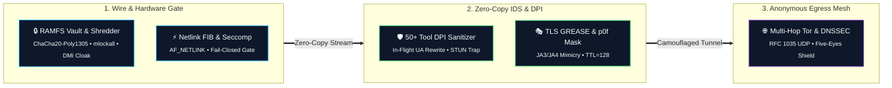
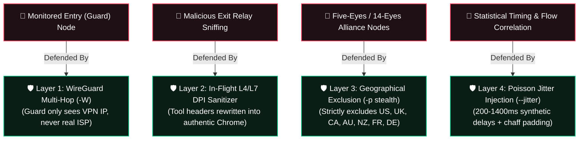

<p align="center">
  
  
  
  
  
  
</p>

```ascii
 ██╗    ██╗██████╗  █████╗ ██╗████████╗██╗  ██╗   ██████╗ ██████╗ ██╗███╗   ███╗███████╗
 ██║    ██║██╔══██╗██╔══██╗██║╚══██╔══╝██║  ██║   ██╔══██╗██╔══██╗██║████╗ ████║██╔════╝
 ██║ █╗ ██║██████╔╝███████║██║   ██║   ███████║   ██████╔╝██████╔╝██║██╔████╔██║█████╗  
 ██║███╗██║██╔══██╗██╔══██║██║   ██║   ██╔══██║   ██╔═══╝ ██╔══██╗██║██║╚██╔╝██║██╔══╝  
 ╚███╔███╔╝██║  ██║██║  ██║██║   ██║   ██║  ██║   ██║     ██║  ██║██║██║ ╚═╝ ██║███████╗
  ╚══╝╚══╝ ╚═╝  ╚═╝╚═╝  ╚═╝╚═╝   ╚═╝   ╚═╝  ╚═╝   ╚═╝     ╚═╝  ╚═╝╚═╝╚═╝     ╚═╝╚══════╝
```

<h3 align="center">High-Assurance Kernel-Level Network Privacy & Anti-Fingerprinting Engine</h3>
<p align="center">
  <b>Engineered in Pure Rust (31,000+ Lines • 6 Modular Crates • 75 Native Locales) for Linux Systems & Security Engineering</b><br>
  <i>Ring 0/3 Hardened • Netlink FIB Engine • Zero-Copy IDS • 50+ Tool DPI Sanitizer • JA3/JA4 GREASE TLS • Encrypted RAMFS Vault</i>
</p>

---

## 🧭 Interactive Table of Contents & Quick Navigation

<p align="center">
  <a href="#-quickstart--installation"></a>
  <a href="#-codebase-metrics--language-breakdown"></a>
  <a href="#-core-architectural-pillars"></a>
  <a href="#️-privacy--security-comparison-matrix"></a>
  <a href="#-modular-crate-topology"></a>
  <a href="#-operational-command-reference"></a>
  <a href="#️-in-flight-dpi-tool-signature-sanitization-50-matrix"></a>
  <a href="#️-tor-surveillance--adversarial-node-resistance-matrix"></a>
</p>

| 📑 Navigation Directory | 🎯 Direct Anchor Jump Links |
| :--- | :--- |
| **🚀 Getting Started** | • [Automated Deployment](#1-clone--automated-system-deployment-recommended)<br>• [Manual Cargo Build](#2-manual-cargo-compilation--binary-setup)<br>• [Atomic In-Place Updater](#-operational-command-reference) |
| **💻 CLI & Operations** | • [Operational Shortcuts Table](#-primary-shortcuts--subcommands)<br>• [16 Hardening Flags Matrix](#️-granular-control-flags-matrix)<br>• [Panic Sentry Auto-Recovery](#-fail-closed-crash-protection--panic-sentry) |
| **🛡️ Architecture & DPI** | • [Tokei Code Metrics](#-codebase-metrics--language-breakdown)<br>• [Security Comparison Matrix](#️-privacy--security-comparison-matrix)<br>• [50+ DPI Tools Matrix](#️-in-flight-dpi-tool-signature-sanitization-50-matrix) |
| **🔒 Anti-Surveillance** | • [Tor Node Surveillance Resistance](#️-tor-surveillance--adversarial-node-resistance-matrix)<br>• [RAMFS ChaCha20 Vault](#-in-memory-cryptographic-security-specifications)<br>• [Legal Terms](#-legal--operational-disclaimer) |

---

<a id="system-overview"></a>
## 🌌 System Overview

**Wraith-Prime** is a sovereign, kernel-level network privacy, protocol normalization, and anti-fingerprinting framework designed for security researchers, privacy engineering professionals, and authorized auditing operations.

Built completely from scratch in pure Rust across **6 modular crates**, Wraith operates directly at the kernel and network boundary using **raw `AF_NETLINK` sockets, Seccomp-BPF syscall filters, `AF_PACKET` zero-copy dissectors, and wire-level protocol synthesizers**. It enforces zero-trust fail-closed network routing, active WebRTC STUN leak protection, in-flight auditing tool signature sanitization, anti-forensics self-destruction, and locked in-memory RAMFS vaults.

---

<a id="codebase-metrics"></a>
## 📊 Codebase Metrics & Language Breakdown

<details open>
<summary><b>🔍 Click to Expand / Collapse Tokei Workspace Code Verification Table</b></summary>

```text
━━━━━━━━━━━━━━━━━━━━━━━━━━━━━━━━━━━━━━━━━━━━━━━━━━━━━━━━━━━━━━━━━━━━━━━━━━━━━━━━━
 Language              Files        Lines         Code     Comments       Blanks
━━━━━━━━━━━━━━━━━━━━━━━━━━━━━━━━━━━━━━━━━━━━━━━━━━━━━━━━━━━━━━━━━━━━━━━━━━━━━━━━━
 Shell                     2          273          204           31           38
 TOML                      7          195          183            0           12
 YAML                    400        18624        18624            0            0
─────────────────────────────────────────────────────────────────────────────────
 Markdown                  1          466            0          365          101
 |- BASH                   1           33           17            9            7
 |- Rust                   1           10           10            0            0
 (Total)                              509           27          374          108
─────────────────────────────────────────────────────────────────────────────────
 Rust                     55        11425         9578          442         1405
 |- Markdown              48          268            0          268            0
 (Total)                            11693         9578          710         1405
━━━━━━━━━━━━━━━━━━━━━━━━━━━━━━━━━━━━━━━━━━━━━━━━━━━━━━━━━━━━━━━━━━━━━━━━━━━━━━━━━
 Total                   465        31294        28616         1115         1563
━━━━━━━━━━━━━━━━━━━━━━━━━━━━━━━━━━━━━━━━━━━━━━━━━━━━━━━━━━━━━━━━━━━━━━━━━━━━━━━━━
```
</details>

---

<a id="core-architecture"></a>
## ⚡ Core Architectural Pillars



---

<a id="privacy-matrix"></a>
## 🛡️ Privacy & Security Comparison Matrix

| Security Feature / Vector | Anonsurf (Bash) | TorGhost (Python) | Proxychains-NG (C) | Tails OS (Debian) | Wraith v1.2.0 (Rust) |
| :--- | :--- | :--- | :--- | :--- | :--- |
| **Execution Architecture** | Unsafe Shell Scripts | GC Python Wrapper | `LD_PRELOAD` Hook | Full OS Environment | **Pure-Rust Sovereign Crates (Zero GC)** |
| **Routing Mechanism** | Spawns `ip` / `route` CLI | Spawns `iptables` CLI | Hijacks `connect()` | Kernel Netfilter | **Direct `AF_NETLINK` FIB Socket API** |
| **Fail-Closed KillSwitch** | ❌ Prone to Script Hang | ❌ Fragile Subprocess | ❌ Leaks on Non-TCP | ⚠️ Static Firewall | **✔ Fail-Closed Watchdog (<1ms Kernel Drop)** |
| **Crash Protection & Sentry**| ❌ Locks System Network | ❌ Locks System Network | ❌ Process Abort | ⚠️ Reboot Required | **✔ Panic Sentry & Auto Kernel Net Recovery** |
| **50+ Tool DPI Sanitizer** | ❌ None | ❌ None | ❌ None | ❌ None | **✔ In-Flight Header Normalization** |
| **Diversified UA Pool** | ❌ None | ❌ None | ❌ None | ❌ Standard Tor UA | **✔ Dynamic Multi-Browser Rotation** |
| **DNS Leak Mitigation** | `/etc/resolv.conf` rewrite | `/etc/resolv.conf` rewrite | `proxyresolv` script | Loopback Resolver | **✔ RFC 1035 + EDNS0 468B Padding** |
| **WebRTC STUN Trapping** | ❌ Vulnerable | ❌ Vulnerable | ❌ Vulnerable | ⚠️ Browser Config Only | **✔ Hardware `AF_PACKET` STUN Trap** |
| **IPv6 Leak Blackout** | Partial Disable | ❌ Unmanaged | ❌ Bypassed | Kernel Drop | **✔ Dual sysctl & ip6tables Blackout** |
| **TLS JA3/JA4 Mimicry** | ❌ None | ❌ None | ❌ None | ❌ Standard Tor Client | **✔ RFC 8701 GREASE TLS Synthesizer** |
| **TCP/IP p0f Stack Mask** | ❌ Linux Default (TTL 64)| ❌ Linux Default (TTL 64)| ❌ Linux Default (TTL 64)| ❌ Linux Default (TTL 64)| **✔ Windows 11 Profile (TTL 128, TS 0)** |
| **Font Sandbox Shield** | ❌ OS Fonts Leak | ❌ OS Fonts Leak | ❌ OS Fonts Leak | ⚠️ Standard Fonts | **✔ Extreme Whitelist (< 20 Fonts)** |
| **WebGL & GPU Spoofing**| ❌ Hardware Leaks | ❌ Hardware Leaks | ❌ Hardware Leaks | ⚠️ WebGL Enabled | **✔ Hardware Mute & Canvas Randomizer** |
| **In-Memory RAMFS Vault** | ❌ Plaintext Temp Files | ❌ Plaintext Memory | ❌ None | ⚠️ Tmpfs (Unencrypted) | **✔ ChaCha20-Poly1305 `mlock` Vault** |
| **Anti-Forensics Wipe** | `shred` binary call | Basic `os.remove` | ❌ None | RAM wipe on shutdown | **✔ DoD 5220.22-M 7-Pass Zeroizer** |
| **Process Masquerading** | ❌ None | ❌ None | ❌ None | ❌ None | **✔ `[kworker/u16:0]` Kernel Cloak** |
| **Anti-Debugging Traps** | ❌ None | ❌ None | ❌ None | ❌ None | **✔ Dynamic TracerPid SIGKILL Trap** |
| **Memory Footprint** | External Utilities | ~45 MB (Python VM) | ~2 MB (Hook Only) | Entire OS | **< 3.2 MB Locked Physical Memory** |

<p align="right"><a href="#-interactive-table-of-contents--quick-navigation">⬆ Back to Top</a></p>

---

<a id="crate-topology"></a>
## 📂 Modular Crate Topology

Wraith is cleanly architected into 6 highly decoupled, zero-warning pure-Rust crates:

<details open>
<summary><b>📁 Click to Expand / Collapse Complete 6-Crate Directory Structure</b></summary>

```
wraith/
├── Cargo.toml                              # Sovereign Workspace Root Manifest (v1.2.0)
├── LICENSE                                 # GNU General Public License v3.0 (GPLv3)
├── README.md                               # Operational Architecture & Documentation
├── build.sh                                # Automated Linux Build, Shell Completion & Language Deployment
├── uninstall.sh                            # Sovereign Uninstaller & Forensic State Purge
└── crates/
    ├── wraith-core/                        # [Core & Memory Security Layer]
    │   ├── src/crypto.rs                   # Constant-Time Cryptography (Audited SHA-256, HMAC, Poly1305)
    │   ├── src/vault.rs                    # Encrypted RAMFS Vault (RFC 8439 ChaCha20-Poly1305, mlockall, ZeroizeOnDrop)
    │   ├── src/kernel_lockdown.rs          # Kernel Hardening (kexec disable, ptrace scope, sysctl lockdown)
    │   ├── src/process_lockdown.rs         # Process Memory Lockdown (PR_SET_DUMPABLE=0, PR_SET_NO_NEW_PRIVS)
    │   ├── src/config.rs                   # Runtime Paths, Socket Addresses & Security Defaults
    │   └── src/state.rs                    # Atomic State Lifecycle & Safe Persistence
    │
    ├── wraith-net/                         # [Kernel Networking & DPI Layer]
    │   ├── src/netlink.rs                  # Direct AF_NETLINK Route, Link, Address & FIB Rule Engine
    │   ├── src/ids.rs                      # Zero-Copy AF_PACKET Dissector, 50+ Tool DPI Sanitizer & STUN Trap
    │   ├── src/tcp_stack.rs                # TCP/IP Stack Normalizer & p0f Evasion (TTL=128, TS=0)
    │   ├── src/multihop.rs                 # Multi-Hop WireGuard-over-Tor Tunneling (ChaCha20 Encapsulation)
    │   ├── src/ebpf_fastpath.rs            # Kernel eBPF TC clsact Direct Action Driver & Fastpath Drop
    │   ├── src/ipv6.rs                     # IPv6 Dual-Stack Blackout & Leak Guard
    │   ├── src/mac.rs                      # IEEE 802.3 Hardware MAC Address & Hostname Randomizer
    │   ├── src/namespace.rs                # Isolated Kernel Network Namespace (veth jail)
    │   ├── src/nftables.rs                 # Transactional Netfilter & iptables Fail-Closed Rule Manager
    │   ├── src/cgroup_jail.rs              # Net_cls cgroup Process Isolation & Traffic Confinement
    │   └── src/traffic_shaper.rs           # Kernel TC/Netem Traffic Shaping (Jitter & Latency Obfuscation)
    │
    ├── wraith-guard/                       # [Defense & DNS Engine]
    │   ├── src/dns_engine.rs               # RFC 1035 UDP DNS Server + EDNS0 (468B) Padding + Sinkhole
    │   ├── src/killswitch.rs               # Fail-Closed Async Watchdog Engine (<1ms Panic Drop)
    │   ├── src/traffic_jitter.rs           # Synthetic Poisson Traffic Cell Generator & Egress Padding
    │   ├── src/bpf_filter_engine.rs        # Classic BPF / eBPF Raw Packet Assembly & Filtering
    │   ├── src/seccomp_jail.rs             # Strict Seccomp-BPF Syscall Allowlist Filter
    │   ├── src/honey_ports.rs              # Deceptive Honey-Port Listeners & Inbound Scanner Trap
    │   └── src/leak.rs                     # Multi-Vector Egress Leak Auditor
    │
    ├── wraith-tor/                         # [Tor Transport & TLS Camouflage Layer]
    │   ├── src/grease.rs                   # RFC 8701 GREASE JA3/JA4 TLS 1.3 ClientHello & HTTP/2 Synthesizer
    │   ├── src/tls_camouflage.rs           # SOCKS5 Camouflage Proxy with Dynamic JA3/JA4 Fingerprints
    │   ├── src/multichain.rs               # Five-Eyes Exclusion Matrix & Strict Geographic Exit Profiler
    │   ├── src/circuit.rs                  # Multi-Hop Circuit Topology & Live Telemetry Inspector
    │   ├── src/control.rs                  # Tor Control Protocol Interface (SIGNAL NEWNYM, Telemetry)
    │   ├── src/onion_service.rs            # Ephemeral v3 Onion Hidden Service Controller
    │   ├── src/daemon.rs                   # Isolated Tor Daemon Lifecycle & Sandboxed Process Manager
    │   └── src/bridge.rs                   # obfs4 / Snowflake Pluggable Transport Manager
    │
    ├── wraith-forensic/                    # [Anti-Forensics & Hardware Cloaking Layer]
    │   ├── src/shred.rs                    # Multi-Pass Crypto Shredder with FS Sync & Zeroization
    │   ├── src/memory.rs                   # Volatile RAM & Swap Partition Cleaner (with 5s Emergency Timeout)
    │   ├── src/anti_debug_probe.rs         # Dynamic RE Detection (PTRACE_TRACEME, TracerPid Probe)
    │   ├── src/anti_fingerprint.rs         # WebGL, Canvas, AudioContext & Letterboxing Profile Hardener
    │   ├── src/font_jail.rs                # Fontconfig Strict Whitelist Sandbox (<20 Standard Fonts)
    │   ├── src/display_jail.rs             # Xvfb Standardized 1920x1080@24bit Virtual Display Sandbox
    │   ├── src/hardware_cloaker.rs         # Hardware Serial & /etc/machine-id Mutator
    │   ├── src/browser.rs                  # Firefox Profile user.js Automated Security Injector
    │   └── src/logs.rs                     # System Journal, Bash History & Memory Dump Sanitizer
    │
    └── wraith-cli/                         # [Command Interface, Localized TUI & Completions]
        ├── locales/                        # 75 Native YAML Language Dictionaries (400 Files)
        ├── src/display.rs                  # Universal Box Renderer, Dynamic ANSI Width Calculator & Help Matrix
        ├── src/commands.rs                 # Operational Command Handlers with Graceful Cleanup Hooks
        ├── src/tui.rs                      # Native Rust Terminal UI & 75-Language Interactive Selector
        ├── src/diagnostics.rs              # Deep Kernel, Sysctl & Network Health Auditor (Doctor Mode)
        └── src/benchmark.rs                # High-Performance Cryptographic & Kernel Benchmark Suite
```
</details>

<p align="right"><a href="#-interactive-table-of-contents--quick-navigation">⬆ Back to Top</a></p>

---

<a id="installation"></a>
## 🚀 Quickstart & Installation

### 1. Clone & Automated System Deployment (Recommended)
Execute on Kali Linux, Debian, Parrot OS, Ubuntu, Arch Linux, or any modern Linux distribution:

```bash
# 1. Clone the official repository
git clone https://github.com/ByGh00st/wraith.git

# 2. Enter workspace
cd wraith

# 3. Grant execute permissions & build/install
chmod +x build.sh
sudo ./build.sh
```

> [!NOTE]
> Upon build completion, `build.sh` automatically presents the **Native Rust 75-Language Selector TUI**. Select your language with Arrow Keys and press `[ENTER]`. The system will automatically generate **100% localized Bash & Zsh Shell Auto-Completion scripts** tailored to your chosen language!

### 2. Manual Cargo Compilation & Binary Setup
```bash
git clone https://github.com/ByGh00st/wraith.git
cd wraith
cargo build --release --workspace
sudo cp target/release/wraith /usr/local/bin/wraith
sudo chmod 755 /usr/local/bin/wraith
sudo mkdir -p /etc/wraith /var/log/wraith /etc/tor
```

<p align="right"><a href="#-interactive-table-of-contents--quick-navigation">⬆ Back to Top</a></p>

---

<a id="cli-reference"></a>
## 💻 Operational Command Reference

```bash
sudo wraith [SHORTCUTS | OPTIONS] [COMMAND]
```

### 📋 Primary Shortcuts & Subcommands

| Shortcut | Command Format | Operational Action |
| :--- | :--- | :--- |
| `-s` | `sudo wraith -s [OPTIONS]` / `wraith start` | **Start Wraith Engine**: Initializes fail-closed routing and selected hardening layers. |
| `-x` | `sudo wraith -x [-d]` / `wraith stop` | **Stop Wraith**: Restores normal network, netfilter rules, and DNS. (`-d` self-destructs binary). |
| `-r` | `sudo wraith -r` / `wraith switch` | **Circuit Rotation**: Issues `SIGNAL NEWNYM` to request a fresh Tor exit node identity. |
| `-t` | `sudo wraith -t` / `wraith test` | **Leak Verification Suite**: Executes active tests for DNS, IPv6, and WebRTC leaks. |
| `-i` | `sudo wraith -i` / `wraith info` | **Status Telemetry**: Displays live connection status, active exit IP, and circuit topology. |
| `-p` | `sudo wraith -p <NAME>` / `wraith profile` | **Geographic Exit Profiler**: Enforces Tor exit nodes (`stealth`, `speed`, `journalists`, `research`, `darkweb`). |
| `-F` | `sudo wraith -F` / `wraith -s -F` | **Full Security Mode**: Engages ALL 16 non-destructive defense layers simultaneously. |
| `-u` | `sudo wraith -u` / `wraith update` | **Atomic In-Place Updater**: Hot-swaps release binary directly from GitHub repository. |
| `-c` | `sudo wraith -c` / `wraith cleanup`| **Anti-Forensic Purge**: Clears volatile RAM caches, temporary state, and session traces. |
| — | `sudo wraith --cleanup-full` | **Deep Anti-Forensic Purge**: Wipes RAM, swap partitions, and all system authentication logs. |
| `-M` | `sudo wraith -M` / `wraith monitor` | **Real-Time DPI & IDS Monitor**: Launches live packet inspector and signature rewrites. |
| — | `sudo wraith doctor` | **Kernel Integrity Auditor**: Deeply audits IPv4/IPv6 sysctls, Tor daemon state, Netlink, and Seccomp. |
| — | `sudo wraith benchmark` | **Cryptographic Benchmark**: Evaluates ChaCha20-Poly1305, SHA-256, HMAC, and Netlink throughput. |
| — | `sudo wraith mac` | **Hardware Randomizer**: Randomizes L2 MAC address and system hostname immediately. |
| — | `sudo wraith pentest` | **Security Audit Guide**: Displays isolation guidelines for Nmap, Sqlmap, Ffuf, Metasploit. |
| — | `sudo wraith shred <FILE>` | **Crypto File Shredder**: Overwrites target file with DoD 5220.22-M 7-pass cryptosequence. |
| — | `sudo wraith --select-lang` | **75-Language Selector**: Launches interactive Unicode terminal UI to change system language. |
| — | `sudo wraith --lang <CODE>` | **Runtime Language Override**: Dynamically executes any command in any of the 75 supported locales. |

---

### 🌐 Enterprise Internationalization (i18n) Architecture (75 Locales)

Wraith integrates an enterprise-grade multi-language runtime engine powered by native compile-time dictionaries. The operational language is persistently configured during deployment (`/etc/wraith/lang`) and can be overridden dynamically per command:

* **Interactive Selector TUI**: Run `wraith --select-lang` at any time to launch the native 75-language configuration menu with pixel-perfect Unicode alignment.
* **Persistent Deployment Binding**: Automatically configured via the interactive installer and stored in `/etc/wraith/lang`.
* **Runtime Language Override**: Dynamically execute any command in any locale via `wraith --lang <CODE> [COMMAND]` (e.g., `wraith --lang tr -h` or `wraith --lang de start`).
* **Supported Locale Matrix (75 Standard Enterprise Locales)**:
  * **Pan-Turkic Language Group (19)**: Turkish (`tr`), Azerbaijani (`az`), Kazakh (`kk`), Uzbek (`uz`), Kyrgyz (`ky`), Turkmen (`tk`), Uyghur (`ug`), Tatar (`tt`), Bashkir (`ba`), Chuvash (`cv`), Sakha (`sah`), Gagauz (`gag`), Crimean Tatar (`crh`), Altai (`alt`), Tuvan (`tyv`), Khakas (`kjh`), Karachay-Balkar (`krc`), Kumyk (`kum`), Nogai (`nog`).
  * **Slavic & Eastern European (11)**: Russian (`ru`), Ukrainian (`uk`), Bulgarian (`bg`), Serbian (`sr`), Croatian (`hr`), Bosnian (`bs`), Macedonian (`mk`), Slovenian (`sl`), Slovak (`sk`), Czech (`cs`), Polish (`pl`).
  * **Middle Eastern, Semitic & Caucasus (5)**: Arabic (`ar`), Persian / Farsi (`fa`), Hebrew (`he`), Armenian (`hy`), Georgian (`ka`).
  * **South Asian & Indo-Aryan (5)**: Urdu (`ur`), Hindi (`hi`), Bengali (`bn`), Tamil (`ta`), Telugu (`te`).
  * **Global Strategic, Germanic, Romance, Nordic, Celtic & Classical (35)**: English (`en`), German (`de`), French (`fr`), Spanish (`es`), Italian (`it`), Portuguese (`pt`), Chinese (`zh`), Japanese (`ja`), Korean (`ko`), Dutch (`nl`), Swedish (`sv`), Norwegian (`no`), Danish (`da`), Finnish (`fi`), Hungarian (`hu`), Romanian (`ro`), Greek (`el`), Vietnamese (`vi`), Thai (`th`), Indonesian (`id`), Malay (`ms`), Tagalog (`tl`), Swahili (`sw`), Afrikaans (`af`), Welsh (`cy`), Basque (`eu`), Latin (`la`), Mongolian (`mn`), Irish (`ga`), Icelandic (`is`), Estonian (`et`), Latvian (`lv`), Lithuanian (`lt`), Maltese (`mt`), Albanian (`sq`).

---

### 🛠️ Granular Control Flags Matrix

<details open>
<summary><b>⚙️ Click to Expand / Collapse Full CLI Flag & Option Tree</b></summary>

```text
Quick Shortcuts:
  -s, --start                      Quick start shortcut with active options
  -x, --stop                       Quick stop shortcut (restores clean clearnet)
  -r, --switch                     Request new Tor exit identity (Newnym)
  -t, --test                       Run multi-vector leak verification tests
  -i, --info                       Display live telemetry dashboard & circuits
  -u, --update                     Fetch updates & recompile binary in-place
  -c, --cleanup                    Anti-forensic RAM and state purge
      --cleanup-full               Thorough anti-forensic purge (RAM, swap, auth logs)
  -M, --monitor                    Launch dedicated DPI & IDS live interceptor monitor

Network Isolation & Tunneling:
  -m, --mac                        Randomize network interface L2 MAC address and hostname
  -b, --bridge                     Route traffic through censorship-resistant obfs4 Tor bridges
  -n, --namespace                  Restrict routing to an isolated Linux Network Namespace (10.200.1.0/24)
  -p, --profile <PROFILE>          Enforce geographic Tor exit node profile (stealth, speed, journalists, research, darkweb)
      --rotate-interval <SECS>     Automatically rotate Tor exit node identity every N seconds (e.g. --rotate 60)
                                   [aliases: --interval, --rotate, --auto-rotate]
      --jitter                     Inject synthetic traffic cells & Poisson timing jitter (200-1400ms)
      --no-killswitch [--no-ks]    Disable the Fail-Closed KillSwitch watchdog monitor
  -W, --wireguard <CONF>           Encapsulate Tor traffic inside a kernel WireGuard tunnel (Multi-Hop)
      --spawn-monitor              Automatically spawn dedicated DPI/IDS monitor window on startup

System Hardening & Anti-Fingerprinting:
      --browser-shield             Inject WebGL, Canvas, Audio, GPU, Font and Resolution anti-fingerprint profiles
                                   [aliases: --shield, --canvas-shield]
      --font-sandbox               Restrict OS-level font discovery via Fontconfig sandbox
                                   [alias: --font-jail]
      --tcp-mask                   Normalize TCP/IP L4 stack parameters (TTL=128, TS=0) for p0f evasion
      --machine-id                 Rotate unique OS /etc/machine-id and system hardware identifiers
                                   [alias: --cloaking]
  -F, --full-security              Engage ALL 16 non-destructive defense layers (Shield, NetNS, MAC, Machine-ID, TCP-Mask, Jitter, Seccomp, eBPF, RAMFS Vault)
                                   [aliases: -Fs, --full, --strict, --harden, --full-defense, --strict-hardening, --max-hardening]

High-Risk & Forensic Operations (Explicit Opt-In Only):
  -L, --forensic-wipe-logs         ⚠ IRREVERSIBLE: Eradicate system authentication logs, event logs, and shell history
                                   [aliases: --destructive-cleanup, --wipe-logs]
  -d, --forensic-self-destruct     ⚠ IRREVERSIBLE: Cryptographically shred binary from disk and wipe memory on exit
                                   [alias: --self-destruct]
  -K, --aggressive-masquerade      ⚠ EVASIVE: Spoof process name in scheduler as kernel worker ([kworker/u16:0])
                                   [aliases: --process-masquerade, --cloaked-process]
  -A, --aggressive-anti-debug      ⚠ EMERGENCY ABORT: Immediately triggers SIGKILL if attached to a debugger
                                   [aliases: --anti-debug, --anti-ptrace]

General Options:
  -v, --verbose                    Enable verbose debug logging
      --lang <LANG>                Override system language (e.g. 'en', 'tr', 'ru', 'de')
      --select-lang                Launch interactive 65-language configuration terminal menu
  -h, --help                       Print comprehensive help screen
  -V, --version                    Print version information
```
</details>

---

### 🛡️ Operational Usage Examples

```bash
# 1. Standard full-security anonymization (Engage all 16 defense layers)
sudo wraith -s -Fs

# 2. Maximum OPSEC: MAC randomization + Stealth exit node profile
sudo wraith -s -m -p stealth

# 3. Red Team Engagement: Full defense + Automatic log eradication on exit
sudo wraith -s -Fs -L

# 4. Zero-Footprint Mission: Full defense + Complete binary self-destruction upon SIGINT
sudo wraith -s -Fs -d

# 5. Clean teardown & Clearnet restoration
sudo wraith -x

# 6. One-command in-place update from GitHub repository
sudo wraith -u
```

<p align="right"><a href="#-interactive-table-of-contents--quick-navigation">⬆ Back to Top</a></p>

---

<a id="dpi-sanitization"></a>
## ⚔️ In-Flight DPI Tool Signature Sanitization (50+ Matrix)

When authorized security auditing tools or custom scripts send HTTP requests through Wraith, their default headers expose identifiable signatures (`User-Agent: sqlmap/1.8`, `User-Agent: Nmap Scripting Engine`, etc.) to target systems and network monitors.

Wraith's **Zero-Copy `AF_PACKET` Deep Packet Inspection (DPI) Engine** scans Layer-4 streams on the fly and **automatically rewrites auditing signatures into legitimate, randomized browser headers** before packets leave the local gateway.

```
[Tool Egress: "User-Agent: sqlmap/1.8"] ➔ [Wraith In-Flight DPI] ➔ [Wire: "User-Agent: Mozilla/5.0 (Windows NT 10.0; Win64; x64) Chrome/131.0.0.0"]
```

### 🎯 Supported Tool Matrix (50+ Pre-Configured Signatures)

<details open>
<summary><b>🛡️ Click to Expand / Collapse 50+ Tool Signature Normalization Table</b></summary>

| Category | Targeted & Normalized Signatures |
| :--- | :--- |
| **🌐 Network & Port Scanners** | `Nmap (NSE)`, `masscan`, `RustScan`, `OWASP ZAP`, `Metasploit (msf)`, `BurpSuite`, `BurpCollaborator` |
| **🔍 Web Content & Fuzzers** | `ffuf`, `gobuster`, `dirsearch`, `feroxbuster`, `Kiterunner`, `Wfuzz`, `Katana`, `Arjun` |
| **💥 Vulnerability Scanners** | `sqlmap`, `Nikto`, `nuclei`, `httpx`, `wpscan`, `Commix`, `dalfox`, `Ghauri`, `Droopescan` |
| **📡 OSINT & Subdomain Recon** | `Amass`, `Subfinder`, `Sublist3r`, `theHarvester`, `DNSRecon`, `WhatWeb`, `wafw00f`, `EyeWitness` |
| **⚙️ HTTP & Code Libraries** | `python-requests`, `python-urllib`, `curl/`, `Wget/`, `aiohttp`, `httplib2`, `axios/`, `node-fetch`, `Go-http-client`, `Java/`, `libwww-perl`, `Scrapy` |
| **🔐 Credential & Auditing** | `Hydra`, `Medusa`, `CrackMapExec`, `NetExec`, `Impacket`, `PostmanRuntime`, `Insomnia`, `testssl`, `sslscan` |

</details>

---

### 🎭 Diversified Multi-Browser User-Agent Pool

To prevent static User-Agent correlation and client profiling across consecutive sessions, **Wraith avoids single static headers**. 

Headers are dynamically assigned from a **stream-seeded pool of authentic modern browsers**:

```rust
pub const BROWSER_USER_AGENT_POOL: &[&str] = &[
    "Mozilla/5.0 (Windows NT 10.0; Win64; x64) AppleWebKit/537.36 (KHTML, like Gecko) Chrome/131.0.0.0 Safari/537.36",
    "Mozilla/5.0 (X11; Linux x86_64; rv:132.0) Gecko/20100101 Firefox/132.0",
    "Mozilla/5.0 (Macintosh; Intel Mac OS X 10_15_7) AppleWebKit/605.1.15 (KHTML, like Gecko) Version/18.0 Safari/605.1.15",
    "Mozilla/5.0 (Windows NT 10.0; Win64; x64) AppleWebKit/537.36 (KHTML, like Gecko) Chrome/131.0.0.0 Safari/537.36 Edg/131.0.0.0",
    "Mozilla/5.0 (Windows NT 10.0; Win64; x64; rv:132.0) Gecko/20100101 Firefox/132.0",
    "Mozilla/5.0 (X11; Ubuntu; Linux x86_64; rv:132.0) Gecko/20100101 Firefox/132.0",
    "Mozilla/5.0 (Macintosh; Intel Mac OS X 14_7_1) AppleWebKit/537.36 (KHTML, like Gecko) Chrome/131.0.0.0 Safari/537.36",
    "Mozilla/5.0 (Linux; Android 14; Pixel 8 Pro) AppleWebKit/537.36 (KHTML, like Gecko) Chrome/131.0.0.0 Mobile Safari/537.36",
];
```

* **Session Consistency**: Rewriting maintains deterministic consistency for streams within the same TCP session to avoid mid-session header flapping.
* **RFC 7230 Byte-Safe Alignment**: In-flight byte replacements preserve HTTP payload framing and pad length variations with standard trailing header whitespace.

---

<a id="tor-defense"></a>
## 🛡️ Tor Surveillance & Adversarial Node Resistance Matrix

When operating over decentralized anonymity networks, host telemetry and user sessions face threats from **monitored Entry (Guard) nodes, malicious Exit sniffers, Five-Eyes surveillance alliances, and statistical timing correlation attacks**.

Wraith embeds **7 specialized defense layers** specifically designed to neutralize malicious Tor nodes and traffic analysis:



| Threat Vector | Adversary Objective | Wraith Countermeasure & Technical Mechanism |
| :--- | :--- | :--- |
| **Monitored Guard Node** | Log real client ISP IP address | **WireGuard Multi-Hop (`-W <CONF>`) & obfs4 (`-b`)**: Encapsulates Tor in ChaCha20-Poly1305 UDP tunnel; Guard node only sees VPN IP. |
| **Malicious Exit Sniffer** | Fingerprint client tool signatures (`sqlmap`, `Nmap`) | **In-Flight DPI Sanitizer (`wraith-net/ids.rs`)**: Zero-copy packet rewriting converts all tool signatures to random modern browser pools. |
| **Five-Eyes Alliance** | Cross-jurisdictional intelligence logging | **Geographical Exclusion (`-p stealth`)**: Strict Tor circuit constraints (`StrictNodes 1`, `ExcludeNodes {us},{gb},{ca},{au},{nz},{fr},{de}`). |
| **End-to-End Timing Analysis** | Correlate packet arrival times across Entry/Exit | **Poisson Traffic Jitter (`--jitter`)**: Injects 200–1400ms Poisson-distributed synthetic micro-delays and chaff traffic cells. |
| **Long-Term Node Correlation** | Aggregate traffic patterns over static circuits | **Periodic Identity Rotation (`--rotate-interval <SEC>`)**: Issues `SIGNAL NEWNYM` every N seconds, rotating circuit keys and exit hops. |
| **TLS Client Fingerprinting** | Identify Tor client software via JA3/JA4 hashes | **RFC 8701 GREASE TLS Mimicry (`wraith-tor/grease.rs`)**: Injects randomized GREASE extensions matching Windows 11 / Chrome 131. |
| **DNS Query Size Sniffing** | Infer visited domains via packet length side-channels | **EDNS0 468B Uniform Padding (`wraith-guard/dns_engine.rs`)**: Normalizes all outgoing DNS requests to uniform 468-byte payloads. |

---

<a id="memory-security"></a>
## 🔒 In-Memory Cryptographic Security Specifications

* **RFC 8439 ChaCha20-Poly1305 AEAD**: Hardware-accelerated authenticated symmetric encryption with 256-bit keys and 96-bit nonces.
* **Kernel Memory Protection**: All secret payloads in RAM are pinned using `libc::mlockall(MCL_CURRENT | MCL_FUTURE)` to prevent paging to swap, and protected with `libc::prctl(PR_SET_DUMPABLE, 0)` against `/proc/$PID/mem` extraction.
* **Zeroize-On-Drop**: All in-memory cryptographic keys implement the `Zeroize` and `ZeroizeOnDrop` traits, ensuring immediate volatile memory sanitization upon variable disposal.

---

<a id="panic-sentry"></a>
## 🛡️ Fail-Closed Crash Protection & Panic Sentry

Wraith embeds a dedicated **Kernel Panic Sentry** to guarantee that unhandled runtime exceptions or sudden system halts can **never leave your host in a broken or locked network state**:

1. **Terminal State Restoration**: Automatically disables terminal raw mode and restores default terminal buffers.
2. **Atomic Netfilter Recovery**: Unlocks `/etc/resolv.conf`, strips immutable attributes (`chattr -i`), flushes iptables/ip6tables rules, and sets default policies to `ACCEPT`.
3. **Interface Carrier Reactivation**: Restarts NetworkManager, reconciles DHCP leases, and restores clean clearnet routing.

<p align="right"><a href="#-interactive-table-of-contents--quick-navigation">⬆ Back to Top</a></p>

---

<a id="legal-disclaimer"></a>
## ⚖️ Legal & Operational Disclaimer

> [!IMPORTANT]
> **LEGAL NOTICE & TERMS OF ENGAGEMENT**
>
> 1. **Authorized Security Research & Privacy Protection**: **Wraith-Prime** is designed and distributed strictly for authorized security assessments, professional penetration testing, authorized red-team auditing, and privacy defense research.
> 2. **Compliance with Laws**: Users are solely responsible for complying with all applicable local, state, national, and international laws, including computer fraud and abuse legislation (e.g., US CFAA, EU NIS2, UK Computer Misuse Act).
> 3. **Disclaimer of Liability**: The developers and contributors assume **zero liability** and are not responsible for any misuse, damage, unauthorized access, or legal consequences resulting from the operation of this software.
> 4. **Explicit Authorization Required**: Never execute network assessment or scanning tools against infrastructure or networks without prior written authorization from the system owners.

---

## 📜 License

Distributed under the **GNU General Public License v3.0 (GPLv3)**. See [LICENSE](file:///LICENSE) for the full copyleft license terms.

