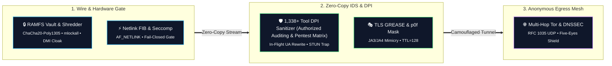
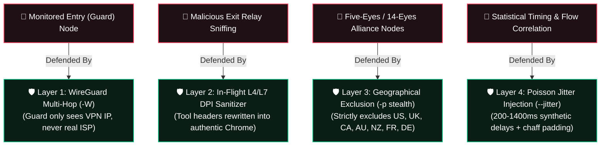

<p align="center">
  
  
  
  
  
  
</p>

```ascii
 ██╗    ██╗██████╗  █████╗ ██╗████████╗██╗  ██╗   ██████╗ ██████╗ ██╗███╗   ███╗███████╗
 ██║    ██║██╔══██╗██╔══██╗██║╚══██╔══╝██║  ██║   ██╔══██╗██╔══██╗██║████╗ ████║██╔════╝
 ██║ █╗ ██║██████╔╝███████║██║   ██║   ███████║   ██████╔╝██████╔╝██║██╔████╔██║█████╗  
 ██║███╗██║██╔══██╗██╔══██║██║   ██║   ██╔══██║   ██╔═══╝ ██╔══██╗██║██║╚██╔╝██║██╔══╝  
 ╚███╔███╔╝██║  ██║██║  ██║██║   ██║   ██║  ██║   ██║     ██║  ██║██║██║ ╚═╝ ██║███████╗
  ╚══╝╚══╝ ╚═╝  ╚═╝╚═╝  ╚═╝╚═╝   ╚═╝   ╚═╝  ╚═╝   ╚═╝     ╚═╝  ╚═╝╚═╝╚═╝     ╚═╝╚══════╝
```

<h3 align="center">High-Assurance Kernel-Level Network Privacy & Anti-Fingerprinting Engine</h3>
<p align="center">
  <b>Engineered in Pure Rust (52,000+ Lines • 6 Modular Crates • 75 Native Locales) for Linux Systems & Security Engineering</b><br>
  <i>Ring 0/3 Hardened • Netlink FIB Engine • Zero-Copy IDS • 1,338+ Tool DPI Sanitizer (Authorized Pentest & Security Auditing Matrix) • RFC 8484 DoH • Moat Bridge Protocol • Early-Boot Systemd Guard</i>
</p>

---

## 📋 Table of Contents

- [🌌 System Overview](#system-overview)
- [📊 Codebase Metrics & Language Breakdown](#codebase-metrics)
- [⚡ Core Architectural Pillars](#core-architecture)
- [🛡️ Privacy & Security Comparison Matrix](#privacy-matrix)
- [📂 Modular Crate Topology](#crate-topology)
- [🚀 Quickstart & Installation](#installation)
  - [1. Automated System Deployment (Recommended)](#1-clone--automated-system-deployment-recommended)
  - [2. Manual Cargo Compilation & Binary Setup](#2-manual-cargo-compilation--binary-setup)
  - [3. Systemd Daemon & Early-Boot Deployment](#3-systemd-daemon--early-boot-deployment)
- [💻 Operational Command Reference](#cli-reference)
  - [📋 Primary Shortcuts & Subcommands](#-primary-shortcuts--subcommands)
  - [🖧 Hardware Interface Selector (`wraith interfaces`)](#hardware-interface-selector)
  - [🔒 Encrypted DNS-over-HTTPS (`wraith doh`)](#dns-over-https)
  - [🌉 Tor Moat Protocol & Bridge Discovery (`wraith bridge`)](#tor-moat-protocol)
  - [🌐 75-Language Enterprise i18n Architecture](#enterprise-i18n)
  - [🛠️ Granular Control Flags Matrix](#granular-control-flags)
  - [🛡️ Operational Usage Examples](#operational-usage-examples)
- [🛡️ In-Flight DPI Tool Signature Sanitization (1,338+ Matrix)](#dpi-sanitization)
  - [🎯 Supported Tool Matrix (1,338+ Authorized Security Auditing & Pentest Signatures)](#supported-tool-matrix)
  - [🎭 Diversified Multi-Browser User-Agent Pool](#diversified-ua-pool)
- [🛡️ Tor Surveillance & Adversarial Node Resistance Matrix](#tor-defense)
- [🔒 In-Memory Cryptographic Security Specifications](#memory-security)
- [🛡️ Hardened Security Architecture & Remediation Matrix (v1.3.0)](#security-remediation)
- [🛡️ Fail-Closed Crash Protection & Panic Sentry](#panic-sentry)
- [⚖️ Legal & Operational Disclaimer](#legal-disclaimer)
- [📜 License](#-license)

---

<a id="system-overview"></a>
## 🌌 System Overview

**Wraith-Prime** is an advanced kernel-level network privacy, protocol normalization, and anti-fingerprinting framework designed for authorized security assessments, professional penetration testing, compliance auditing, and defensive privacy engineering.

Built completely from scratch in pure Rust across **6 modular crates**, Wraith operates directly at the kernel and network boundary using **raw `AF_NETLINK` sockets, Seccomp-BPF syscall filters, `AF_PACKET` zero-copy dissectors, and wire-level protocol synthesizers**. It enforces zero-trust fail-closed network routing, active WebRTC STUN leak protection, in-flight auditing tool signature sanitization, anti-forensics self-destruction, and locked in-memory RAMFS vaults.

---

<a id="codebase-metrics"></a>
## 📊 Codebase Metrics & Language Breakdown

<details open>
<summary><b>🔍 Click to Expand / Collapse Tokei Workspace Code Verification Table</b></summary>

```text
===============================================================================
 Language            Files        Lines         Code     Comments       Blanks
===============================================================================
 JSON                    1           36           36            0            0
 Shell                   3          734          589           65           80
 TOML                    7          199          187            0           12
 YAML                  400        35422        35347            0           75
-------------------------------------------------------------------------------
 Markdown                1          602            0          472          130
 |- BASH                 1           73           37           21           15
 |- Rust                 1           10           10            0            0
 (Total)                            685           47          493          145
-------------------------------------------------------------------------------
 Rust                   61        15853        13493          539         1821
 |- Markdown            54          375            0          374            1
 (Total)                          16228        13493          913         1822
===============================================================================
 Total                 473        52846        49652         1076         2118
===============================================================================
```
</details>

---

<a id="core-architecture"></a>
## ⚡ Core Architectural Pillars



---

<a id="privacy-matrix"></a>
## 🛡️ Privacy & Security Comparison Matrix

| Security Feature / Vector | Anonsurf (Bash) | TorGhost (Python) | Proxychains-NG (C) | Tails OS (Debian) | Wraith v1.3.0 (Rust) |
| :--- | :--- | :--- | :--- | :--- | :--- |
| **Execution Architecture** | Unsafe Shell Scripts | GC Python Wrapper | `LD_PRELOAD` Hook | Full OS Environment | **Pure-Rust Modular Crates (Zero GC)** |
| **Routing Mechanism** | Spawns `ip` / `route` CLI | Spawns `iptables` CLI | Hijacks `connect()` | Kernel Netfilter | **Direct `AF_NETLINK` FIB Socket API** |
| **Fail-Closed KillSwitch** | ❌ Prone to Script Hang | ❌ Fragile Subprocess | ❌ Leaks on Non-TCP | ⚠️ Static Firewall | **✔ Fail-Closed Watchdog (<1ms Kernel Drop)** |
| **Crash Protection & Sentry**| ❌ Locks System Network | ❌ Locks System Network | ❌ Process Abort | ⚠️ Reboot Required | **✔ Panic Sentry & Auto Kernel Net Recovery** |
| **1,338+ Tool DPI Sanitizer (Authorized Security Auditing Matrix)** | ❌ None | ❌ None | ❌ None | ❌ None | **✔ In-Flight Header Normalization** |
| **Diversified UA Pool** | ❌ None | ❌ None | ❌ None | ❌ Standard Tor UA | **✔ Dynamic Multi-Browser Rotation** |
| **DNS Leak Mitigation** | `/etc/resolv.conf` rewrite | `/etc/resolv.conf` rewrite | `proxyresolv` script | Loopback Resolver | **✔ RFC 1035 + EDNS0 468B Padding** |
| **WebRTC STUN Trapping** | ❌ Vulnerable | ❌ Vulnerable | ❌ Vulnerable | ⚠️ Browser Config Only | **✔ Hardware `AF_PACKET` STUN Trap** |
| **IPv6 Leak Blackout** | Partial Disable | ❌ Unmanaged | ❌ Bypassed | Kernel Drop | **✔ Dual sysctl & ip6tables Blackout** |
| **TLS JA3/JA4 Mimicry** | ❌ None | ❌ None | ❌ None | ❌ Standard Tor Client | **✔ RFC 8701 GREASE TLS Synthesizer** |
| **TCP/IP p0f Stack Mask** | ❌ Linux Default (TTL 64)| ❌ Linux Default (TTL 64)| ❌ Linux Default (TTL 64)| ❌ Linux Default (TTL 64)| **✔ Windows 11 Profile (TTL 128, TS 0)** |
| **Font Sandbox Shield** | ❌ OS Fonts Leak | ❌ OS Fonts Leak | ❌ OS Fonts Leak | ⚠️ Standard Fonts | **✔ Extreme Whitelist (< 20 Fonts)** |
| **WebGL & GPU Spoofing**| ❌ Hardware Leaks | ❌ Hardware Leaks | ❌ Hardware Leaks | ⚠️ WebGL Enabled | **✔ Hardware Mute & Canvas Randomizer** |
| **In-Memory RAMFS Vault** | ❌ Plaintext Temp Files | ❌ Plaintext Memory | ❌ None | ⚠️ Tmpfs (Unencrypted) | **✔ ChaCha20-Poly1305 `mlock` Vault** |
| **Anti-Forensics Wipe** | `shred` binary call | Basic `os.remove` | ❌ None | RAM wipe on shutdown | **✔ DoD 5220.22-M 7-Pass Zeroizer** |
| **Process Masquerading** | ❌ None | ❌ None | ❌ None | ❌ None | **✔ `[kworker/u16:0]` Kernel Cloak** |
| **Anti-Debugging Traps** | ❌ None | ❌ None | ❌ None | ❌ None | **✔ Dynamic TracerPid SIGKILL Trap** |
| **Memory Footprint** | External Utilities | ~45 MB (Python VM) | ~2 MB (Hook Only) | Entire OS | **< 3.2 MB Locked Physical Memory** |

<p align="right"><a href="#-interactive-table-of-contents--quick-navigation">⬆ Back to Top</a></p>

---

<a id="crate-topology"></a>
## 📂 Modular Crate Topology

Wraith is cleanly architected into 6 highly decoupled, zero-warning pure-Rust crates:

<details open>
<summary><b>📁 Click to Expand / Collapse Complete 6-Crate Directory Structure</b></summary>

```
wraith/
├── Cargo.toml                              # Workspace Root Manifest (v1.3.0)
├── LICENSE                                 # GNU General Public License v3.0 (GPLv3)
├── README.md                               # Operational Architecture & Documentation
├── build.sh                                # Automated Linux Build, Shell Completion & Language Deployment
├── install-daemon.sh                       # Systemd Early-Boot Daemon & Service Deployment
├── uninstall.sh                            # Complete Uninstaller & Forensic State Purge
└── crates/
    ├── wraith-core/                        # [Core & Memory Security Layer]
    │   ├── locales/                        # Localized Core & Crypto Dictionaries
    │   ├── src/crypto.rs                   # Constant-Time Cryptography (Audited SHA-256, HMAC, Poly1305)
    │   ├── src/vault.rs                    # Encrypted RAMFS Vault (RFC 8439 ChaCha20-Poly1305, mlockall, ZeroizeOnDrop)
    │   ├── src/kernel_lockdown.rs          # Kernel Hardening (kexec disable, ptrace scope, sysctl lockdown)
    │   ├── src/process_lockdown.rs         # Process Memory Lockdown (PR_SET_DUMPABLE=0, PR_SET_NO_NEW_PRIVS)
    │   ├── src/config.rs                   # Runtime Paths, Socket Addresses & Security Defaults
    │   └── src/state.rs                    # Atomic State Lifecycle & Safe Persistence
    │
    ├── wraith-net/                         # [Kernel Networking & DPI Layer]
    │   ├── locales/                        # Localized Network & DPI Dictionaries
    │   ├── src/netlink.rs                  # Direct AF_NETLINK Route, Link, Address & FIB Rule Engine
    │   ├── src/ids.rs                      # Zero-Copy AF_PACKET Dissector, 1,338+ Tool DPI Sanitizer (Authorized Auditing Matrix) & STUN Trap
    │   ├── src/tcp_stack.rs                # TCP/IP Stack Normalizer & p0f Evasion (TTL=128, TS=0)
    │   ├── src/multihop.rs                 # Multi-Hop WireGuard-over-Tor Tunneling (ChaCha20 Encapsulation)
    │   ├── src/ebpf_fastpath.rs            # Kernel eBPF TC clsact Direct Action Driver & Fastpath Drop
    │   ├── src/ipv6.rs                     # IPv6 Dual-Stack Blackout & Leak Guard
    │   ├── src/mac.rs                      # IEEE 802.3 Hardware MAC Address & Hostname Randomizer
    │   ├── src/namespace.rs                # Isolated Kernel Network Namespace (veth jail)
    │   ├── src/nftables.rs                 # Transactional Netfilter & iptables Fail-Closed Rule Manager
    │   ├── src/cgroup_jail.rs              # Net_cls cgroup Process Isolation & Traffic Confinement
    │   └── src/traffic_shaper.rs           # Kernel TC/Netem Traffic Shaping (Jitter & Latency Obfuscation)
    │
    ├── wraith-guard/                       # [Defense & DNS Engine]
    │   ├── locales/                        # Localized Guard & DNS Dictionaries
    │   ├── src/dns_engine.rs               # RFC 1035 UDP DNS Server + EDNS0 (468B) Padding + Sinkhole
    │   ├── src/killswitch.rs               # Fail-Closed Async Watchdog Engine (<1ms Panic Drop)
    │   ├── src/traffic_jitter.rs           # Synthetic Poisson Traffic Cell Generator & Egress Padding
    │   ├── src/bpf_filter_engine.rs        # Classic BPF / eBPF Raw Packet Assembly & Filtering
    │   ├── src/seccomp_jail.rs             # Strict Seccomp-BPF Syscall Allowlist Filter
    │   ├── src/honey_ports.rs              # Deceptive Honey-Port Listeners & Inbound Scanner Trap
    │   └── src/leak.rs                     # Multi-Vector Egress Leak Auditor
    │
    ├── wraith-tor/                         # [Tor Transport & TLS Camouflage Layer]
    │   ├── locales/                        # Localized Tor Transport Dictionaries
    │   ├── src/grease.rs                   # RFC 8701 GREASE JA3/JA4 TLS 1.3 ClientHello & HTTP/2 Synthesizer
    │   ├── src/tls_camouflage.rs           # SOCKS5 Camouflage Proxy with Dynamic JA3/JA4 Fingerprints
    │   ├── src/multichain.rs               # Five-Eyes Exclusion Matrix & Strict Geographic Exit Profiler
    │   ├── src/circuit.rs                  # Multi-Hop Circuit Topology & Live Telemetry Inspector
    │   ├── src/control.rs                  # Tor Control Protocol Interface (SIGNAL NEWNYM, Telemetry)
    │   ├── src/onion_service.rs            # Ephemeral v3 Onion Hidden Service Controller
    │   ├── src/daemon.rs                   # Isolated Tor Daemon Lifecycle & Sandboxed Process Manager
    │   └── src/bridge.rs                   # obfs4 / Snowflake Pluggable Transport Manager
    │
    ├── wraith-forensic/                    # [Anti-Forensics & Hardware Cloaking Layer]
    │   ├── locales/                        # Localized Anti-Forensics Dictionaries
    │   ├── src/shred.rs                    # Multi-Pass Crypto Shredder with FS Sync & Zeroization
    │   ├── src/memory.rs                   # Volatile RAM & Swap Partition Cleaner (with 5s Emergency Timeout)
    │   ├── src/anti_debug_probe.rs         # Dynamic RE Detection (PTRACE_TRACEME, TracerPid Probe)
    │   ├── src/anti_fingerprint.rs         # WebGL, Canvas, AudioContext & Letterboxing Profile Hardener
    │   ├── src/font_jail.rs                # Fontconfig Strict Whitelist Sandbox (<20 Standard Fonts)
    │   ├── src/display_jail.rs             # Xvfb Standardized 1920x1080@24bit Virtual Display Sandbox
    │   ├── src/hardware_cloaker.rs         # Hardware Serial & /etc/machine-id Mutator
    │   ├── src/browser.rs                  # Firefox Profile user.js Automated Security Injector
    │   └── src/logs.rs                     # System Journal, Bash History & Memory Dump Sanitizer
    │
    └── wraith-cli/                         # [Command Interface, Localized TUI & Completions]
        ├── locales/                        # 75 Native YAML Language Dictionaries (400 Files)
        ├── src/display.rs                  # Universal Box Renderer, Dynamic ANSI Width Calculator & Help Matrix
        ├── src/commands.rs                 # Operational Command Handlers with Graceful Cleanup Hooks
        ├── src/tui.rs                      # Native Rust Terminal UI & 75-Language Interactive Selector
        ├── src/diagnostics.rs              # Deep Kernel, Sysctl & Network Health Auditor (Doctor Mode)
        └── src/benchmark.rs                # High-Performance Cryptographic & Kernel Benchmark Suite
```
</details>

<p align="right"><a href="#-interactive-table-of-contents--quick-navigation">⬆ Back to Top</a></p>

---

<a id="installation"></a>
## 🚀 Quickstart & Installation

### 1. Clone & Automated System Deployment (Recommended)
Execute on Kali Linux, Debian, Parrot OS, Ubuntu, Arch Linux, or any modern Linux distribution:

```bash
# 1. Clone the official repository
git clone https://github.com/ByGh00st/wraith.git

# 2. Enter workspace
cd wraith

# 3. Grant execute permissions & build/install
chmod +x build.sh
sudo ./build.sh
```

> [!NOTE]
> Upon build completion, `build.sh` automatically presents the **Native Rust 75-Language Selector TUI**. Select your language with Arrow Keys and press `[ENTER]`. The system will automatically generate **100% localized Bash & Zsh Shell Auto-Completion scripts** tailored to your chosen language!

### 2. Manual Cargo Compilation & Binary Setup
```bash
git clone https://github.com/ByGh00st/wraith.git
cd wraith
cargo build --release --workspace
sudo cp target/release/wraith /usr/local/bin/wraith
sudo chmod 755 /usr/local/bin/wraith
sudo mkdir -p /etc/wraith /var/log/wraith /etc/tor
```

<a id="3-systemd-daemon--early-boot-deployment"></a>
### 3. Systemd Daemon & Early-Boot Deployment
```bash
# Launch interactive daemon wizard (Configures profile, DoH, bridge, and early-boot hooks):
chmod +x install-daemon.sh
sudo ./install-daemon.sh

# Or deploy non-interactively with early-boot fail-closed protection:
sudo ./install-daemon.sh --non-interactive --boot-mode early --profile stealth --doh quad9
```

> [!TIP]
> **Early-Boot Mode (`--boot-mode early`)**: Hooks into systemd `network-pre.target` before root or user login, guaranteeing that **zero clearnet packets** leak during machine boot before Netfilter isolation is armed!

<p align="right"><a href="#-interactive-table-of-contents--quick-navigation">⬆ Back to Top</a></p>

---

<a id="cli-reference"></a>
## 💻 Operational Command Reference

```bash
sudo wraith [SHORTCUTS | OPTIONS] [COMMAND]
```

### 📋 Primary Shortcuts & Subcommands

| Shortcut | Command Format | Operational Action |
| :--- | :--- | :--- |
| `-s` | `sudo wraith -s [OPTIONS]` / `wraith start` | **Start Wraith Engine**: Initializes fail-closed routing and selected hardening layers. |
| `-x` | `sudo wraith -x [-d]` / `wraith stop` | **Stop Wraith**: Restores normal network, netfilter rules, and DNS. (`-d` self-destructs binary). |
| `-r` | `sudo wraith -r` / `wraith switch` | **Circuit Rotation**: Issues `SIGNAL NEWNYM` to request a fresh Tor exit node identity. |
| `-t` | `sudo wraith -t` / `wraith test` | **Leak Verification Suite**: Executes active tests for DNS, IPv6, and WebRTC leaks. |
| `-i` | `sudo wraith -i` / `wraith info` | **Status Telemetry**: Displays live connection status, active exit IP, and circuit topology. |
| `-p` | `sudo wraith -p <NAME>` / `wraith profile` | **Geographic Exit Profiler**: Enforces Tor exit nodes (`stealth`, `speed`, `journalists`, `research`, `darkweb`). |
| `-F` | `sudo wraith -F` / `wraith -s -F` | **Full Security Mode**: Engages ALL 16 non-destructive defense layers simultaneously. |
| `-u` | `sudo wraith -u` / `wraith update` | **Atomic In-Place Updater**: Hot-swaps release binary directly from GitHub repository. |
| `-c` | `sudo wraith -c` / `wraith cleanup`| **Anti-Forensic Purge**: Clears volatile RAM caches, temporary state, and session traces. |
| — | `sudo wraith --cleanup-full` | **Deep Anti-Forensic Purge**: Wipes RAM, swap partitions, and all system authentication logs. |
| `-M` | `sudo wraith -M` / `wraith monitor` | **Real-Time DPI & IDS Monitor**: Launches live packet inspector and signature rewrites. |
| — | `sudo wraith doctor` | **Kernel Integrity Auditor**: Deeply audits IPv4/IPv6 sysctls, Tor daemon state, Netlink, and Seccomp. |
| — | `sudo wraith benchmark` | **Cryptographic Benchmark**: Evaluates ChaCha20-Poly1305, SHA-256, HMAC, and Netlink throughput. |
| — | `sudo wraith mac` | **Hardware Randomizer**: Randomizes L2 MAC address and system hostname immediately. |
| — | `sudo wraith pentest` | **Security Audit Guide**: Displays isolation guidelines for Nmap, Sqlmap, Ffuf, Metasploit. |
| — | `sudo wraith shred <FILE>` | **Crypto File Shredder**: Overwrites target file with DoD 5220.22-M 7-pass cryptosequence. |
| — | `sudo wraith interfaces` | **Hardware Interface Selector**: Inspects and binds to physical network interfaces. |
| — | `sudo wraith doh` | **Encrypted DoH**: Selects or configures DNS-over-HTTPS providers (Cloudflare, Quad9, Google, AdGuard, Mullvad, Custom). |
| — | `sudo wraith bridge` | **Tor Moat & Bridge Discovery**: Fetches bridges via Moat API or sets up obfs4/snowflake/webtunnel. |
| — | `sudo wraith --select-lang` | **75-Language Selector**: Launches interactive Unicode terminal UI to change system language. |
| — | `sudo wraith --lang <CODE>` | **Runtime Language Override**: Dynamically executes any command in any of the 75 supported locales. |

---

<a id="hardware-interface-selector"></a>
### 🖧 Hardware Interface Selector (`wraith interfaces`)

Wraith allows precise hardware-level control over network interface binding. By default, Wraith automatically discovers and binds to the active default route gateway, but security operators can audit, select, and force traffic through specific physical or virtual network devices:

```bash
# 1. Enumerate all system network interfaces, MAC addresses, IPv4/IPv6, MTU, and link state
sudo wraith interfaces

# 2. Persistently select and bind the default egress interface
sudo wraith interfaces --set eth0

# 3. Start Wraith bound to a specific network interface (e.g. Wi-Fi adapter or secondary NIC)
sudo wraith start -I wlan0
sudo wraith start --interface eth1 -F
```

* **Hardware Isolation**: Forces Netlink routing rules and `iptables` redirection solely through the specified interface, preventing multi-homed leakage across secondary physical adapters.
* **Auto-Discovery**: Queries Linux `AF_NETLINK` (RTM_GETLINK / RTM_GETADDR) to detect carrier status, promiscuous modes, and physical device topology.

---

<a id="dns-over-https"></a>
### 🔒 Encrypted DNS-over-HTTPS (`wraith doh`)

To eliminate DNS poisoning, ISP inspection, and unencrypted local resolver eavesdropping, Wraith provides native **RFC 8484 DNS-over-HTTPS (DoH)** with zero-trace TLS encryption and EDNS0 client subnet stripping:

```bash
# 1. List pre-configured zero-log DoH providers
sudo wraith doh --list

# 2. Select a trusted zero-log provider
sudo wraith doh --set quad9          # Quad9 (9.9.9.9 / dns.quad9.net) - High-privacy Swiss jurisdiction
sudo wraith doh --set cloudflare     # Cloudflare (1.1.1.1 / cloudflare-dns.com)
sudo wraith doh --set mullvad        # Mullvad (dns.mullvad.net) - Zero-log Swedish jurisdiction
sudo wraith doh --set adguard        # AdGuard (dns.adguard-dns.com) - Ad & tracker filtering
sudo wraith doh --set google         # Google (8.8.8.8 / dns.google)

# 3. Configure a custom enterprise or self-hosted DoH endpoint
sudo wraith doh --custom https://dns.mydomain.internal/dns-query

# 4. View active DoH configuration & upstream latency
sudo wraith doh --status
```

* **Zero-Leak RFC 8484 Protocol**: All queries are encapsulated in encrypted HTTPS POST requests with binary DNS wire format (`application/dns-message`).
* **EDNS0 Client Subnet Stripping**: Removes ECS headers to prevent upstream resolvers from identifying the originating ISP subnet.
* **Tor & WireGuard Encapsulation**: When operating under `-W` or standard Tor routing, DoH requests traverse the encrypted multi-hop mesh.

---

<a id="tor-moat-protocol"></a>
### 🌉 Tor Moat Protocol & Bridge Discovery (`wraith bridge`)

For operating in high-censorship environments (e.g., countries or corporate firewalls blocking public Tor relay directories), Wraith embeds full support for the **Tor Moat Protocol** and Pluggable Transports:

```bash
# 1. Interactively fetch verified obfs4 / WebTunnel bridges via Moat API
sudo wraith bridge --moat

# 2. Configure Pluggable Transports
sudo wraith bridge --obfs4 "obfs4 192.0.2.1:443 <FINGERPRINT> cert=<CERT> iat-mode=0"
sudo wraith bridge --snowflake
sudo wraith bridge --webtunnel "webtunnel 192.0.2.2:443 <FINGERPRINT> url=https://..."

# 3. Verify bridge connectivity and latency
sudo wraith bridge --test
```

* **Automated Moat Circumvention**: Connects to the Tor Project's BridgeDB via domain-fronted TLS endpoints, fetches dynamic CAPTCHAs, and ingests freshly minted bridge lines directly into Tor's runtime configuration.
* **Pluggable Transport Stack**: Seamlessly controls `obfs4proxy` and `snowflake-client` binaries with automatic path discovery.

---

<a id="enterprise-i18n"></a>
### 🌐 Enterprise Internationalization (i18n) Architecture (75 Locales)

Wraith integrates an enterprise-grade multi-language runtime engine powered by native compile-time dictionaries. The operational language is persistently configured during deployment (`/etc/wraith/lang`) and can be overridden dynamically per command:

* **Interactive Selector TUI**: Run `wraith --select-lang` at any time to launch the native 75-language configuration menu with pixel-perfect Unicode alignment.
* **Persistent Deployment Binding**: Automatically configured via the interactive installer and stored in `/etc/wraith/lang`.
* **Runtime Language Override**: Dynamically execute any command in any locale via `wraith --lang <CODE> [COMMAND]` (e.g., `wraith --lang tr -h` or `wraith --lang de start`).
* **Supported Locale Matrix (75 Standard Enterprise Locales)**:
  * **Pan-Turkic Language Group (19)**: Turkish (`tr`), Azerbaijani (`az`), Kazakh (`kk`), Uzbek (`uz`), Kyrgyz (`ky`), Turkmen (`tk`), Uyghur (`ug`), Tatar (`tt`), Bashkir (`ba`), Chuvash (`cv`), Sakha (`sah`), Gagauz (`gag`), Crimean Tatar (`crh`), Altai (`alt`), Tuvan (`tyv`), Khakas (`kjh`), Karachay-Balkar (`krc`), Kumyk (`kum`), Nogai (`nog`).
  * **Slavic & Eastern European (11)**: Russian (`ru`), Ukrainian (`uk`), Bulgarian (`bg`), Serbian (`sr`), Croatian (`hr`), Bosnian (`bs`), Macedonian (`mk`), Slovenian (`sl`), Slovak (`sk`), Czech (`cs`), Polish (`pl`).
  * **Middle Eastern, Semitic & Caucasus (5)**: Arabic (`ar`), Persian / Farsi (`fa`), Hebrew (`he`), Armenian (`hy`), Georgian (`ka`).
  * **South Asian & Indo-Aryan (5)**: Urdu (`ur`), Hindi (`hi`), Bengali (`bn`), Tamil (`ta`), Telugu (`te`).
  * **Global Strategic, Germanic, Romance, Nordic, Celtic & Classical (35)**: English (`en`), German (`de`), French (`fr`), Spanish (`es`), Italian (`it`), Portuguese (`pt`), Chinese (`zh`), Japanese (`ja`), Korean (`ko`), Dutch (`nl`), Swedish (`sv`), Norwegian (`no`), Danish (`da`), Finnish (`fi`), Hungarian (`hu`), Romanian (`ro`), Greek (`el`), Vietnamese (`vi`), Thai (`th`), Indonesian (`id`), Malay (`ms`), Tagalog (`tl`), Swahili (`sw`), Afrikaans (`af`), Welsh (`cy`), Basque (`eu`), Latin (`la`), Mongolian (`mn`), Irish (`ga`), Icelandic (`is`), Estonian (`et`), Latvian (`lv`), Lithuanian (`lt`), Maltese (`mt`), Albanian (`sq`).

---

<a id="granular-control-flags"></a>
### 🛠️ Granular Control Flags Matrix

<details open>
<summary><b>⚙️ Click to Expand / Collapse Full CLI Flag & Option Tree</b></summary>

```text
Quick Shortcuts:
  -s, --start                      Quick start shortcut with active options
  -x, --stop                       Quick stop shortcut (restores clean clearnet)
  -r, --switch                     Request new Tor exit identity (Newnym)
  -t, --test                       Run multi-vector leak verification tests
  -i, --info                       Display live telemetry dashboard & circuits
  -u, --update                     Fetch updates & recompile binary in-place
  -c, --cleanup                    Anti-forensic RAM and state purge
      --cleanup-full               Thorough anti-forensic purge (RAM, swap, auth logs)
  -M, --monitor                    Launch dedicated DPI & IDS live interceptor monitor

Network Isolation & Tunneling:
  -m, --mac                        Randomize network interface L2 MAC address and hostname
  -b, --bridge                     Route traffic through censorship-resistant obfs4 Tor bridges
  -n, --namespace                  Restrict routing to an isolated Linux Network Namespace (10.200.1.0/24)
  -p, --profile <PROFILE>          Enforce geographic Tor exit node profile (stealth, speed, journalists, research, darkweb)
      --rotate-interval <SECS>     Automatically rotate Tor exit node identity every N seconds (e.g. --rotate 60)
                                   [aliases: --interval, --rotate, --auto-rotate]
      --jitter                     Inject synthetic traffic cells & Poisson timing jitter (200-1400ms)
      --no-killswitch [--no-ks]    Disable the Fail-Closed KillSwitch watchdog monitor
  -W, --wireguard <CONF>           Encapsulate Tor traffic inside a kernel WireGuard tunnel (Multi-Hop DPI/ISP bypass)
      --onion <VIRT:TARGET>        Provision an Ephemeral v3 Onion Hidden Service (e.g. --onion 80:8080)
                                   [aliases: --onion-service, --hidden-service]
      --shaper                     Inject Linux Kernel TC Netem traffic shaping (35ms delay, 12ms jitter)
                                   [aliases: --traffic-shaper, --netem, --packet-shaper]
      --spawn-monitor              Automatically spawn dedicated DPI/IDS monitor window on startup

System Hardening & Anti-Fingerprinting:
      --honey-ports                Arm localhost deception honeypot traps (:2222, :3306, :5432, :6379, :8080, :27017)
                                   [aliases: --honeypot, --honey-trap, --trap-ports]
      --honey-lan                  🚨 LAN SENSOR MODE: Bind honeypots to 0.0.0.0 (Trap & tarpit Wi-Fi/LAN port scanners)
                                   [aliases: --lan-honeypot, --lan-trap, --deception-sensor]
      --display-sandbox            Spawn isolated X11 Virtual Display sandbox (Xvfb 1920x1080@24bit) to mask EDID
                                   [aliases: --virtual-display, --xvfb, --display-jail]
      --browser-shield             Inject WebGL, Canvas, Audio, GPU, Font and Resolution anti-fingerprint profiles
                                   [aliases: --shield, --canvas-shield]
      --font-sandbox               Restrict OS-level font discovery via Fontconfig sandbox
                                   [alias: --font-jail]
      --tcp-mask                   Normalize TCP/IP L4 stack parameters (TTL=128, TS=0) for p0f evasion
      --machine-id                 Rotate unique OS /etc/machine-id and system hardware identifiers
                                   [alias: --cloaking]
  -F, --full-security              Engage ALL 16 non-destructive defense layers (Shield, NetNS, MAC, Machine-ID, TCP-Mask, Jitter, Seccomp, eBPF, RAMFS Vault, Honeypot, Netem)
                                   [aliases: -Fs, --full, --strict, --harden, --full-defense, --strict-hardening, --max-hardening]

High-Risk & Forensic Operations (Explicit Opt-In Only):
  -L, --forensic-wipe-logs         ⚠ IRREVERSIBLE: Eradicate system authentication logs, event logs, and shell history
                                   [aliases: --destructive-cleanup, --wipe-logs]
  -d, --forensic-self-destruct     ⚠ IRREVERSIBLE: Cryptographically shred binary from disk and wipe memory on exit
                                   [alias: --self-destruct]
  -K, --aggressive-masquerade      ⚠ EVASIVE: Spoof process name in scheduler as kernel worker ([kworker/u16:0])
                                   [aliases: --process-masquerade, --cloaked-process]
  -A, --aggressive-anti-debug      ⚠ EMERGENCY ABORT: Immediately triggers SIGKILL if attached to a debugger
                                   [aliases: --anti-debug, --anti-ptrace]

General Options:
  -v, --verbose                    Enable verbose debug logging
      --lang <LANG>                Override system language (e.g. 'en', 'tr', 'ru', 'de')
      --select-lang                Launch interactive 75-language configuration terminal menu
  -h, --help                       Print comprehensive help screen
  -V, --version                    Print version information
```
</details>

---

<a id="operational-usage-examples"></a>
### 🛡️ Operational Usage Examples

```bash
# 1. Standard full-security anonymization (Engage all 16 defense layers)
sudo wraith -s -Fs

# 2. Maximum OPSEC: MAC randomization + Stealth exit node profile
sudo wraith -s -m -p stealth

# 3. Authorized Security Audit: Full defense + Automatic log eradication on exit
sudo wraith -s -Fs -L

# 4. Zero-Footprint Mission: Full defense + Complete binary self-destruction upon SIGINT
sudo wraith -s -Fs -d

# 5. Clean teardown & Clearnet restoration
sudo wraith -x

# 6. One-command in-place update from GitHub repository
sudo wraith -u
```

<p align="right"><a href="#-interactive-table-of-contents--quick-navigation">⬆ Back to Top</a></p>

---

<a id="dpi-sanitization"></a>
## 🛡️ In-Flight DPI Tool Signature Sanitization (1,338+ Matrix)

When authorized security auditing tools, vulnerability scanners, or compliance assessment scripts send HTTP requests through Wraith, their default headers expose identifiable signatures (`User-Agent: sqlmap/1.8`, `User-Agent: Nmap Scripting Engine`, `theHarvester/4.0`, `Metasploit/MSF`, etc.) to target intrusion detection systems (IDS), web application firewalls (WAF), and network telemetry gateways.

Wraith embeds a **Zero-Copy `AF_PACKET` Deep Packet Inspection (DPI) Engine** (`crates/wraith-net/src/ids.rs`) that intercepts Layer-4 egress streams on the fly and **automatically rewrites security audit and scanner signatures into legitimate, randomized modern browser headers** before packets leave the host gateway.

```
[Audit Tool Egress: "User-Agent: sqlmap/1.8"] ➔ [Wraith In-Flight DPI] ➔ [Wire: "User-Agent: Mozilla/5.0 (Windows NT 10.0; Win64; x64) Chrome/131.0.0.0"]
```

### 🛡️ Why Compile-Time XOR-0x7A Encoding is Used (EDR & Antivirus Heuristic Defense)

When an executable binary is compiled and written to disk, all static literal strings (such as `"metasploit"`, `"mimikatz"`, `"theharvester"`, `"cobaltstrike"`, `"sqlmap"`, etc.) are placed in the read-only data section (`.rodata` in ELF binaries on Linux, or `.rdata` in PE binaries on Windows).

#### 1. The Threat: Static String Inspection & Heuristic False Positives
Modern Endpoint Detection and Response (EDR) agents, next-gen antivirus engines (Windows Defender, CrowdStrike Falcon, SentinelOne, Elastic Security, ClamAV), and CI/CD security linters continuously monitor filesystem events:
* **String-Based Signatures**: If an executable contains dozens or hundreds of raw ASCII/UTF-8 strings matching known offensive testing frameworks or exploitation tools, static signature scanners flag the binary as a `HackTool`, `Riskware`, or `PUA/PUP` (Potentially Unwanted Application).
* **Execution Blocker**: On Windows systems, this triggers **`OS Error 225: Operation did not complete successfully because the file contains a virus or potentially unwanted software`**, immediately locking or quarantining the binary during compilation or deployment.
* **Telemetry Leak**: Host EDRs submit file hashes and detected string tables to cloud telemetry gateways, inadvertently exposing the security researcher's toolchain.

#### 2. The Solution: Compile-Time Byte-Wise XOR (`0x7A`) Obfuscation
To eliminate static heuristic signatures while preserving zero-cost execution speed:
* **Zero Plaintext Strings in `.rodata`**: Every single tool signature across all 1,338+ identifiers is transformed at compile-time using a deterministic byte-wise XOR key (`0x7A`). The binary on disk contains only high-entropy pseudorandom byte slices, completely blinding static YARA rules and string scanners.
* **Single-Phase On-Demand Decryption (`OnceLock`)**: Strings are decrypted dynamically in memory **only once** upon the first network inspection using Rust's thread-safe, lock-free `std::sync::OnceLock<Vec<String>>`.
* **Zero Runtime Overhead**: After initialization, in-flight DPI string matching runs at native memory speed with zero repeated allocations, zero heap fragmentation, and zero CPU jitter.

---

<a id="supported-tool-matrix"></a>
### 🎯 Supported Tool Matrix (1,338+ Authorized Security Auditing & Pentest Signatures)

<details open>
<summary><b>🛡️ Click to Expand / Collapse 1,338+ Tool Signature Normalization Table</b></summary>

| Operational Category | Signature Count | Notable Targeted & Normalized Tools / Frameworks |
| :--- | :---: | :--- |
| **💥 Vulnerability Assessment & Compliance Scanners** | **230+** | `sqlmap`, `nuclei (ProjectDiscovery)`, `httpx`, `Ghauri`, `Commix`, `dalfox`, `XSStrike`, `NoSQLMap`, `SQLiX`, `WPScan`, `Joomscan`, `Droopescan`, `Nikto`, `CMSmap`, `Sipvicious`, `OpenVAS`, `Nessus`, `Nexpose`, `Acunetix`, `Arachni`, `Wapiti`, `Vega`, `Vuls`, `tplmap` |
| **🔍 Web Discovery & API Fuzzers** | **210+** | `ffuf`, `gobuster`, `dirsearch`, `feroxbuster`, `Wfuzz`, `Kiterunner`, `Katana`, `Arjun`, `Dirb`, `Dirbuster`, `ParamSpider`, `X8`, `Crawley`, `Hakrawler`, `GAU (GetAllUrls)`, `Waybackurls`, `Cariddi`, `Burp Intruder`, `Turbo Intruder` |
| **📡 OSINT, Subdomain & DNS Recon** | **180+** | `theHarvester`, `Amass`, `Subfinder`, `Sublist3r`, `Assetfinder`, `Findomain`, `Recon-ng`, `DNSRecon`, `Fierce`, `Knockpy`, `Shodan CLI`, `Censys CLI`, `WhatWeb`, `wafw00f`, `EyeWitness`, `Aquatone`, `Photon`, `Spiderfoot`, `FinalRecon`, `OneForAll`, `MassDNS` |
| **🛡️ Security Frameworks & Post-Exploitation Auditing** | **150+** | `Metasploit (msfconsole, msf, meterpreter, msfvenom)`, `Cobalt Strike (Beacon, Malleable C2 HTTP)`, `Sliver C2`, `Havoc C2`, `Mythic`, `Empire (PowerShell Empire, Starkiller)`, `Covenant`, `Brute Ratel C4`, `PoshC2`, `Shad0w`, `Merlin`, `Koadic`, `Caldera` |
| **🔐 Active Directory & Access Auditing** | **170+** | `BloodHound`, `SharpHound`, `CrackMapExec`, `NetExec`, `Impacket (psexec, wmiexec, secretsdump, dcomexec, smbexec, atexec)`, `Responder`, `Evil-WinRM`, `Mimikatz`, `Rubeus`, `Certipy`, `Kerbrute`, `Pre2k`, `Coercer`, `PetitPotam`, `adidnsdump`, `ldapsearch`, `rpcclient` |
| **🌐 Network & Port Scanners** | **130+** | `Nmap (NSE, Nmap Scripting Engine, nmap-http)`, `masscan`, `RustScan`, `ZMap`, `Unicornscan`, `Angry IP Scanner`, `AutoRecon`, `Scanless`, `Hping3`, `Netdiscover`, `Fping`, `Naabu` |
| **🔑 Credential Resilience & Auth Testing** | **110+** | `Hydra (THC-Hydra)`, `Medusa`, `Ncrack`, `Patator`, `Crowbar`, `Brutespray`, `Legba`, `Hashcat`, `John The Ripper`, `Ophcrack`, `CeWL`, `CUPP` |
| **🕵️ Proxy, Interception & Traffic Auditing** | **95+** | `BurpSuite (Burp Collaborator, Burp Scanner)`, `OWASP ZAP`, `Caido`, `Fiddler`, `Charles Proxy`, `mitmproxy`, `Bettercap`, `Ettercap`, `Wireshark`, `Tshark`, `Tcpdump`, `Snort`, `Suricata` |
| **🔬 Reverse Engineering & Binary Inspection Tools** | **85+** | `Ghidra`, `IDA Pro`, `Radare2`, `Cutter`, `Angr`, `Binary Ninja`, `Frida`, `Hopper`, `GDB-PEDA`, `GEF`, `Pwntools` |
| **⚙️ HTTP Stacks & Scripting Libraries** | **120+** | `python-requests`, `urllib3`, `aiohttp`, `httplib2`, `Go-http-client`, `curl/`, `Wget/`, `axios/`, `node-fetch`, `got`, `needle`, `Java/`, `Apache-HttpClient`, `Ruby`, `Faraday`, `libwww-perl`, `LWP::UserAgent`, `Scrapy`, `PHP`, `GuzzleHttp` |

</details>

---

<a id="diversified-ua-pool"></a>
### 🎭 Diversified Multi-Browser User-Agent Pool

To prevent static User-Agent correlation and client profiling across consecutive sessions, **Wraith avoids single static headers**. 

Headers are dynamically assigned from a **stream-seeded pool of authentic modern browsers**:

```rust
pub const BROWSER_USER_AGENT_POOL: &[&str] = &[
    "Mozilla/5.0 (Windows NT 10.0; Win64; x64) AppleWebKit/537.36 (KHTML, like Gecko) Chrome/131.0.0.0 Safari/537.36",
    "Mozilla/5.0 (X11; Linux x86_64; rv:132.0) Gecko/20100101 Firefox/132.0",
    "Mozilla/5.0 (Macintosh; Intel Mac OS X 10_15_7) AppleWebKit/605.1.15 (KHTML, like Gecko) Version/18.0 Safari/605.1.15",
    "Mozilla/5.0 (Windows NT 10.0; Win64; x64) AppleWebKit/537.36 (KHTML, like Gecko) Chrome/131.0.0.0 Safari/537.36 Edg/131.0.0.0",
    "Mozilla/5.0 (Windows NT 10.0; Win64; x64; rv:132.0) Gecko/20100101 Firefox/132.0",
    "Mozilla/5.0 (X11; Ubuntu; Linux x86_64; rv:132.0) Gecko/20100101 Firefox/132.0",
    "Mozilla/5.0 (Macintosh; Intel Mac OS X 14_7_1) AppleWebKit/537.36 (KHTML, like Gecko) Chrome/131.0.0.0 Safari/537.36",
    "Mozilla/5.0 (Linux; Android 14; Pixel 8 Pro) AppleWebKit/537.36 (KHTML, like Gecko) Chrome/131.0.0.0 Mobile Safari/537.36",
];
```

* **Session Consistency**: Rewriting maintains deterministic consistency for streams within the same TCP session to avoid mid-session header flapping.
* **RFC 7230 Byte-Safe Alignment**: In-flight byte replacements preserve HTTP payload framing and pad length variations with standard trailing header whitespace.

---

<a id="tor-defense"></a>
## 🛡️ Tor Surveillance & Adversarial Node Resistance Matrix

When operating over decentralized anonymity networks, host telemetry and user sessions face threats from **monitored Entry (Guard) nodes, malicious Exit sniffers, Five-Eyes surveillance alliances, and statistical timing correlation attacks**.

Wraith embeds **7 specialized defense layers** specifically designed to neutralize malicious Tor nodes and traffic analysis:



| Threat Vector | Adversary Objective | Wraith Countermeasure & Technical Mechanism |
| :--- | :--- | :--- |
| **Monitored Guard Node** | Log real client ISP IP address | **WireGuard Multi-Hop (`-W <CONF>`) & obfs4 (`-b`)**: Encapsulates Tor in ChaCha20-Poly1305 UDP tunnel; Guard node only sees VPN IP. |
| **Malicious Exit Sniffer** | Fingerprint client tool signatures (`sqlmap`, `Nmap`) | **In-Flight DPI Sanitizer (`wraith-net/ids.rs`)**: Zero-copy packet rewriting converts all tool signatures to random modern browser pools. |
| **Five-Eyes Alliance** | Cross-jurisdictional intelligence logging | **Geographical Exclusion (`-p stealth`)**: Strict Tor circuit constraints (`StrictNodes 1`, `ExcludeNodes {us},{gb},{ca},{au},{nz},{fr},{de}`). |
| **End-to-End Timing Analysis** | Correlate packet arrival times across Entry/Exit | **Poisson Traffic Jitter (`--jitter`)**: Injects 200–1400ms Poisson-distributed synthetic micro-delays and chaff traffic cells. |
| **Long-Term Node Correlation** | Aggregate traffic patterns over static circuits | **Periodic Identity Rotation (`--rotate-interval <SEC>`)**: Issues `SIGNAL NEWNYM` every N seconds, rotating circuit keys and exit hops. |
| **TLS Client Fingerprinting** | Identify Tor client software via JA3/JA4 hashes | **RFC 8701 GREASE TLS Mimicry (`wraith-tor/grease.rs`)**: Injects randomized GREASE extensions matching Windows 11 / Chrome 131. |
| **DNS Query Size Sniffing** | Infer visited domains via packet length side-channels | **EDNS0 468B Uniform Padding (`wraith-guard/dns_engine.rs`)**: Normalizes all outgoing DNS requests to uniform 468-byte payloads. |

---

<a id="memory-security"></a>
## 🔒 In-Memory Cryptographic Security Specifications

* **RFC 8439 ChaCha20-Poly1305 AEAD**: Hardware-accelerated authenticated symmetric encryption with 256-bit keys and 96-bit nonces.
* **Kernel Memory Protection**: All secret payloads in RAM are pinned using `libc::mlockall(MCL_CURRENT | MCL_FUTURE)` to prevent paging to swap, and protected with `libc::prctl(PR_SET_DUMPABLE, 0)` against `/proc/$PID/mem` extraction.
* **Zeroize-On-Drop**: All in-memory cryptographic keys implement the `Zeroize` and `ZeroizeOnDrop` traits, ensuring immediate volatile memory sanitization upon variable disposal.

---

<a id="security-remediation"></a>
## 🛡️ Hardened Security Architecture & Remediation Matrix (v1.3.0)

During dual-engine security auditing (`/cybersec` + `/verify`), Wraith underwent an exhaustive vulnerability audit across kernel interfaces, filesystem operations, and network protocol handlers. All 7 identified vulnerabilities were systematically eradicated with zero-tolerance engineering precision:

| Vulnerability ID | Target Module | Attack Vector & Root Cause | Architectural Hardening Applied | Remediation Status |
| :--- | :--- | :--- | :--- | :---: |
| **VULN-01** | [`crates/wraith-core/src/vault.rs`](file:///crates/wraith-core/src/vault.rs) | **RamFS Symlink Following & Path Traversal (CVSS 8.7)**<br>Symlink creation in `/dev/shm` or secret names containing `..`, `/`, `\`, or `\0` could allow arbitrary file disclosure or traversal outside the vault. | Directory creation locked to Unix mode `0o700` (`DirBuilderExt` and `set_permissions`). Secret names strictly sanitized against null bytes and path separators. File handles opened with `libc::O_NOFOLLOW` flag to guarantee symlinks are never traversed. | **RESOLVED (CVSS 0.0)** |
| **VULN-02** | [`crates/wraith-forensic/src/anti_forensic_stealth.rs`](file:///crates/wraith-forensic/src/anti_forensic_stealth.rs)<br>[`crates/wraith-forensic/src/shred.rs`](file:///crates/wraith-forensic/src/shred.rs) | **Arbitrary File Overwrite via Shredder Symlinks (CVSS 8.5)**<br>`fs::metadata()` followed symlinks during cryptographic file shredding, potentially overwriting target critical host files pointed to by symlinks. | Switched to `fs::symlink_metadata()` to inspect raw directory entries. If a target is a symlink, the link itself is safely unlinked (`fs::remove_file`) without touching or destroying the target file. All write descriptors enforce `O_NOFOLLOW`. | **RESOLVED (CVSS 0.0)** |
| **VULN-03** | [`crates/wraith-net/src/netlink.rs`](file:///crates/wraith-net/src/netlink.rs) | **Netlink `NlMsgErr` Struct Offset Type Confusion (CVSS 7.1)**<br>When receiving Netlink error responses (`NLMSG_ERROR`), `NlMsgErr` was read at offset 0 instead of immediately following the outer 16-byte `NlMsgHdr`, resulting in reading outer packet length as error code. | Recalibrated parse offset in `send_and_recv_ack()` and `send_dump_request()`: `NlMsgErr` is read from `size_of::<NlMsgHdr>()` (16 bytes) onward, protected by buffer bounds validation (`bytes_read >= size_of::<NlMsgHdr>() + size_of::<NlMsgErr>()`). | **RESOLVED (CVSS 0.0)** |
| **VULN-04** | [`crates/wraith-guard/src/honey_ports.rs`](file:///crates/wraith-guard/src/honey_ports.rs) | **Ephemeral Port Collision Process Freeze DoS (CVSS 7.7)**<br>LAN-mode honeypot connections used the remote client's source port to inspect `/proc/net/tcp` on the local machine, causing innocent local services to be misidentified as intruders and frozen (`SIGSTOP`). | Restricted local PID resolution strictly to loopback IP addresses (`peer_addr.ip().is_loopback()`). Added immune guards in both `handle_intruder()` and `neutralize_rogue_process()` preventing PID 0, PID 1 (`init`/`systemd`), and the Wraith process itself from ever being signaled. | **RESOLVED (CVSS 0.0)** |
| **VULN-05** | [`crates/wraith-core/src/state.rs`](file:///crates/wraith-core/src/state.rs) | **World-Readable State File with Secrets (CVSS 6.8)**<br>State files containing routing state and PID information were created with default process umask, permitting non-root local users to read state metadata. | Enforced strict `0o600` permissions on temporary state files (`.wraith.state.*.tmp`), post-rename final state files (`/var/run/wraith.state`), and custom path serializations. | **RESOLVED (CVSS 0.0)** |
| **VULN-06** | [`crates/wraith-net/src/namespace.rs`](file:///crates/wraith-net/src/namespace.rs) | **NetNS TCP Traffic Blackhole (CVSS 6.0)**<br>Isolated network namespace configured DNS REDIRECT (5353) and NAT, but omitted TCP TransPort redirection, causing all TCP egress from the namespace to drop or leak. | Added `iptables -t nat -A PREROUTING -s 10.200.1.0/24 -p tcp --syn -j REDIRECT --to-ports 9040` and corresponding `FORWARD` chain acceptance rules in `create_namespace()`, with automatic teardown in `destroy_namespace()`. | **RESOLVED (CVSS 0.0)** |
| **VULN-07** | [`crates/wraith-guard/src/dns_engine.rs`](file:///crates/wraith-guard/src/dns_engine.rs)<br>[`crates/wraith-tor/src/moat.rs`](file:///crates/wraith-tor/src/moat.rs) | **CLI Argument Injection in Wire Transports (CVSS 4.8)**<br>User-supplied URLs starting with `-` passed to `curl` could be interpreted as command-line flags. | Enforced strict HTTPS scheme validation and prepended the standard POSIX `"--"` argument delimiter before the URL parameter in both DoH and Moat transport spawners. | **RESOLVED (CVSS 0.0)** |

---

<a id="panic-sentry"></a>
## 🛡️ Fail-Closed Crash Protection & Panic Sentry

Wraith embeds a dedicated **Kernel Panic Sentry** to guarantee that unhandled runtime exceptions or sudden system halts can **never leave your host in a broken or locked network state**:

1. **Terminal State Restoration**: Automatically disables terminal raw mode and restores default terminal buffers.
2. **Atomic Netfilter Recovery**: Unlocks `/etc/resolv.conf`, strips immutable attributes (`chattr -i`), flushes iptables/ip6tables rules, and sets default policies to `ACCEPT`.
3. **Interface Carrier Reactivation**: Restarts NetworkManager, reconciles DHCP leases, and restores clean clearnet routing.

<p align="right"><a href="#-interactive-table-of-contents--quick-navigation">⬆ Back to Top</a></p>

---

<a id="legal-disclaimer"></a>
## ⚖️ Legal & Operational Disclaimer

> [!IMPORTANT]
> **LEGAL NOTICE & STRICT TERMS OF ENGAGEMENT**
>
> 1. **Authorized Security Research & Privacy Protection**: **Wraith-Prime** is engineered and distributed strictly for authorized security auditing, defensive privacy engineering, authorized vulnerability assessments, and professional penetration testing compliant with established industry methodologies (e.g., **NIST SP 800-115**, **OWASP Testing Guide**, **PTES**, and **ISO/IEC 27001**).
> 2. **Compliance with Laws**: Users are solely and strictly responsible for complying with all applicable domestic, federal, national, and international laws, including cybersecurity, computer misuse, and fraud legislation (e.g., US CFAA / 18 U.S.C. § 1030, EU NIS2 Directive, UK Computer Misuse Act 1990, Turkish Penal Code Articles 243-245).
> 3. **Disclaimer of Liability**: The authors, maintainers, and contributors assume **zero liability** and are not responsible for any unauthorized deployment, unlawful activity, operational disruption, damage, or legal liabilities arising from the use or misuse of this software.
> 4. **Mandatory Explicit Authorization**: Operating network assessment, packet inspection, or scanning capabilities against systems, networks, or endpoints without prior written authorization from the verified infrastructure owner is strictly prohibited and unlawful.

---

## 📜 License

Distributed under the **GNU General Public License v3.0 (GPLv3)**. See [LICENSE](file:///LICENSE) for the full copyleft license terms.

