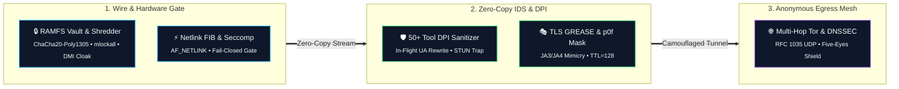

<p align="center">
  
  
  
  
  
</p>

```ascii
 ██╗    ██╗██████╗  █████╗ ██╗████████╗██╗  ██╗   ██████╗ ██████╗ ██╗███╗   ███╗███████╗
 ██║    ██║██╔══██╗██╔══██╗██║╚══██╔══╝██║  ██║   ██╔══██╗██╔══██╗██║████╗ ████║██╔════╝
 ██║ █╗ ██║██████╔╝███████║██║   ██║   ███████║   ██████╔╝██████╔╝██║██╔████╔██║█████╗  
 ██║███╗██║██╔══██╗██╔══██║██║   ██║   ██╔══██║   ██╔═══╝ ██╔══██╗██║██║╚██╔╝██║██╔══╝  
 ╚███╔███╔╝██║  ██║██║  ██║██║   ██║   ██║  ██║   ██║     ██║  ██║██║██║ ╚═╝ ██║███████╗
  ╚══╝╚══╝ ╚═╝  ╚═╝╚═╝  ╚═╝╚═╝   ╚═╝   ╚═╝  ╚═╝   ╚═╝     ╚═╝  ╚═╝╚═╝╚═╝     ╚═╝╚══════╝
```

<h3 align="center">High-Assurance Kernel-Level Network Privacy & Anti-Fingerprinting Engine</h3>
<p align="center">
  <b>Engineered in Pure Rust (10,000+ Lines • 6 Modular Crates) for Linux Systems & Security Engineering</b><br>
  <i>Ring 0/3 Hardened • Netlink FIB Engine • Zero-Copy IDS • 50+ Tool DPI Sanitizer • JA3/JA4 GREASE TLS • Encrypted RAMFS Vault</i>
</p>

---

## 🧭 Interactive Table of Contents & Quick Navigation

<p align="center">
  <a href="#-quickstart--installation"></a>
  <a href="#-codebase-metrics--language-breakdown"></a>
  <a href="#-core-architectural-pillars"></a>
  <a href="#️-privacy--security-comparison-matrix"></a>
  <a href="#-modular-crate-topology"></a>
  <a href="#-operational-command-reference"></a>
  <a href="#️-in-flight-dpi-tool-signature-sanitization-50-matrix"></a>
</p>

| 📑 Navigation Directory | 🎯 Direct Anchor Jump Links |
| :--- | :--- |
| **🚀 Getting Started** | [Automated Deployment](#1-clone--automated-system-deployment-recommended) • [Manual Cargo Build](#2-manual-cargo-compilation--binary-setup) • [Atomic In-Place Updater](#-operational-command-reference) |
| **💻 CLI & Operations** | [Primary Subcommands Table](#-primary-subcommands) • [16 Hardening Flags Matrix](#️-granular-control-flags-matrix) • [Interactive TUI Dashboard](#-primary-subcommands) |
| **🛡️ Architecture & DPI** | [Tokei Code Metrics](#-codebase-metrics--language-breakdown) • [Security Comparison Matrix](#️-privacy--security-comparison-matrix) • [50+ DPI Tools Matrix](#️-in-flight-dpi-tool-signature-sanitization-50-matrix) |
| **🔒 Low-Level Security** | [RAMFS ChaCha20 Vault](#-in-memory-cryptographic-security-specifications) • [Seccomp & Netlink FIB](#-core-architectural-pillars) • [Legal Terms of Engagement](#️-legal--operational-disclaimer) |

---

<a id="system-overview"></a>
## 🌌 System Overview

**Wraith-Prime** is a high-assurance, kernel-level network privacy, protocol normalization, and anti-fingerprinting framework designed for security researchers, privacy engineering professionals, and authorized auditing operations.

Built completely from scratch in pure Rust across **6 modular crates**, Wraith operates directly at the kernel and network boundary using **raw `AF_NETLINK` sockets, Seccomp-BPF syscall filters, `AF_PACKET` zero-copy dissectors, and wire-level protocol synthesizers**. It enforces zero-trust fail-closed network routing, active WebRTC STUN leak protection, in-flight auditing tool signature sanitization, and locked in-memory RAMFS vaults.

---

<a id="codebase-metrics"></a>
## 📊 Codebase Metrics & Language Breakdown

<details open>
<summary><b>🔍 Click to Expand / Collapse Tokei Workspace Code Verification Table</b></summary>

```text
===============================================================================
 Language            Files        Lines         Code     Comments       Blanks
===============================================================================
 Shell                   1           74           54           11            9
 TOML                    7          182          170            0           12
-------------------------------------------------------------------------------
 Markdown                1          338            0          271           67
 |- BASH                 1           16           11            3            2
 |- Rust                 1           10           10            0            0
 (Total)                            364           21          274           69
-------------------------------------------------------------------------------
 Rust                   54         9214         7564          376         1274
 |- Markdown            47          245            0          245            0
 (Total)                           9459         7564          621         1274
===============================================================================
 Total                  63         9808         7788          658         1362
===============================================================================
```
</details>

---

<a id="core-architecture"></a>
## ⚡ Core Architectural Pillars



---

<a id="privacy-matrix"></a>
## 🛡️ Privacy & Security Comparison Matrix

| Security Feature / Vector | Anonsurf (Bash) | TorGhost (Python) | Proxychains-NG (C) | Tails OS (Debian) | Wraith v1.1.0 (Rust) |
| :--- | :--- | :--- | :--- | :--- | :--- |
| **Execution Architecture** | Unsafe Shell Scripts | GC Python Wrapper | `LD_PRELOAD` Hook | Full OS Environment | **Pure-Rust Sovereign Crates (Zero GC)** |
| **Routing Mechanism** | Spawns `ip` / `route` CLI | Spawns `iptables` CLI | Hijacks `connect()` | Kernel Netfilter | **Direct `AF_NETLINK` FIB Socket API** |
| **Fail-Closed KillSwitch** | ❌ Prone to Script Hang | ❌ Fragile Subprocess | ❌ Leaks on Non-TCP | ⚠️ Static Firewall | **✔ Async Watchdog (<1ms Kernel Drop)** |
| **50+ Tool DPI Sanitizer** | ❌ None | ❌ None | ❌ None | ❌ None | **✔ In-Flight Header Normalization** |
| **Diversified UA Pool** | ❌ None | ❌ None | ❌ None | ❌ Standard Tor UA | **✔ Dynamic Multi-Browser Rotation** |
| **DNS Leak Mitigation** | `/etc/resolv.conf` rewrite | `/etc/resolv.conf` rewrite | `proxyresolv` script | Loopback Resolver | **✔ RFC 1035 + EDNS0 468B Padding** |
| **WebRTC STUN Trapping** | ❌ Vulnerable | ❌ Vulnerable | ❌ Vulnerable | ⚠️ Browser Config Only | **✔ Hardware `AF_PACKET` STUN Trap** |
| **IPv6 Leak Blackout** | Partial Disable | ❌ Unmanaged | ❌ Bypassed | Kernel Drop | **✔ Dual sysctl & ip6tables Blackout** |
| **TLS JA3/JA4 Mimicry** | ❌ None | ❌ None | ❌ None | ❌ Standard Tor Client | **✔ RFC 8701 GREASE TLS Synthesizer** |
| **TCP/IP p0f Stack Mask** | ❌ Linux Default (TTL 64)| ❌ Linux Default (TTL 64)| ❌ Linux Default (TTL 64)| ❌ Linux Default (TTL 64)| **✔ Windows 11 Profile (TTL 128, TS 0)** |
| **In-Memory RAMFS Vault** | ❌ Plaintext Temp Files | ❌ Plaintext Memory | ❌ None | ⚠️ Tmpfs (Unencrypted) | **✔ ChaCha20-Poly1305 `mlock` Vault** |
| **Anti-Forensics Wipe** | `shred` binary call | Basic `os.remove` | ❌ None | RAM wipe on shutdown | **✔ DoD 5220.22-M 7-Pass Zeroizer** |
| **Memory Footprint** | External Utilities | ~45 MB (Python VM) | ~2 MB (Hook Only) | Entire OS | **< 3.2 MB Locked Physical Memory** |

<p align="right"><a href="#-interactive-table-of-contents--quick-navigation">⬆ Back to Top</a></p>

---

<a id="crate-topology"></a>
## 📂 Modular Crate Topology

Wraith is cleanly architected into 6 highly decoupled, zero-warning pure-Rust crates:

<details open>
<summary><b>📁 Click to Expand / Collapse Complete 6-Crate Directory Structure</b></summary>

```
wraith/
├── Cargo.toml                              # Sovereign Workspace Root Manifest
├── LICENSE                                 # GNU General Public License v3.0 (GPLv3)
├── README.md                               # Operational Architecture & Documentation
├── build.sh                                # Production Linux Build & Installation Script
└── crates/
    ├── wraith-core/                        # [Core & Memory Security Layer]
    │   ├── src/crypto.rs                   # Constant-Time Cryptography (Audited SHA-256, HMAC, Poly1305)
    │   ├── src/vault.rs                    # Encrypted RAMFS Vault (RFC 8439 ChaCha20-Poly1305, mlockall, ZeroizeOnDrop)
    │   ├── src/kernel_lockdown.rs          # Kernel Hardening (kexec disable, ptrace scope, sysctl lockdown)
    │   ├── src/process_lockdown.rs         # Process Memory Lockdown (PR_SET_DUMPABLE=0, PR_SET_NO_NEW_PRIVS)
    │   └── src/state.rs                    # Atomic State Lifecycle & Safe Persistence
    │
    ├── wraith-net/                         # [Kernel Networking & DPI Layer]
    │   ├── src/netlink.rs                  # Direct AF_NETLINK Route, Link, Address & FIB Rule Engine
    │   ├── src/ids.rs                      # Zero-Copy AF_PACKET Dissector, 50+ Tool DPI Sanitizer & STUN Trap
    │   ├── src/tcp_stack.rs                # TCP/IP Stack Normalizer & p0f Evasion (TTL=128, TS=0)
    │   ├── src/ipv6.rs                     # IPv6 Dual-Stack Blackout & Leak Guard
    │   ├── src/mac.rs                      # IEEE 802.3 Hardware MAC Address Randomizer
    │   ├── src/namespace.rs                # Isolated Kernel Network Namespace (veth jail)
    │   ├── src/nftables.rs                 # Transactional Netfilter & iptables Fail-Closed Rule Manager
    │   └── src/traffic_shaper.rs           # Kernel TC/Netem Traffic Shaping (Jitter & Latency Obfuscation)
    │
    ├── wraith-guard/                       # [Defense & DNS Engine]
    │   ├── src/dns_engine.rs               # RFC 1035 UDP DNS Server + EDNS0 (468B) Padding + Sinkhole
    │   ├── src/killswitch.rs               # Fail-Closed Async Watchdog Engine (<1ms Panic Drop)
    │   ├── src/traffic_jitter.rs           # Synthetic Poisson Traffic Cell Generator & Egress Padding
    │   ├── src/bpf_filter_engine.rs        # Classic BPF / eBPF Raw Packet Assembly & Filtering
    │   ├── src/seccomp_jail.rs             # Strict Seccomp-BPF Syscall Allowlist Filter
    │   └── src/leak.rs                     # Multi-Vector Egress Leak Auditor
    │
    ├── wraith-tor/                         # [Tor Transport & TLS Camouflage Layer]
    │   ├── src/grease.rs                   # RFC 8701 GREASE JA3/JA4 TLS 1.3 ClientHello Synthesizer
    │   ├── src/tls_camouflage.rs           # SOCKS5 Camouflage Proxy with Dynamic JA3/JA4 Fingerprints
    │   ├── src/circuit.rs                  # Multi-Hop Circuit Topology & Geographic Profiler
    │   ├── src/control.rs                  # Tor Control Protocol Interface (SIGNAL NEWNYM, Telemetry)
    │   ├── src/onion_service.rs            # Ephemeral v3 Onion Hidden Service Controller
    │   └── src/bridge.rs                   # obfs4 / Snowflake Pluggable Transport Manager
    │
    ├── wraith-forensic/                    # [Anti-Forensics & Hardware Cloaking Layer]
    │   ├── src/shred.rs                    # Multi-Pass Crypto Shredder with FS Sync & Zeroization
    │   ├── src/memory.rs                   # Volatile RAM & Swap Partition Cleaner (with 5s Emergency Timeout)
    │   ├── src/anti_debug_probe.rs         # Dynamic RE Detection (PTRACE_TRACEME, TracerPid Probe)
    │   ├── src/display_jail.rs             # Xvfb Standardized 1920x1080@24bit Virtual Display Sandbox
    │   ├── src/hardware_cloaker.rs         # Hardware Serial & /etc/machine-id Mutator
    │   ├── src/browser.rs                  # Browser Profile Hardener (Canvas, WebGL, Audio Shield)
    │   └── src/logs.rs                     # System Journal, Bash History & Memory Dump Sanitizer
    │
    └── wraith-cli/                         # [Command Interface & TUI Dashboard]
        ├── src/display.rs                  # Terminal Presentation Engine & Status Dashboards
        ├── src/commands.rs                 # Subcommand Handlers with Graceful Task Handle Join
        ├── src/tui.rs                      # Interactive Real-Time Circuit & Threat Telemetry TUI
        └── src/benchmark.rs                # High-Performance Cryptographic & Kernel Benchmark Suite
```
</details>

<p align="right"><a href="#-interactive-table-of-contents--quick-navigation">⬆ Back to Top</a></p>

---

<a id="installation"></a>
## 🚀 Quickstart & Installation

### 1. Clone & Automated System Deployment (Recommended)
Execute on Kali Linux, Debian, or any modern Linux distribution:

```bash
# 1. Clone the repository
git clone https://github.com/ByGh00st/wraith.git

# 2. Enter the project directory
cd wraith

# 3. Grant execute permissions & build/install system-wide
chmod +x build.sh
sudo ./build.sh
```

### 2. Manual Cargo Compilation & Binary Setup
```bash
git clone https://github.com/ByGh00st/wraith.git
cd wraith
cargo build --release --workspace
sudo cp target/release/wraith /usr/local/bin/wraith
sudo chmod 755 /usr/local/bin/wraith
sudo mkdir -p /etc/wraith /var/log/wraith /etc/tor
```

<p align="right"><a href="#-interactive-table-of-contents--quick-navigation">⬆ Back to Top</a></p>

---

<a id="cli-reference"></a>
## 💻 Operational Command Reference

```bash
sudo wraith [COMMAND] [OPTIONS]
```

### 📋 Primary Subcommands

| Command | Operational Action |
| :--- | :--- |
| `sudo wraith start [OPTIONS]` | **Start Wraith Engine**: Initializes fail-closed routing and selected hardening layers. |
| `sudo wraith stop` | **Stop Wraith**: Restores original network configuration, interfaces, and DNS. |
| `sudo wraith switch` | **Circuit Rotation**: Issues `SIGNAL NEWNYM` to request a fresh Tor exit node identity. |
| `sudo wraith test` | **Leak Verification Suite**: Executes active tests for DNS, IPv6, and WebRTC leaks. |
| `sudo wraith info` | **Status Dashboard**: Displays live connection status, active exit IP, and circuit topology. |
| `sudo wraith dashboard` | **Interactive TUI Dashboard**: Launches terminal TUI displaying real-time telemetry. |
| `sudo wraith doctor` | **Kernel Integrity Auditor**: Audits IPv4/IPv6 sysctls, Tor daemon state, Netlink, and Seccomp. |
| `sudo wraith benchmark` | **Cryptographic Benchmark**: Evaluates ChaCha20-Poly1305, SHA-256, HMAC, and Netlink throughput. |
| `sudo wraith cleanup` | **Anti-Forensic Purge**: Clears volatile RAM caches, temporary state, and session traces. |
| `sudo wraith profile <NAME>` | **Geographic Exit Profiler**: Enforces Tor exit nodes by region (`stealth`, `speed`, `research`, `darkweb`). |
| `sudo wraith pentest` | **Security Audit Guide**: Displays guidelines for routing security assessment tools over Tor. |
| `sudo wraith update` | **Atomic In-Place Updater**: Hot-swaps release binary with zero config loss. |

---

### 🛠️ Granular Control Flags Matrix

<details open>
<summary><b>⚙️ Click to Expand / Collapse Full CLI Flag & Option Tree</b></summary>

```text
Options:
  -s, --start                      Quick start shortcut
  -x, --stop                       Quick stop shortcut
  -r, --switch                     Request new Tor exit node identity
  -t, --test                       Run comprehensive leak tests
  -i, --info                       Display telemetry dashboard & circuits
  -u, --update                     Fetch updates & recompile binary in-place
      --dashboard                  Launch interactive terminal telemetry dashboard
      --doctor                     Run deep multi-tier kernel diagnostics auditor
      --bench                      Run high-performance benchmarks
      --pentest                    Display security tool sanitization guide
  -c, --cleanup                    Anti-forensic cleanup
      --cleanup-full               Thorough anti-forensic purge (wipes swap, RAM caches, logs)
  -v, --verbose                    Enable verbose debug logging

Network Isolation:
  -m, --mac                        Randomize network interface L2 MAC address and hostname
  -b, --bridge                     Route traffic through censorship-resistant obfs4 Tor bridges
  -n, --namespace                  Restrict routing to an isolated Linux Network Namespace (10.200.1.0/24)
  -p, --profile <PROFILE>          Enforce geographic Tor exit node profile (stealth, speed, research, darkweb)
      --rotate-interval <SECS>     Automatically rotate Tor exit node identity every N seconds (e.g. --rotate 60)
                                   [aliases: --interval, --rotate, --auto-rotate]
      --jitter                     Inject synthetic traffic cells & Poisson timing jitter (200-1400ms)
      --no-killswitch [--no-ks]    Disable the Fail-Closed KillSwitch watchdog monitor

System Hardening:
      --browser-shield             Inject WebGL, Canvas, Audio, GPU, Font and Resolution anti-fingerprint profiles
                                   [aliases: --shield, --canvas-shield]
      --font-sandbox               Restrict OS-level font discovery via Fontconfig sandbox
                                   [alias: --font-jail]
      --tcp-mask                   Normalize TCP/IP L4 stack parameters (TTL=128, TS=0) for p0f evasion
      --machine-id                 Rotate unique OS /etc/machine-id and system hardware identifiers
                                   [alias: --cloaking]
  -F, --full-security              Engage ALL 16 non-destructive defense layers (Shield, NetNS, MAC, Machine-ID, TCP-Mask, Jitter, Seccomp, eBPF, RAMFS Vault)
                                   [aliases: -Fs, --full, --strict, --harden, --full-defense, --strict-hardening, --max-hardening]

High-Risk & Forensic Operations (Explicit Opt-In Only):
      --forensic-wipe-logs         ⚠ IRREVERSIBLE: Eradicate system authentication logs, event logs, and shell history
                                   [aliases: --destructive-cleanup, --wipe-logs]
  -d, --forensic-self-destruct     ⚠ IRREVERSIBLE: Cryptographically shred binary from disk and wipe memory on exit
                                   [alias: --self-destruct]
      --aggressive-masquerade      ⚠ EVASIVE: Spoof process name in scheduler as kernel worker ([kworker/u16:0])
                                   [aliases: --process-masquerade, --cloaked-process]
      --aggressive-anti-debug      ⚠ EMERGENCY ABORT: Immediately triggers SIGKILL if attached to a debugger
                                   [aliases: --anti-debug, --anti-ptrace]
```
</details>

<p align="right"><a href="#-interactive-table-of-contents--quick-navigation">⬆ Back to Top</a></p>

---

<a id="dpi-sanitization"></a>
## ⚔️ In-Flight DPI Tool Signature Sanitization (50+ Matrix)

When authorized security auditing tools or custom scripts send HTTP requests through Wraith, their default headers expose identifiable signatures (`User-Agent: sqlmap/1.8`, `User-Agent: Nmap Scripting Engine`, etc.) to target systems and network monitors.

Wraith's **Zero-Copy `AF_PACKET` Deep Packet Inspection (DPI) Engine** scans Layer-4 streams on the fly and **automatically rewrites auditing signatures into legitimate, randomized browser headers** before packets leave the local gateway.

```
[Tool Egress: "User-Agent: sqlmap/1.8"] ➔ [Wraith In-Flight DPI] ➔ [Wire: "User-Agent: Mozilla/5.0 (Windows NT 10.0; Win64; x64) Chrome/131.0.0.0"]
```

### 🎯 Supported Tool Matrix (50+ Pre-Configured Signatures)

<details open>
<summary><b>🛡️ Click to Expand / Collapse 50+ Tool Signature Normalization Table</b></summary>

| Category | Targeted & Normalized Signatures |
| :--- | :--- |
| **🌐 Network & Port Scanners** | `Nmap (NSE)`, `masscan`, `RustScan`, `OWASP ZAP`, `Metasploit (msf)`, `BurpSuite`, `BurpCollaborator` |
| **🔍 Web Content & Fuzzers** | `ffuf`, `gobuster`, `dirsearch`, `feroxbuster`, `Kiterunner`, `Wfuzz`, `Katana`, `Arjun` |
| **💥 Vulnerability Scanners** | `sqlmap`, `Nikto`, `nuclei`, `httpx`, `wpscan`, `Commix`, `dalfox`, `Ghauri`, `Droopescan` |
| **📡 OSINT & Subdomain Recon** | `Amass`, `Subfinder`, `Sublist3r`, `theHarvester`, `DNSRecon`, `WhatWeb`, `wafw00f`, `EyeWitness` |
| **⚙️ HTTP & Code Libraries** | `python-requests`, `python-urllib`, `curl/`, `Wget/`, `aiohttp`, `httplib2`, `axios/`, `node-fetch`, `Go-http-client`, `Java/`, `libwww-perl`, `Scrapy` |
| **🔐 Credential & Auditing** | `Hydra`, `Medusa`, `CrackMapExec`, `NetExec`, `Impacket`, `PostmanRuntime`, `Insomnia`, `testssl`, `sslscan` |

</details>

---

### 🎭 Diversified Multi-Browser User-Agent Pool

To prevent static User-Agent correlation and client profiling across consecutive sessions, **Wraith avoids single static headers**. 

Headers are dynamically assigned from a **stream-seeded pool of authentic modern browsers**:

```rust
pub const BROWSER_USER_AGENT_POOL: &[&str] = &[
    "Mozilla/5.0 (Windows NT 10.0; Win64; x64) AppleWebKit/537.36 (KHTML, like Gecko) Chrome/131.0.0.0 Safari/537.36",
    "Mozilla/5.0 (X11; Linux x86_64; rv:132.0) Gecko/20100101 Firefox/132.0",
    "Mozilla/5.0 (Macintosh; Intel Mac OS X 10_15_7) AppleWebKit/605.1.15 (KHTML, like Gecko) Version/18.0 Safari/605.1.15",
    "Mozilla/5.0 (Windows NT 10.0; Win64; x64) AppleWebKit/537.36 (KHTML, like Gecko) Chrome/131.0.0.0 Safari/537.36 Edg/131.0.0.0",
    "Mozilla/5.0 (Windows NT 10.0; Win64; x64; rv:132.0) Gecko/20100101 Firefox/132.0",
    "Mozilla/5.0 (X11; Ubuntu; Linux x86_64; rv:132.0) Gecko/20100101 Firefox/132.0",
    "Mozilla/5.0 (Macintosh; Intel Mac OS X 14_7_1) AppleWebKit/537.36 (KHTML, like Gecko) Chrome/131.0.0.0 Safari/537.36",
    "Mozilla/5.0 (Linux; Android 14; Pixel 8 Pro) AppleWebKit/537.36 (KHTML, like Gecko) Chrome/131.0.0.0 Mobile Safari/537.36",
];
```

* **Session Consistency**: Rewriting maintains deterministic consistency for streams within the same TCP session to avoid mid-session header flapping.
* **RFC 7230 Byte-Safe Alignment**: In-flight byte replacements preserve HTTP payload framing and pad length variations with standard trailing header whitespace.

---

### 🚨 Unrecognized & Custom Tool Detection (Heuristic Normalization)

What happens if an auditor uses a custom Python script, proprietary Go client, or an unlisted tool (`User-Agent: my-custom-recon-bot-v3.0`)?

1. **Heuristic Detection**: Wraith inspects HTTP `User-Agent` headers on the wire. If the header does not match standard browser syntax (`Mozilla/5.0`), it is flagged as an **identifiable tracking vector**.
2. **Automatic Normalization**: To prevent unique client profiling, Wraith's DPI engine intercepts and rewrites the header to a randomized authentic browser signature in-flight.
3. **Live Operator Alert**: An interactive alert is printed to the terminal with telemetry details:

```text
  ╔════════════════════════════════════════════════════════════════════════════════════════════════╗
  ║  ⚠️ WRAITH-DPI // UNRECOGNIZED CUSTOM USER-AGENT INTERCEPTED                                    ║
  ╠════════════════════════════════════════════════════════════════════════════════════════════════╣
  ║  • Detected Raw Header: User-Agent: my-custom-recon-bot-v3.0                                   ║
  ║  • Intercept Decision : Auto-sanitized to randomized authentic Browser User-Agent Pool         ║
  ║  • Operational Rationale : Non-browser / bespoke User-Agents expose unique tracking markers!     ║
  ║  • Operator Control   : To pass verbatim headers, configure dedicated transparent proxy rule.  ║
  ╚════════════════════════════════════════════════════════════════════════════════════════════════╝
```

<p align="right"><a href="#-interactive-table-of-contents--quick-navigation">⬆ Back to Top</a></p>

---

<a id="memory-security"></a>
## 🔒 In-Memory Cryptographic Security Specifications

* **RFC 8439 ChaCha20-Poly1305 AEAD**: Hardware-accelerated authenticated symmetric encryption with 256-bit keys and 96-bit nonces.
* **Kernel Memory Protection**: All secret payloads in RAM are pinned using `libc::mlockall(MCL_CURRENT | MCL_FUTURE)` to prevent paging to swap, and protected with `libc::prctl(PR_SET_DUMPABLE, 0)` against `/proc/$PID/mem` extraction.
* **Zeroize-On-Drop**: All in-memory cryptographic keys implement the `Zeroize` and `ZeroizeOnDrop` traits, ensuring immediate volatile memory sanitization upon variable disposal.

<p align="right"><a href="#-interactive-table-of-contents--quick-navigation">⬆ Back to Top</a></p>

---

<a id="legal-disclaimer"></a>
## ⚖️ Legal & Operational Disclaimer

> [!IMPORTANT]
> **LEGAL NOTICE & TERMS OF ENGAGEMENT**
>
> 1. **Authorized Security Research & Privacy Protection**: **Wraith-Prime** is designed and distributed strictly for authorized security assessments, professional penetration testing, authorized red-team auditing, and privacy defense research.
> 2. **Compliance with Laws**: Users are solely responsible for complying with all applicable local, state, national, and international laws, including computer fraud and abuse legislation (e.g., US CFAA, EU NIS2, UK Computer Misuse Act).
> 3. **Disclaimer of Liability**: The developers and contributors assume **zero liability** and are not responsible for any misuse, damage, unauthorized access, or legal consequences resulting from the operation of this software.
> 4. **Explicit Authorization Required**: Never execute network assessment or scanning tools against infrastructure or networks without prior written authorization from the system owners.

---

## 📜 License

Distributed under the **GNU General Public License v3.0 (GPLv3)**. See [LICENSE](file:///LICENSE) for the full copyleft license terms.
