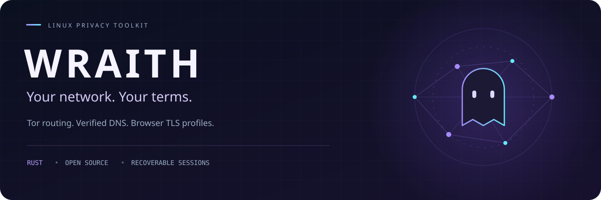
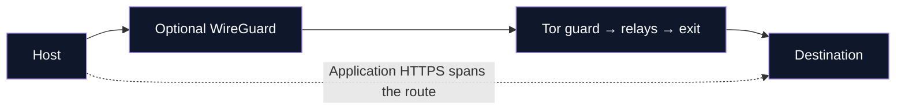
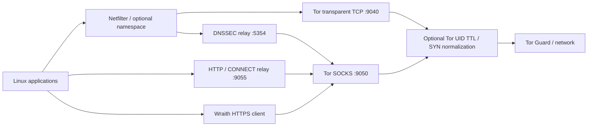

<a id="top"></a>

<p align="center">
  
</p>

<h1 align="center">Linux network privacy, in one terminal.</h1>
<p align="center">
  Route TCP through Tor. Validate DNS locally. Make verified HTTPS requests with browser TLS profiles.<br>
  <b>Configure a session. Inspect the route. Restore your settings.</b>
</p>

<p align="center">
  <a href="#installation"></a>
  <a href="#cli-reference"></a>
  <a href="#privacy-matrix"></a>
</p>

<p align="center">
  
  
  
  <a href="LICENSE"></a>
  <a href="https://github.com/ByGh00st/wraith/stargazers"></a>
</p>

<p align="center">
  <a href="https://github.com/ByGh00st/wraith/actions/workflows/e2e-kernel-test.yml"></a>
  <a href="https://github.com/ByGh00st/wraith/actions/workflows/fuzz.yml"></a>
  <a href="https://github.com/ByGh00st/wraith/actions/workflows/multi-distro.yml"></a>
  <a href="https://github.com/ByGh00st/wraith/actions/workflows/lintian-audit.yml"></a>
</p>

---

**Wraith is an open-source Linux Tor proxy and privacy session manager.** It brings network routing, DNSSEC over DoH, browser-profile HTTPS requests and recoverable host controls into a Rust CLI with a localized terminal interface.

<table>
<tr>
<td width="50%" valign="top">
<h3>🌐 Choose your route</h3>
<p>Tor TCP routing, optional network namespaces and Tor-over-WireGuard, with session controls in one place.</p>
<a href="#core-architecture">Explore the architecture →</a>
</td>
<td width="50%" valign="top">
<h3>🔒 Verify your connections</h3>
<p>Local DNSSEC validation over Tor DoH. Certificate-verified HTTPS with Chrome, Firefox or Safari TLS profiles.</p>
<a href="#browser-tls">See TLS profiles and scope →</a>
</td>
</tr>
<tr>
<td width="50%" valign="top">
<h3>⌨️ Stay in the terminal</h3>
<p>Interface and resolver selectors, circuit telemetry, 17 locales and a concise command workflow.</p>
<a href="#cli-reference">Find your command →</a>
</td>
<td width="50%" valign="top">
<h3>↩️ Keep a way back</h3>
<p>Recorded configuration changes, explicit session shutdown and retryable recovery when cleanup fails.</p>
<a href="#full-security">Read setup and recovery →</a>
</td>
</tr>
</table>

### A session in three commands

After [installation](#installation), start a session and inspect or stop it from the terminal.

```bash
sudo wraith -s     # Start the background session worker
sudo wraith -i     # Inspect status and Tor circuits
sudo wraith -x     # Stop and restore recorded settings
```

---

<p align="center">
  <a href="#installation">Installation</a> · <a href="#cli-reference">Commands</a> · <a href="#full-security">Setup &amp; recovery</a> · <a href="#browser-tls">TLS profiles</a> · <a href="#core-architecture">Architecture</a> · <a href="#privacy-matrix">Comparison</a> · <a href="#validation">Validation</a> · <a href="docs/wiki/Home.md">Wiki</a>
</p>

Wraith manages sessions on an existing **Linux x86_64 or ARM64 host**. It requires elevated privileges for routing and host changes. Tor carries TCP; arbitrary UDP/QUIC is unsupported. Browser TLS profiles apply to Wraith's own clients, and a successful exit-IP check describes that request. See the [threat model](docs/THREAT_MODEL.md) for the protection scope.

---

<a id="installation"></a>

## 🚀 Quickstart & Installation

<a id="quick-install"></a>

### Quick install · signed APT repository and official release assets

> **[Wraith v1.5.0](https://github.com/ByGh00st/wraith/releases/tag/v1.5.0)** · Native Debian packages and GNU/musl archives for x86_64 and ARM64, with `SHA256SUMS.txt`. Prefer compiling locally? Follow [source installation](#1-clone--automated-system-deployment).

```bash
# Debian / Ubuntu / Kali: configure the signed Wraith APT repository once.
sudo install -d -m 0755 /etc/apt/keyrings
curl -fsSL https://bygh00st.github.io/wraith/wraith-archive-keyring.asc | sudo tee /etc/apt/keyrings/wraith.asc >/dev/null
echo 'deb [signed-by=/etc/apt/keyrings/wraith.asc] https://bygh00st.github.io/wraith stable main' | sudo tee /etc/apt/sources.list.d/wraith.list >/dev/null
sudo apt update
sudo apt install wraith
```

| Your system | Selected package | Global executable |
| :--- | :--- | :--- |
| Debian / Ubuntu / Kali · x86_64 or ARM64 | Native `.deb`, installed with APT | `/usr/bin/wraith` |
| Arch / Fedora and other glibc systems | GNU `.tar.gz` | `/usr/local/bin/wraith` |
| Alpine / musl · x86_64 or ARM64 | Static musl `.tar.gz` | `/usr/local/bin/wraith` |

APT verifies Wraith's signed repository metadata before accepting packages. Confirm the archive-key fingerprint before adding it: `8B71 B4C4 22EF 0171 6338 4556 5D6B 16E4 201C 32FB`. Afterwards, `sudo apt upgrade` updates Wraith with the rest of the system. The installer remains available for automatic direct-release installation and for non-Debian systems:

```bash
curl -fsSL https://raw.githubusercontent.com/ByGh00st/wraith/main/install.sh | sudo bash
```

The installer needs **Bash, curl and Python 3.8+**; Alpine users can install them with `apk add bash curl python3`. Already running as root? Use `bash` instead of `sudo bash` in the installer command. It detects CPU and libc, selects assets from the official GitHub release, verifies SHA-256 and checks the installed version. Archive installs still need the runtime tools listed below. GNU artifacts are built on Ubuntu 22.04 and require compatible glibc/libstdc++ versions; APT checks Debian library dependencies (the current packages require `libc6 >= 2.34`).

<details>
<summary><b>Manual Debian installation · inspect the download first</b></summary>

```bash
# x86_64 / amd64; use arm64 in the package filename on ARM64
wget https://github.com/ByGh00st/wraith/releases/download/v1.5.0/wraith_1.5.0_amd64.deb
wget https://github.com/ByGh00st/wraith/releases/download/v1.5.0/SHA256SUMS.txt
sha256sum --ignore-missing --check SHA256SUMS.txt
sudo apt install ./wraith_1.5.0_amd64.deb
wraith --version
```

APT owns `/usr/bin/wraith`. The signed Wraith repository supports `sudo apt install wraith` and normal APT upgrades after the one-time setup above. To remove an APT installation, finish session cleanup with `sudo wraith -x`, then run `sudo apt remove wraith`. If an older `/usr/local/bin/wraith` shadows it, inspect `type -a wraith` and explicitly resolve that previous installation. The installer reports the conflict.

To inspect and verify without installing:

```bash
curl -fsSL https://raw.githubusercontent.com/ByGh00st/wraith/main/install.sh -o install.sh
less install.sh
bash install.sh --dry-run
```

`--dry-run` downloads and validates assets without running the binary or changing system files. Release checksums detect mismatches; they share the repository's GitHub trust boundary and are not independent signatures.

</details>

<a id="1-clone--automated-system-deployment"></a>

### Build from source

The runtime targets **x86_64 and ARM64 Linux**. The source-install helper supports GNU/Linux on Debian-family distributions. Windows supports portable development tests, not privileged network sessions.

```bash
git clone https://github.com/ByGh00st/wraith.git
cd wraith
chmod +x build.sh
sudo ./build.sh
```

Install Rust under your ordinary account first. The helper installs Debian-family dependencies, builds the locked workspace as the invoking user, and atomically installs one executable. Existing sessions keep running; firewall, resolver and filesystem mount settings are preserved. See [build.sh](build.sh).

<a id="2-manual-cargo-compilation--binary-setup"></a>

### Manual build and runtime dependencies

Use current stable Rust (dependencies require at least Rust 1.88) and C/C++ compilers, CMake, Perl and libclang for BoringSSL. Build as your ordinary account, then install the executable:

```bash
CMAKE_BUILD_PARALLEL_LEVEL=2 cargo build --release --locked -j 2
sudo install -m 0755 target/release/wraith /usr/local/bin/wraith
wraith --version
wraith --help
```

| Dependency | Required for |
| :--- | :--- |
| Tor and a dedicated non-root account (`debian-tor`, `tor`, `toranon` or `_tor`) | Tor transport; UID 0 is never a fallback |
| Dedicated `/run/wraith-tor` and `/var/lib/wraith/tor` | Wraith Tor runtime and data; system Tor files are kept separate |
| iproute2 (`ip`, `tc`) | Interfaces, namespaces and optional shaping |
| util-linux (`nsenter`) | Execute TCP settings through a pinned namespace descriptor |
| iptables/ip6tables plus save/restore tools | Session policy and recovery snapshots |
| CMake, Perl, libclang, C/C++ compiler | Native browser TLS engine build, including source updates |
| curl | Connectivity and bridge helper requests |
| fontconfig / `fc-cache` | Font sandbox application and restoration |
| WireGuard tools | Optional `-W` outer tunnel |
| Xvfb and `xauth` | Optional private virtual display |
| Pluggable transport executable | Selected Tor bridge transport |

For build failures and memory limits, see [build troubleshooting](docs/wiki/Troubleshooting.md#build-and-package-diagnostics).

<a id="3-systemd-daemon-deployment"></a>

### Optional systemd service

```bash
sudo ./install-daemon.sh
# Or configure without the wizard:
sudo ./install-daemon.sh --non-interactive --boot-mode standard --profile stealth --doh quad9
```

Default service ordering follows `network-online.target`; installation does not immediately start a session. Unsupported `--boot-mode early` is rejected. Inspect the generated unit and strict prerequisites before enabling it. The service does not establish protection for all early-boot traffic.

<p align="right"><a href="#top">⬆ Back to Top</a></p>

---

<a id="cli-reference"></a>

## Daily commands

<a id="-primary-shortcuts--subcommands"></a>

| Command | Action |
| :--- | :--- |
| `sudo wraith -s` | Start a background session |
| `sudo wraith -i` | Inspect session status and Tor circuits |
| `sudo wraith -t` | Run bounded connectivity and leak checks |
| `sudo wraith -r` | Request a new identity for eligible new Tor streams |
| `sudo wraith -x` | Stop and restore recorded settings; retry incomplete recovery |
| `sudo wraith -Fs` | Start the strict preset in the foreground |
| `sudo wraith doctor` | Inspect host and network prerequisites |
| `sudo wraith exec -- PROGRAM ...` | Launch an application in the managed namespace |
| `wraith fetch URL --tls-profile chrome` | Make a verified HTTPS request through Tor |
| `wraith --help` / `wraith start --help` | Show commands and available session options |

Choose one operation per invocation. `sudo wraith -Fs` and `sudo wraith start -F` are supported; session flags before a subcommand, such as `wraith -F start`, are rejected. `-v` and `--lang` are global options. Strict and interactive sessions stay in the foreground; Ctrl+C requests cleanup. NEWNYM does not migrate existing connections or erase cookies and logins.

<a id="hardware-interface-selector"></a>
<a id="dns-over-https"></a>
<a id="operational-usage-examples"></a>

### Choose your session settings

```bash
wraith interfaces
# Replace wlan0 with your adapter; run one session at a time.
sudo wraith start -I wlan0 -D quad9
sudo wraith -i
sudo wraith -x
```

`wraith doh` lists/selects DNS-over-HTTPS providers. Without an interactive terminal, supply the interface and resolver explicitly. MAC rotation may require Wi-Fi association or DHCP renewal. See [daily workflow](docs/wiki/Daily-Workflow.md) and [DNS and routing](docs/wiki/DNS-and-Routing.md).

<a id="tor-moat-protocol"></a>
<a id="granular-control-flags"></a>

### Optional controls

| Option or command | Purpose |
| :--- | :--- |
| `wraith bridge` / `sudo wraith bridge moat` | Inspect bridge pools or discover supported transports |
| `-W /path/to/wg.conf` | Carry Tor through a configured WireGuard tunnel |
| `--morph-l4 auto --tls-profile safari` | Select matching namespace and Tor access-link TCP settings |
| `--rotate-interval 120` | Periodically request new Tor identities |
| `--browser-shield` | Apply preferences to supported browser profiles |
| `--display-sandbox` | Create a private X11 display; requires Xvfb and xauth |

WireGuard needs compatible configuration and system tools. Applications must use the selected browser profile or display for those controls to apply. Cleanup utilities and irreversible log/file removal options are documented separately from the session workflow; inspect command help before use. See [advanced configuration](docs/wiki/Advanced-Configuration.md) for prerequisites and the complete option scope.

<a id="enterprise-i18n"></a>

### Language selection

The interface ships 17 locales: `ar`, `az`, `de`, `en`, `es`, `fa`, `fr`, `it`, `ja`, `ko`, `nl`, `pl`, `pt`, `ru`, `tr`, `uk`, `zh`. Translation coverage can differ by message.

```bash
wraith --select-lang
wraith --lang tr --help
```

---

<a id="full-security"></a>

## Strict setup and recorded recovery

`sudo wraith -Fs` combines full-security (`-F`) with start (`-s`) in a foreground session. It requires Tor routing and its watchdog, DNSSEC over DoH, namespace and Tor access-link L4 controls, managed browser/font settings, host identity controls and process/memory protections. Required setup failure refuses activation and attempts recorded cleanup.

```bash
# On a prepared Linux host; replace eth0 with your interface.
sudo wraith -Fs -I eth0 --tls-profile firefox
# From a second terminal, as your normal sudo user:
sudo wraith exec -- curl https://example.com
sudo wraith -i
sudo wraith -x
```

`auto` pairs Chrome with Windows11 TCP settings, Firefox with LinuxDefault, and Safari with MacOS. Strict mode rejects incompatible manual pairs and `--morph-l4 off`. Existing applications are not moved into the namespace, and curl retains its own TLS implementation. Session `--tls-profile` selects Wraith's DoH and optional cover-request client; `fetch` has a separate profile option.

Host MAC, hostname and machine-id changes are journaled. Browser controls require supported profiles; MAC changes can interrupt connectivity. Kernel lockdown, `kernel.kexec_load_disabled` and `kernel.yama.ptrace_scope` are observed boot/administrator policies, not settings Wraith changes or requires for a temporary session. Read [strict prerequisites and optional additions](docs/wiki/Advanced-Configuration.md#full-security-preset) before starting.

<a id="panic-sentry"></a>

### Failure and shutdown behavior

| Event | Behavior |
| :--- | :--- |
| Tor health checks fail | The watchdog adds an application egress gate while preserving the existing routing policy. On successful recovery it restores the saved Tor session policy. |
| Wraith panics | The handler restores terminal presentation and retains restrictive network policy and recovery records. It does not open direct internet access or replace DNS. |
| Normal stop or foreground Ctrl+C | Wraith attempts recorded cleanup and restores saved host settings. |
| Cleanup fails | The error remains visible and recovery records are retained for a retry with `sudo wraith -x`. |
| Tor L4 queue worker fails | New queued SYNs are dropped; established connections can continue. |

The watchdog uses bounded health checks; it does not promise an instantaneous response. Release builds use `panic = "abort"`, so a panic does not run normal destructors or synchronous network teardown.

<a id="orphan-recovery"></a>

### Recover an interrupted session

Startup checks worker identity and recorded ownership under a lifecycle lock before creating a session. The session journal and private namespace/egress leases authorize cleanup of Wraith-owned resources. Busy namespaces, changed identities and ambiguous resources stop automatic recovery. Close applications launched with `wraith exec`, resolve the reported error, then retry:

```bash
sudo wraith -x
```

A failed managed-Tor stop or namespace teardown withholds firewall restoration. Missing state does not authorize a host-wide firewall flush. Snapshots preserve recorded file contents, modes/ownership, missing-file state and resolver symlink targets; they do not capture ACLs/xattrs or independent changes by other programs. Durable network leases do not replace the full `/var/run/wraith.state` journal, which may disappear on reboot.

See [troubleshooting and orphan recovery](docs/wiki/Troubleshooting.md) for DNS failures, Wi-Fi reconnection, namespace conflicts and incomplete cleanup.

---

<a id="dpi-sanitization"></a>

## HTTP relay and browser TLS profiles

The source contains **1,338 signature entries** spanning HTTP clients and security tools. Matching text does not prove every named tool is proxied or indistinguishable from a browser.

The HTTP relay on port 9055 handles redirected port-80 traffic and performs initial-request User-Agent sanitization against the 1,338+ signature catalog before forwarding through Tor SOCKS. It removes `Forwarded`, `X-Forwarded-For`, `X-Real-IP`, `Via`, `Client-IP`, `True-Client-IP`, `X-Client-IP`, `X-Originating-IP` and proxy-only authentication/connection headers. Origin authorization, cookies and binary bodies are preserved. Later requests on a persistent stream are not reparsed. HTTPS CONNECT tunnels preserve the application's original TLS stream. The `AF_PACKET` packet monitor inspects copies for detection and alerting; wire sanitization is handled by the L7 proxy.

```text
Cleartext HTTP → HTTP relay :9055 → Tor SOCKS :9050 → destination
HTTPS CONNECT → tunnel through Tor → original TLS stream
Packet monitor → observations and counters
```

<a id="browser-tls"></a>

### 🔐 Real ClientHello profiles: JA3 / JA4 scope

Wraith uses a TLS client backed by **BoringSSL through [wreq](https://github.com/0x676e67/wreq)** and its emulation profiles. TLS cipher suites, extensions, ALPN and HTTP/2 settings come from the selected profile. This changes the actual connection handshake, rather than only a User-Agent string or a displayed fingerprint value.

| Profile | Pinned emulation | Used by |
| :--- | :--- | :--- |
| `chrome` | Chrome 131 / Windows | Default `fetch`, DNS-over-HTTPS and cover requests |
| `firefox` | Firefox 133 / Linux | Selected `fetch`, session DoH/cover requests or Rust client integration |
| `safari` | Safari 18 / macOS | Selected `fetch`, session DoH/cover requests or Rust client integration |

These are specific supported profiles, not a promise to impersonate the latest browser release. JA3/JA4 are fingerprinting schemes, not encryption or anonymity shields. Matching a handshake profile does not reproduce JavaScript, cookies, browser behavior or every network fingerprint.

```bash
# Start a Wraith/Tor session first, then fetch without root privileges.
wraith fetch https://example.org/ --tls-profile chrome --output page.html
wraith fetch https://example.org/ --tls-profile firefox --output firefox-page.html
wraith fetch --help
```

The client uses **SOCKS5 remote DNS**, certificate-chain and hostname verification, TLS 1.2 or newer, bounded timeouts, and an 8 MiB fetch limit. Redirects are not followed. Output is written atomically and existing files are not overwritten. A failed Tor connection does not fall back to a direct request.

Supported integrations can invoke `wraith fetch` or use the public `wraith_tor::BrowserTlsClient` API for HTTPS GET requests. The DNS relay uses the same client for DNS-message POST requests. Other applications can use the HTTP relay's CONNECT support, but retain their own TLS fingerprint. Wraith does not install a root CA or decrypt their HTTPS sessions.

<a id="cover-requests"></a>

### 🌊 Optional encrypted cover requests

```bash
# Replace this with an HTTPS endpoint you control or have permission to use.
sudo wraith -s --jitter --jitter-endpoint https://your-domain.example/cover
```

The worker performs a real HTTPS GET through Tor after each randomized **15–45 second** pause, caps each response at **16 KiB**, and cancels on session shutdown. It requires an explicit endpoint and is not automatically enabled by `-Fs`. This creates application traffic; it does not establish resistance to timing correlation.

The encoded catalog is an implementation detail, not encryption or an antivirus exclusion mechanism. Normalization does not guarantee non-detection or exemption from Tor-exit blocklists.

---

<a id="supported-tool-matrix"></a>
<a id="diversified-ua-pool"></a>

The signature catalog and browser-shaped User-Agent templates support initial HTTP normalization. Catalog entries do not establish coverage of every named tool, and a User-Agent template is not a browser implementation. See the [TLS and HTTP guide](docs/wiki/TLS-and-HTTP.md) for request handling, limits and integrations.

---

<a id="l4-tcp-profiles"></a>

## TCP profile scope

Namespace TCP settings apply to applications launched inside the managed namespace. A separate policy normalizes the Tor daemon's outgoing IPv4 TCP toward its Guard or TCP bridge, scoped to the dedicated non-root Tor UID.

| Reference profile | TTL | Tor SYN MSS cap | Tor SYN timestamps |
| :--- | ---: | :--- | :--- |
| Windows11 | 128 | 1460; never increases the kernel offer | Remove the timestamp option |
| MacOS | 64 | 1440; never increases the kernel offer | Preserve existing values |
| LinuxDefault | 64 | No cap | Preserve existing values |

The Tor egress engine reorders existing SYN options, preserves native window/window-scale values and recomputes checksums. It does not synthesize timestamp state or replace the TCP stack. Missing TTL/NFQUEUE support or failed policy readback refuses startup. Queue counters and configuration readback do not establish a measured OS fingerprint.

The public Tor exit's TCP stack and Tor's outer TLS handshake remain unchanged. UDP-based bridge paths are outside this TCP policy. With WireGuard, the local observer sees the tunnel's outer packets. See [L4 and L7](docs/wiki/L4-and-L7.md), [namespace design](docs/L4-SYSCTL-DESIGN.md) and [egress design](docs/L4-EGRESS-DESIGN.md) for field-level behavior, ownership and recovery.

---

<a id="tor-defense"></a>

## 🛡️ Tor Threats & Operational Boundaries

| Concern | Relevant control | Remaining boundary |
| :--- | :--- | :--- |
| Direct egress | Strict firewall, namespace and watchdog | Host root can change policy |
| Guard sees source IP | Optional Tor-over-WireGuard | Trust shifts to the VPN path |
| Exit reads cleartext | Application HTTPS | Rewriting headers does not encrypt content |
| Resolver tampering | Local DNSSEC | Unsigned delegations remain unsigned |
| Geographic preference | Exit profiles | Geography does not establish relay trust |
| Long-lived identity | NEWNYM for eligible new streams | Existing streams, logins and cookies persist |
| Timing correlation | Optional netem and bounded HTTPS cover traffic | No established correlation defense |
| TLS fingerprinting | Real browser-profile TLS/HTTP2 for Wraith clients | Other applications retain their own TLS fingerprints |
| Tor blocking | Bridge support on the access path | Destinations can restrict exit addresses |


```mermaid
graph LR
    classDef node fill:#0f172a,stroke:#a78bfa,color:#f8fafc;
    A["Host"]:::node --> B["Optional WireGuard"]:::node
    B --> C["Tor guard → relays → exit"]:::node
    C --> D["Destination"]:::node
    A -. "Application HTTPS spans the route" .-> D
```

A successful exit-IP probe describes that request, not every interface, protocol or application.

---

<a id="memory-security"></a>

## Memory controls and limits

| Mechanism | Purpose |
| :--- | :--- |
| ChaCha20-Poly1305 | Authenticated vault encryption |
| Zeroization on drop | Clear owned session, snapshot, vault and WireGuard secret buffers during destruction |
| Memory locking | Request resident memory; strict mode propagates failure |
| Dump restrictions | Process controls and reversible core-pattern setting |
| Seccomp TSYNC | Apply the ptrace restriction to existing threads |

`StateData`, namespace TCP snapshots, route snapshots and Tor egress snapshots implement zeroization on drop. Sensitive maps wipe their keys and values on replacement, clear and destruction. State JSON buffers, vault plaintext and WireGuard configuration input use `Zeroizing`; WireGuard debug output redacts its keys. The on-disk recovery journal remains available for restoration.

Release builds use **`panic = "abort"`**. Normal scope exits and ordinary error returns run destructors; a release panic, SIGKILL or power loss does not. Tests use unwinding, so an unwind-drop regression is not evidence of cleanup after a release panic. This does not erase allocator copies, third-party TLS internals, kernel buffers or every process allocation, and is not a cold-boot resistance guarantee. Memory locking does not defeat a compromised kernel. Seccomp is not a general syscall allowlist; file overwrites cannot establish erasure from SSD firmware, snapshots or backups.

---

<a id="system-overview"></a>
<a id="core-architecture"></a>

## Architecture

Wraith runs in user space and configures Linux networking through Netfilter, namespaces and host controls. Its session lifecycle records changes before mutation and retains recovery state when cleanup is incomplete.


```mermaid
flowchart LR
    A[Linux applications] --> B[Netfilter / optional namespace]
    B --> C[Tor transparent TCP :9040]
    A --> D[HTTP / CONNECT relay :9055]
    A --> E[Wraith HTTPS client]
    B --> F[DNSSEC relay :5354]
    D --> G[Tor SOCKS :9050]
    E --> G
    F --> G
    C --> L[Optional Tor UID TTL / SYN normalization]
    G --> L
    L --> H[Tor Guard / network]
```

<a id="crate-topology"></a>

| Crate | Responsibility |
| :--- | :--- |
| [`wraith-core`](crates/wraith-core) | State, snapshots, configuration and cryptographic utilities |
| [`wraith-net`](crates/wraith-net) | Routing policy, interfaces, namespaces and Tor access-link TCP normalization |
| [`wraith-tor`](crates/wraith-tor) | Tor lifecycle, HTTP/CONNECT relay and verified browser-profile TLS client |
| [`wraith-guard`](crates/wraith-guard) | DNSSEC over Tor DoH, watchdog, packet observations and optional cover requests |
| [`wraith-forensic`](crates/wraith-forensic) | Managed browser/host controls and explicit cleanup utilities |
| [`wraith-cli`](crates/wraith-cli) | Session orchestration, commands and localized terminal interface |

The [architecture guide](docs/wiki/Architecture.md) covers component boundaries and ownership. Design details and source files remain in their respective crate directories.

---

<a id="privacy-matrix"></a>

## 🛡️ Privacy & Security Comparison Matrix

<p align="center">
  <b>Different tools. Different boundaries. One detailed comparison.</b><br>
  Compare routing, application privacy and everyday operation by documented capability.
</p>

<p align="center">
  <a href="#matrix-network">🌐 Network</a> · <a href="#matrix-privacy">🔐 Privacy</a> · <a href="#matrix-workflow">⌨️ Workflow</a> · <a href="#matrix-evidence">📚 Evidence</a>
</p>

| ✅ Supported | ◐ Conditional / limited | ❌ Not provided in the compared scope | — Not established / not applicable |
| :---: | :---: | :---: | :---: |

**Read the qualifiers:** a tick means an implemented or documented capability, not a security score. Optional controls still require configuration. The [validation section](#validation) distinguishes recorded results from the checks configured in CI.

<a id="matrix-network"></a>

### 🌐 01 / Network & transport

| Capability | 👻 **Wraith** | 🦜 **AnonSurf** | 👤 **TorGhost** | 🔗 **Proxychains-NG** | 💿 **Tails** |
| :--- | :---: | :---: | :---: | :---: | :---: |
| **Host-level Tor TCP routing** | ✅ Netfilter | ✅ Netfilter | ✅ Netfilter | ❌ Per-app hooks | ✅ OS policy |
| **Application socket proxying** | ◐ Local Tor relay | — | — | ✅ SOCKS / HTTP chains | ◐ Tor applications |
| **Non-Tor egress restrictions** | ✅ Strict policy | ◐ LAN exclusions | ◐ LAN exclusions | ❌ No host firewall | ✅ OS policy¹ |
| **DNS sent through Tor** | ✅ DoH relay | ✅ Tor DNS | ✅ Tor DNS | ◐ Proxy DNS setup | ✅ Integrated |
| **Local DNSSEC proof validation** | ✅ Hickory | — | ❌ Tor DNS only | ❌ No validator | — |
| **TCP + UDP port-53 interception** | ✅ Both | ◐ UDP rule | ◐ UDP rule | ❌ No interception | — |
| **Explicit host IPv6 restriction** | ✅ Session rules | ✅ Disable IPv6 | ❌ No IPv6 rule² | ❌ No host policy | — |
| **Access-link L4 TCP SYN normalization** | ◐ Tor UID NFQUEUE rewrite⁷ | ❌ | ❌ | ❌ | ❌ |
| **General UDP transport through Tor** | ❌ (Tor limitation) | ❌ | ❌ | ❌ | ❌ |

<a id="matrix-privacy"></a>

### 🔐 02 / Application privacy & recovery

| Capability | 👻 **Wraith** | 🦜 **AnonSurf** | 👤 **TorGhost** | 🔗 **Proxychains-NG** | 💿 **Tails** |
| :--- | :---: | :---: | :---: | :---: | :---: |
| **Selectable Chrome / Firefox / Safari TLS client** | ✅ Owned requests³ | — | ❌ | ❌ App TLS | ◐ Tor Browser⁴ |
| **Initial cleartext HTTP header normalization** | ◐ Local relay | — | ❌ | ❌ | — |
| **Other apps' HTTPS ClientHello rewriting** | ❌ CONNECT passthrough | — | ❌ | ❌ | — |
| **Saved firewall restoration** | ✅ Journaled tables | ✅ Saved rules | ❌ Flush/reset² | — No host policy | — Separate OS |
| **Resolver backup / restoration** | ✅ Saved entry | ✅ dnstool | ✅ Backup file | — | — Separate OS |
| **MAC address randomization** | ✅ Optional | — | ❌ | ❌ | ✅ Default⁵ |
| **Encrypted persistent OS storage** | ❌ Ephemeral RAMFS vault only | ❌ Host tool | ❌ Host tool | ❌ App tool | ✅ Optional⁶ |
| **Cold-boot / OS-wide RAM wipe on shutdown** | ❌ Internal buffer zeroize only | ❌ | ❌ | ❌ | ✅ Kernel memory wipe⁸ |
| **Browser privacy preferences** | ✅ Managed profiles | — | ❌ | ❌ | ✅ Tor Browser⁴ |

<a id="matrix-workflow"></a>

### ⌨️ 03 / Deployment & daily workflow

| Capability | 👻 **Wraith** | 🦜 **AnonSurf** | 👤 **TorGhost** | 🔗 **Proxychains-NG** | 💿 **Tails** |
| :--- | :---: | :---: | :---: | :---: | :---: |
| **Use on an existing Linux installation** | ✅ | ✅ Parrot focus | ✅ | ✅ | ❌ Boot environment |
| **Dedicated bootable privacy OS** | ❌ | ❌ | ❌ | ❌ | ✅ |
| **Graphical desktop interface** | ❌ Terminal UI | ✅ GTK | ❌ CLI | ❌ CLI | ✅ Desktop |
| **Native runtime on a non-Linux OS** | ❌ Runtime | ❌ | ❌ | ✅ BSD / macOS / others | ❌ Dedicated OS |
| **Start / stop command workflow** | ✅ Sessions | ✅ Sessions | ✅ Sessions | ◐ Per process | ◐ Boot / shutdown |
| **Operator-requested Tor identity change** | ✅ NEWNYM | ✅ Identity action | ✅ NEWNYM | — Upstream proxy | ✅ Tor Browser⁴ |

<a id="matrix-evidence"></a>
<details>
<summary><b>📚 Evidence, scope and comparison notes</b></summary>

Reviewed **2026-09-26** against upstream documentation and source. A dash is deliberately not a cross: an unverified capability must not be presented as absent. These projects differ in deployment scope; there is no overall winner or calculated anonymity score.

1. [How Tails works](https://tails.net/about/index.en.html) describes its integrated environment and Tor limits. Its explicitly separate Unsafe Browser is not an anonymous Tor browsing path.
2. [TorGhost routing source](https://github.com/SusmithKrishnan/torghost/blob/master/torghost.py) defines the compared rules, resolver backup and stop/reset behavior. Entries describe that implementation, not every possible external Tor configuration.
3. Wraith's profiles apply to `fetch`, its native client API and DoH. The HTTP relay normalizes the first cleartext request; CONNECT retains application TLS. [TLS scope](#browser-tls) · [Threat model](docs/THREAT_MODEL.md) · [Validation](#validation).
4. Tails integrates Tor Browser; this is not equivalent to a three-profile HTTP client API. Browser identity controls have a different scope from system-wide identity changes. See [Tails included software](https://tails.net/doc/about/features/index.en.html).
5. [Tails MAC address anonymization](https://tails.net/doc/first_steps/welcome_screen/mac_spoofing/index.en.html) documents its defaults and compatibility limits.
6. [Tails Persistent Storage](https://tails.net/doc/persistent_storage/index.en.html) is encrypted optional storage. Wraith's in-memory vault serves a different purpose.
7. Wraith provides selective TCP SYN rewrite on the Tor access link (TTL, MSS cap, option layout); this does not replace the kernel TCP stack, does not alter public Tor exit packets, and has no measured p0f wire guarantee.
8. Tails executes an automated kernel-level memory wipe on shutdown/reboot (amnesia) to resist physical RAM extraction. Wraith runs as a userspace session manager on an existing Linux host; it zeroizes its own internal buffers but cannot erase kernel allocations or provide cold-boot hardware immunity.

Additional sources: [AnonSurf routing and restoration](https://github.com/ParrotSec/anonsurf/blob/master/scripts/anondaemon), [AnonSurf project and interfaces](https://github.com/ParrotSec/anonsurf), [Proxychains-NG capabilities and compatibility](https://github.com/rofl0r/proxychains-ng#readme).

</details>

---

<a id="updates"></a>

## ⬆️ Official GitHub Updates

Update from your existing official GitHub clone:

```bash
cd /path/to/wraith
wraith -u                 # equivalent: wraith update
sudo ./build.sh            # compile as your normal user, then install
```

The updater validates the origin and `main` branch, rejects uncommitted changes and URL rewrite rules, then performs a **fast-forward-only** update from `ByGh00st/wraith` over verified HTTPS. It never resets your work. Git hooks and filesystem monitors are disabled; Git runs as the normal user even when invoked through `sudo`. A failed fetch or divergent branch returns an error. `./update.sh` follows the same source-sync workflow.

For release installations, rerun `install.sh` or install a newer `.deb`; `-u` remains a source-checkout operation.

Source synchronization and binary installation are separate steps. `build.sh` uses an isolated build directory and installs only after a successful locked build. Run it through `sudo` from the account that owns your Rust toolchain. Direct root builds are rejected. GitHub HTTPS and repository access controls are the source-update trust boundary.

Clones predating a repository history rewrite may fail the fast-forward check. Preserve local work and clone into a new directory; the updater will not reset your existing checkout.

The core library contains Minisign manifest verification, but the CLI does **not** currently install signed offline artifacts. Supplying `--artifact`, `--manifest` or `--signature` returns an explicit error rather than falling through to a source update.

---

<a id="validation"></a>

## Development and validation

The workflow badges above show GitHub Actions status for `main`. A passing run describes the checks executed at its commit and under its fixtures; it does not establish every routing, anonymity or host-recovery property.

| Workflow | Configured scope |
| :--- | :--- |
| [Native packages](.github/workflows/release.yml) | GNU/musl builds and native package checks for x86_64 and ARM64 |
| [Kernel integration](.github/workflows/e2e-kernel-test.yml) | Seven namespace scenarios and the opt-in native SYN wire audit |
| [Parser fuzzing](.github/workflows/fuzz.yml) | Five libFuzzer targets, scheduled weekly or manually; inspect each run for duration and findings |
| [Distribution matrix](.github/workflows/multi-distro.yml) | Package installation and `--version`/`--help` on Kali, Debian, Ubuntu, Arch and Alpine; doctor output is informational and does not fail the job |
| [Debian audit](.github/workflows/lintian-audit.yml) | Package quality and removal/purge checks |

### Recorded v1.5.0 results

The **2026-09-27** stabilization record reports 252 passed, 0 failed and 1 ignored on Windows; native GNU Linux reports 254 passed, 0 failed and 1 ignored on each architecture. These are historical counts, separate from current workflow status.

The [native package run at `1cee183`](https://github.com/ByGh00st/wraith/actions/runs/35992818793) records the four GNU/musl targets, two Debian packages and four archives; release publication was skipped. See [development](docs/wiki/Development.md) and [releasing](docs/RELEASING.md) for commands and release scope.

```bash
cargo check --workspace --all-targets --locked
cargo test --workspace --locked
cargo clippy --workspace --all-targets --locked -- -D warnings
cargo audit --deny warnings
```

Portable regressions exercise TLS certificate/hostname rejection, request framing and limits, DNSSEC responses, state recovery and packet parsing. Privileged routing and recovery require Linux integration checks. An advisory scan covers published advisories; fuzzing results are bounded by the selected targets, inputs and runtime.

### Native wire audit

[`live_wire_syn_audit.rs`](crates/wraith-net/tests/live_wire_syn_audit.rs) captures a kernel SYN in an isolated mount/network sandbox. It checks a controlled Windows-profile fixture, including TTL, MSS, timestamp absence, window size and namespace MAC. Its window assertion is not a universal Windows fingerprint.

```bash
# Linux with build dependencies, util-linux, iproute2 and Netfilter tools:
sudo -E cargo test -p wraith-net --test live_wire_syn_audit -- --ignored --nocapture
```

<a id="codebase-metrics"></a>

For source structure, use the [crate map](#crate-topology). Line counts and catalog size are inventory metrics, not validation results.

Report failures with the command, distribution, interface, expected behavior and sanitized logs. Omit passwords, private keys and tokens.

---

<a id="legal-disclaimer"></a>

## Responsible use

Use Wraith only where you have authorization and comply with applicable laws and policies. Wraith does not guarantee anonymity, non-detection or protection from attribution. Its technical boundaries are documented in the [threat model](docs/THREAT_MODEL.md).

<a id="project-guides"></a>

## Project guides

| Install and use | Understand and troubleshoot | Contribute and report |
| :--- | :--- | :--- |
| [Getting started](docs/wiki/Getting-Started.md) | [Architecture](docs/wiki/Architecture.md) | [Contributing](CONTRIBUTING.md) |
| [Daily workflow](docs/wiki/Daily-Workflow.md) | [Threat model](docs/THREAT_MODEL.md) | [Security policy](SECURITY.md) |
| [Advanced configuration](docs/wiki/Advanced-Configuration.md) | [Troubleshooting](docs/wiki/Troubleshooting.md) | [Support](SUPPORT.md) |

Report ordinary bugs through [Issues](https://github.com/ByGh00st/wraith/issues/new/choose). Use the private channel in the security policy for sensitive vulnerabilities. Collaboration follows the [code of conduct](CODE_OF_CONDUCT.md).

<a id="-license"></a>

## License

Distributed under **GNU GPL v3.0**, without warranty as described in [LICENSE](LICENSE). The license governs distribution and modification rights.

<p align="center"><a href="#top">Back to top</a> · <a href="docs/wiki/Home.md">Wiki guides</a></p>
