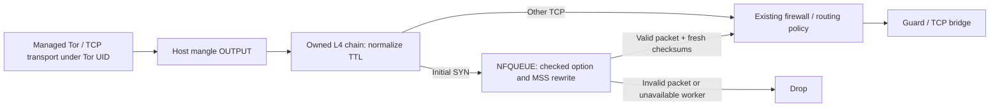

# Tor access-link TCP normalization

Wraith keeps shared Tor exits and targets the IPv4 TCP fields visible between the local machine and its Guard or TCP bridge. The application namespace remains separate. This engine does not require a VPS, change host TCP sysctls or implement a new TCP state machine.

## Packet path

`--morph-l4 auto`, a manual profile, `--namespace`, `--tcp-mask` and `-Fs` select the existing namespace profile and this egress policy. `--namespace --morph-l4 off` keeps isolation without either TCP normalization layer. Strict mode rejects `off`. Auto follows Chrome → Windows11, Firefox → LinuxDefault and Safari → MacOS.

## Modules and ownership

| Module | Responsibility |
| :--- | :--- |
| `tcp_wire.rs` | Pure checked IPv4/SYN transformation and checksum calculation |
| `nfqueue.rs` | Minimal netlink protocol over safe `nix` sockets; owned close-on-exec descriptor |
| `tcp_egress.rs` | UID-scoped rules, queue startup, policy readback, journal and teardown |
| CLI lifecycle | Start before managed Tor, verify before activation, cancel/join on shutdown |

No new dependency or unsafe block is introduced. The kernel must support IPv4 mangle, owner/comment matches, TTL and NFQUEUE. Existing application namespace setup also needs TCPMSS. Commands use the configured `iptables` backend with a bounded xtables lock wait.

The `WRAITH_L4_EGRESS` chain, `wraith-l4-egress` comment and queue **41884** are reserved for the session. Startup refuses a conflicting chain/comment, queue references in the IPv4/IPv6 iptables-save output or an already-bound queue. Queue binding is exclusive. Independently managed native nftables rules are not coordinated; as with the existing session firewall, concurrent privileged policy writers are outside the ownership boundary. The jump selects only TCP, the dedicated non-root Tor UID and non-loopback output. Processes sharing that UID share the policy; it is not PID isolation.

## Field transformations

| Field | Windows11 | MacOS | LinuxDefault |
| :--- | :--- | :--- | :--- |
| IPv4 TTL on Tor TCP packets | 128 | 64 | 64 |
| SYN MSS | At most 1460 | At most 1440 | Preserve |
| Existing known option order | MSS, NOP, WS, NOP, NOP, SACK | MSS, NOP, WS, NOP, NOP, TS, SACK | MSS, SACK, TS, NOP, WS |
| Timestamp offer | Remove | Preserve | Preserve |
| Window, WS value, sequence and flags | Preserve | Preserve | Preserve |

Absent capabilities are never inserted. The option layouts are selective reference layouts, not promises of native OS equivalence. Unknown extensions retain contents and relative order after known options. EOL padding aligns the TCP header to four bytes. Fast Open payload and cookies survive; authenticated TCP MD5/AO headers are rejected because rewriting would invalidate their authentication.

The parser rejects invalid lengths, fragmented IPv4, non-initial SYNs, duplicate/malformed known options and layouts exceeding the 40-byte TCP option limit. It recomputes both checksums after updating lengths. It does not rewrite IP IDs, congestion behavior, receive-window state, retransmission timing or Tor's outer TLS handshake.

## Queue protocol and failure handling

1. Save the original firewall through the existing session journal and stop recorded system Tor services.
2. Bind an owned `SOCK_CLOEXEC` netlink socket and acquire the queue without unbinding anyone else's queue.
3. Configure full packet copying, a maximum queue length of 1024 and UID metadata. Disable GSO delivery and fail-open. Validate configuration ACKs.
4. Verify queue peer identity through `/proc/net/netfilter/nfnetlink_queue`, then persist its profile, UID, number and peer port ID before attaching rules.
5. Create the owned chain, add TTL and initial-SYN queue rules, attach its OUTPUT jump, and verify each rule with `iptables -C`.
6. Start the worker before managed Tor bootstrap. Accept only kernel-origin netlink frames for the owned queue, IPv4 LOCAL_OUT hook and expected UID, with complete payload and ready checksums. Unsupported packets receive a DROP verdict; malformed queue messages terminate the worker.
7. Require a live worker, owned queue and matching rules before marking the session Active. Applications cannot enter the namespace while it is still Arming.

There is no `--queue-bypass` and no NFQUEUE fail-open flag. Worker failure, queue saturation or a missing listener blocks new initial SYNs. Established connections are outside the queue and can continue; this does not constitute an all-traffic kill switch. A worker exit is reported by the active CLI session. Rule readback at activation and inspect cannot prevent a privileged external process from replacing policy later.

Netlink fields are decoded from bounded slices. Socket ownership, kernel-sender validation, sequence-checked ACKs, checked attribute lengths and explicit byte order avoid pointer casts and inherited queue descriptors. The worker polls the nonblocking socket with a short idle wait and observes cancellation.

## Inspect and recovery

`wraith -i` shows the saved profile, live rules, owned queue binding, sequence counter, pending packets and kernel/netlink delivery drop counters. These counters do not count successful rewrites, explicit DROP verdicts or completed handshakes. They are control-plane observations, not packet-capture proof.

Shutdown cancels the worker and stops managed Tor before removing the owned chain and restoring the original firewall snapshot. A failed Tor stop or namespace teardown withholds firewall restoration. Other failures retain the journal for `wraith -x` recovery. A panic preserves the policy and journal; process exit closes the queue, so new SYNs stay blocked until recovery.

Before attaching rules, startup persists the egress snapshot in `/var/lib/wraith/egress-owner.json` as well as the session journal. Orphan preflight runs under the CLI lifecycle lock after excluding live workers and stopping managed Tor. Removal validates the snapshot, refuses unknown/duplicate chain rules, removes the exact owned jump and deletes the matching lease last. Missing chains are safe to retry; an unowned fixed chain prevents a new start rather than authorizing a whole-table flush.

The snapshot implements zeroization on drop. Configured L4↔L7 inspect telemetry compares its profile with both namespace and TLS selections; this is separate from actual queue/rule readback and from an unmeasured wire identity. The native ignored SYN audit exercises the namespace path only, not this NFQUEUE runtime.

## Limits and validation

The public Tor exit opens its own destination connections. Its TCP fingerprint and exit reputation are unaffected. Wraith browser TLS profiles apply to Wraith-owned HTTPS within Tor; they do not change Tor's Guard handshake. IPv6 is blocked by session policy. UDP-based transports are outside this TCP engine. With WireGuard, the ISP sees the tunnel's outer packets; this normalization applies to the inner Tor TCP flow.

Portable tests exercise fixed packet layouts and independently calculated checksums, malformed/truncated packets, extensions and payload, netlink framing/ACKs, metadata ownership, each policy setup failure and cleanup ordering. Linux-specific code is cross-compiled and checked with Clippy. Privileged NFQUEUE integration, Guard connectivity, PMTU/retransmission behavior and live p0f captures have **not** been executed on the Windows development host.

Protocol references: [Linux NFQUEUE ABI](https://github.com/torvalds/linux/blob/master/include/uapi/linux/netfilter/nfnetlink_queue.h), [kernel queue implementation](https://github.com/torvalds/linux/blob/master/net/netfilter/nfnetlink_queue.c), [Tor exit stream behavior](https://spec.torproject.org/tor-spec/opening-streams.html).
