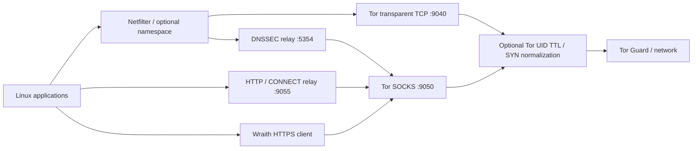

# Architecture

> **07 / UNDERSTAND** · Components, responsibilities and deployment scope.

## Six crates, separate responsibilities

| Crate | Responsibility |
| :--- | :--- |
| `wraith-core` | State, snapshots, configuration and cryptographic utilities |
| `wraith-net` | Network policy, interfaces, namespace TCP, Tor access-link NFQUEUE and optional shaping |
| `wraith-tor` | Tor transport, HTTP CONNECT and the verified browser TLS client |
| `wraith-guard` | DNS, DNSSEC, watchdog, observations and optional cover requests |
| `wraith-forensic` | Managed browser/host controls and explicit cleanup utilities |
| `wraith-cli` | Session orchestration, commands and terminal presentation |

## Choose by deployment scope

| Approach | Projects | Typical workflow |
| :--- | :--- | :--- |
| Existing-host privacy sessions | Wraith, AnonSurf, TorGhost | Configure routing on the current Linux environment |
| Selected-application proxying | Proxychains-NG | Start compatible programs through configured proxies |
| Separate privacy operating system | Tails | Boot a dedicated environment |

See the [source-backed comparison](https://github.com/ByGh00st/wraith#privacy-matrix) for differences and practical boundaries. This is an architecture comparison, not an anonymity ranking or performance benchmark.

## Reading the security boundaries

Netfilter and namespaces enforce routing policy; packet observations do not rewrite arbitrary encrypted payloads. Tor exit addresses can be blocked by destinations. Changing a TLS profile does not guarantee browser indistinguishability, and memory controls do not isolate from a compromised kernel.

## Session identity and managed Tor

The recovery journal is `/var/run/wraith.state`. New Linux session records bind ownership to boot ID, process start ticks and executable device/inode. Shutdown opens a pidfd, verifies the recorded identity and sends SIGTERM through that descriptor. Renaming a process does not establish ownership, and PID reuse does not select the replacement process for signaling.

A live legacy record without this identity is refused for automatic signaling. Stop its original worker before retrying recovery; keep the journal. The Linux runtime needs pidfd support.

Wraith uses `/etc/tor/wraithrc`, `/var/lib/wraith/tor` and `/run/wraith-tor/control.authcookie`. Supported active system Tor services are recorded, temporarily stopped and restored during cleanup. Their boot enablement is preserved. Egress restrictions are armed before Tor bootstrap.

TCP rollback includes saved sysctl values, the MSS rule and original initial-window route metrics. Metrics are restored and read back even if the namespace remains alive; a changed route identity is rejected. Session namespace teardown still removes its owned resources.

## Pinned namespace TCP engine

TCP sysctl transactions keep a namespace descriptor open from snapshot through readback and rollback. Subprocesses use that descriptor through `nsenter`; Tokio worker threads remain in their original namespace. Only managed namespace names and approved TCP keys pass validation. The host writer is disabled. Saved namespace identity also prevents sysctl restoration into a replacement namespace.

See [L4 and L7](L4-and-L7.md) for profile targets, CLI selection and failure policies.

## Tor access-link packet engine

L4-enabled sessions arm a separate Tor UID-scoped IPv4 mangle policy before managed Tor starts. TTL applies to non-loopback Tor TCP packets; initial SYNs enter an owned NFQUEUE for option reordering, MSS reduction and Windows timestamp-off negotiation. The worker preserves window/scale, sequence numbers, flags and payload, with fresh checksums. No host TCP sysctl writes or replacement TCP stack are involved.

Queue ownership is journaled and persisted in a private egress lease before rule attachment, then checked again before activation. A dead/full queue drops new SYNs without bypass; established connections can continue. Shutdown stops managed Tor before removing the policy and restoring the original tables. A failed Tor stop or namespace teardown withholds firewall restoration and retains recovery state. See the [packet-engine design](https://github.com/ByGh00st/wraith/blob/main/docs/L4-EGRESS-DESIGN.md).

## Ownership-checked orphan recovery

Startup acquires `/run/wraith.lifecycle.lock`, checks the recorded worker identity and restores an interrupted session before claiming a new one. The lock is released after the claim; cleanup does not hold it while asking a live worker to stop, so the worker can acquire it for its own restoration.

`recover_orphaned_state()` uses private durable leases in `/var/lib/wraith/`:

| Lease | Ownership evidence | Cleanup scope |
| :--- | :--- | :--- |
| `netns-owner.json` | Boot ID, namespace device/inode, random veth/rule tag, expected MAC | Owned namespace, veth peers, exact tagged rules and expected resolver entry |
| `egress-owner.json` | Recorded Tor egress snapshot and exact policy rules | Owned Tor access-link chain after managed Tor stops |

Namespace removal discards its sysctl, MSS and FIB overrides without writing global host TCP settings. Cleanup refuses busy namespaces, changed lifetimes, unowned links and unexpected resolver files. A `veth_wraith*` prefix alone never authorizes deletion. Legacy journaled namespaces require identity and reciprocal veth-peer evidence.

Leases are removed last, making partial cleanup retryable. Empty repeat preflight succeeds; an unknown fixed egress chain blocks startup instead of triggering a broad flush. After reboot, old leases can clean stale files but cannot authorize deletion of new network objects. Durable network leases do not replace the full host journal in `/var/run/wraith.state`, which may be lost across reboot.

## Namespace L2 initialization

The namespace-side veth gets an OS-CSPRNG MAC with `(first_byte & 0x03) == 0x02`: locally administered and unicast. Wraith writes and reads it back before either veth endpoint is UP. Entropy or readback failure aborts setup. The lease ties subsequent MAC drift inspection to that namespace lifetime.

This applies to namespace creation even with L4 morphing off. Physical-adapter MAC rotation is a separate host control; a veth MAC is not a new identity at a remote Tor destination.

## Owned memory and destruction

`StateData`, TCP/route/egress snapshots and process identity implement zeroization on drop. `SensitiveMap` drains and wipes owned keys/values on replacement, clear and destruction. Protected buffers also cover state JSON, vault plaintext and WireGuard configuration input; WireGuard debug formatting redacts secret fields.

Release builds use panic unwinding so destructors can run on ordinary error returns and unwound scopes. A panic does not synchronously restore network state: restrictive policy and records remain for recovery. SIGKILL, abort and power loss skip destructors. This is not whole-process erasure, a guarantee about third-party TLS allocations, or protection from cold-boot inspection. The disk recovery journal is intentionally retained until cleanup succeeds.

**Next:** [Development and project information →](Development.md)
