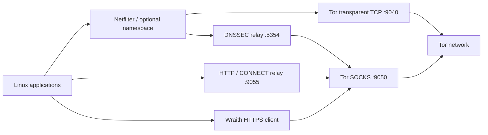

# Architecture

> **07 / UNDERSTAND** · Components, responsibilities and deployment scope.

## Six crates, separate responsibilities

| Crate | Responsibility |
| :--- | :--- |
| `wraith-core` | State, snapshots, configuration and cryptographic utilities |
| `wraith-net` | Network policy, interfaces, namespaces and optional shaping |
| `wraith-tor` | Tor transport, HTTP CONNECT and the verified browser TLS client |
| `wraith-guard` | DNS, DNSSEC, watchdog, observations and optional cover requests |
| `wraith-forensic` | Managed browser/host controls and explicit cleanup utilities |
| `wraith-cli` | Session orchestration, commands and terminal presentation |

## Choose by deployment scope

| Approach | Projects | Typical workflow |
| :--- | :--- | :--- |
| Existing-host privacy sessions | Wraith, AnonSurf, TorGhost | Configure routing on the current Linux environment |
| Selected-application proxying | Proxychains-NG | Start compatible programs through configured proxies |
| Separate privacy operating system | Tails | Boot a dedicated environment |

See the [source-backed comparison](https://github.com/ByGh00st/wraith#privacy-matrix) for differences and practical boundaries. This is an architecture comparison, not an anonymity ranking or performance benchmark.

## Reading the security boundaries

Netfilter and namespaces enforce routing policy; packet observations do not rewrite arbitrary encrypted payloads. Tor exit addresses can be blocked by destinations. Changing a TLS profile does not guarantee browser indistinguishability, and memory controls do not isolate from a compromised kernel.

## Session identity and managed Tor

The recovery journal is `/var/run/wraith.state`. New Linux session records bind ownership to boot ID, process start ticks and executable device/inode. Shutdown opens a pidfd, verifies the recorded identity and sends SIGTERM through that descriptor. Renaming a process does not establish ownership, and PID reuse does not select the replacement process for signaling.

A live legacy record without this identity is refused for automatic signaling. Stop its original worker before retrying recovery; keep the journal. The Linux runtime needs pidfd support.

Wraith uses `/etc/tor/wraithrc`, `/var/lib/wraith/tor` and `/run/wraith-tor/control.authcookie`. Supported active system Tor services are recorded, temporarily stopped and restored during cleanup. Their boot enablement is preserved. Egress restrictions are armed before Tor bootstrap.

TCP rollback includes saved sysctl values, the MSS rule and original initial-window route metrics. Metrics are restored and read back even if the namespace remains alive; a changed route identity is rejected. Session namespace teardown still removes its owned resources.

## Pinned namespace TCP engine

TCP sysctl transactions keep a namespace descriptor open from snapshot through readback and rollback. Subprocesses use that descriptor through `nsenter`; Tokio worker threads remain in their original namespace. Only managed namespace names and approved TCP keys pass validation. The host writer is disabled. Saved namespace identity also prevents sysctl restoration into a replacement namespace.

See [L4 and L7](L4-and-L7.md) for profile targets, failure policies and the remaining CLI work.

**Next:** [Development and project information →](Development.md)
