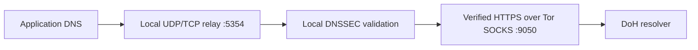

# DNS & routing

> **04 / NETWORK** · Follow a query from the application to its resolver.



## Select a resolver

```bash
sudo wraith -s -D quad9
# Alternative session configuration:
sudo wraith -s -D cloudflare
```

Run one session at a time. A custom RFC 8484 HTTPS endpoint is also supported:

```bash
sudo wraith -s -D https://resolver.example/dns-query
```

Replace the example endpoint with a real resolver. Quad9 is the default DoH upstream. Application-selected encrypted DNS is a separate flow from intercepted port-53 queries.

## What DNSSEC verifies

Wraith validates DNSSEC locally with Hickory and built-in root trust anchors. An upstream AD bit cannot replace proof validation. Bogus or indeterminate proofs are rejected; authenticated unsigned delegations remain unsigned.

The DoH connection uses Wraith's certificate-verified Chrome TLS profile through Tor. DNSSEC validates DNS data; HTTPS protects transport to the resolver. These are separate checks.

## What Tor carries

| Traffic | Session behavior |
| :--- | :--- |
| Supported IPv4 TCP | Tor transparent routing |
| Intercepted UDP/TCP DNS | Local DNS relay |
| Arbitrary UDP / QUIC | Not transported by Tor as general-purpose UDP |
| IPv6 | Session firewall controls; live route validation remains required |

Strict policy uses a dedicated Tor UID and netfilter enforcement. Optional namespaces provide another routing boundary. Other root processes can change host policy.

L4-enabled sessions also normalize the Tor UID's outgoing IPv4 TCP TTL and initial SYN options/MSS before Guard connections. Shared Tor exits are preserved. This packet policy does not alter Tor TLS or application TLS; see [L4 and L7](L4-and-L7.md).

**Next:** [Advanced configuration →](Advanced-Configuration.md)

## Failure handling and optional WireGuard

DNSSEC/transport failure returns SERVFAIL, without unvalidated raw DoH or UDP fallback. STUN filters run before NAT and cover both local output and namespace ingress.

WireGuard carries Tor's outer connection. The supported configuration uses one peer, IPv4 Address, a numeric IPv4 Endpoint and `AllowedIPs = 0.0.0.0/0`. PresharedKey, PersistentKeepalive, ListenPort and MTU are supported. Hooks, custom routing tables and unsupported properties are rejected. The config's DNS field does not override Wraith's resolver policy. Existing interface or policy-routing ownership conflicts fail setup.
